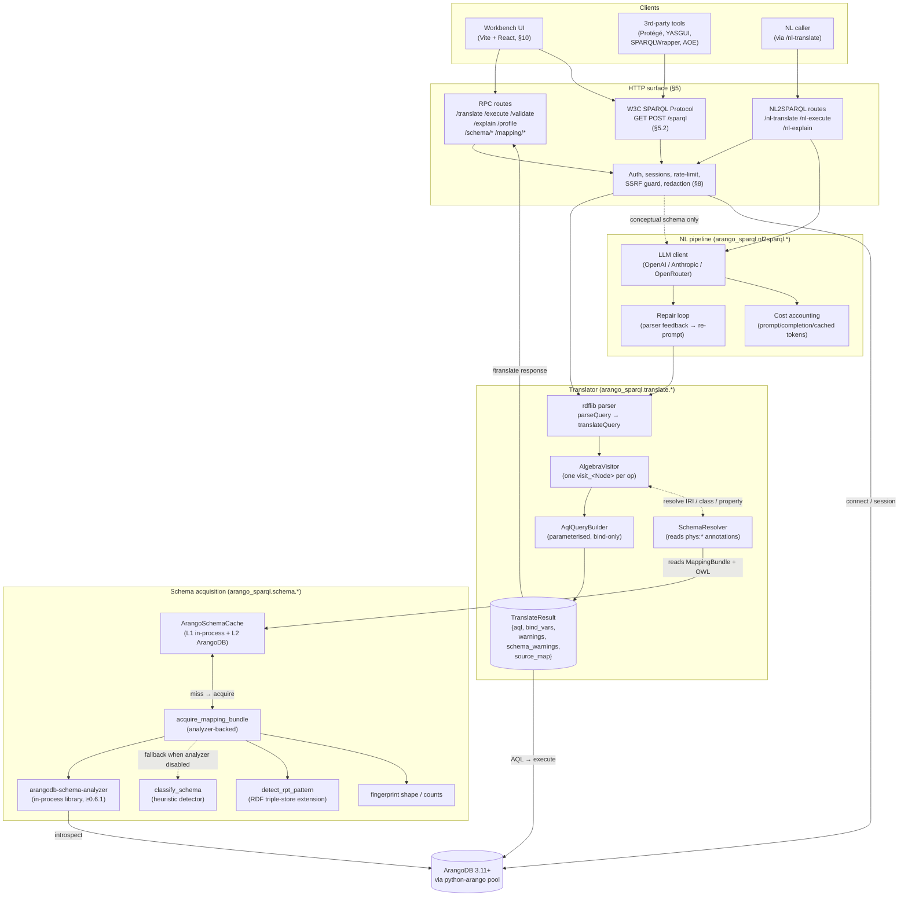

# Product Requirements Document — `arango-sparql-py` v1

**Status**: Draft v1. **Single source of truth** — this document subsumes
the original v0 transpiler-design memo (now [Appendix C: Inception
narrative](#appendix-c-inception-narrative)) and the standalone decision
records (now [Appendix B: Decision records](#appendix-b-decision-records-adrs)).

**Owner**: Arthur Keen

**Audience**: maintainers, contributors, downstream integrators (the ArangoDB
Platform team that consumes this as a BYOC service), and AI agents working on
the repo.

**Conventions.** This document uses [RFC 2119](https://www.rfc-editor.org/rfc/rfc2119)
keywords (**MUST**, **MUST NOT**, **SHOULD**, **SHOULD NOT**, **MAY**) where a
requirement is normative. The "Normative?" column in the table of contents
below is the authoritative list of normative sections; everything else is
rationale that supports the spec but is not itself enforceable. The §3
acceptance criteria are the contract — section bodies elaborate the
contract, and the bodies marked normative in the TOC carry concrete
behavioural rules (the rest is architecture description).

---

## Table of contents

| §  | Section                                                | Normative? |
| -- | ------------------------------------------------------ | ---------- |
| 1  | [Mission](#1-mission)                                  |            |
| 2  | [Non-goals (v1)](#2-non-goals-v1)                      |            |
| 3  | [Success criteria (v1.0 acceptance)](#3-success-criteria-v10-acceptance) | ✅ |
| 4  | [Architecture overview](#4-architecture-overview)      |            |
| 5  | [HTTP surface](#5-http-surface)                        | ✅ (5.1, 5.2) |
| 6  | [Schema model & physical layouts](#6-schema-model--physical-layouts) | ✅ (6.2, 6.5) |
| 7  | [NL → SPARQL pipeline](#7-nl--sparql-pipeline)         |            |
| 8  | [Multitenancy & security](#8-multitenancy--security)   | ✅ (8.6) |
| 9  | [Observability](#9-observability)                      | ✅ (9.4–9.7) |
| 10 | [UI / Workbench](#10-ui--workbench)                    | ✅ (10.10, 10.11) |
| 11 | [Third-party tool compatibility](#11-third-party-tool-compatibility-the-sparql-protocol-audience) |            |
| 12 | [Cross-project integration](#12-cross-project-integration) |        |
| 13 | [Conformance & testing](#13-conformance--testing)      | ✅ (13.1) |
| 14 | [Release roadmap](#14-release-roadmap)                 |            |
| 15 | [Deployment & operations](#15-deployment--operations)  | ✅ |
| 16 | [Versioning & upgrades](#16-versioning--upgrades)      | ✅ |
| 17 | [Privacy & data handling](#17-privacy--data-handling)  | ✅ |
| 18 | [Glossary](#18-glossary)                               |            |
| A  | [Appendix A: Configuration reference](#appendix-a-configuration-reference) | ✅ |
| B  | [Appendix B: Decision records (ADRs)](#appendix-b-decision-records-adrs) |            |
| C  | [Appendix C: Inception narrative](#appendix-c-inception-narrative) |            |

> **Single source of truth.** This document subsumes the former
> `vision.md` (now Appendix C) and the standalone ADR files under
> `decisions/` (now Appendix B). Those files remain as one-line stubs
> that redirect here so existing links keep resolving; all new
> requirements, decisions, and narrative belong in this PRD.

---

## 1. Mission

Replace the legacy JavaScript Foxx [`arango-sparql`](https://github.com/ArthurKeen/arango-sparql)
service with a standalone Python microservice that:

1. **Translates SPARQL 1.1 to ArangoDB AQL** with W3C-grounded correctness.
2. **Exposes a SPARQL endpoint** that conforms to the W3C SPARQL 1.1 Protocol,
   so any standard SPARQL client (Apache Jena, RDFLib, Oxigraph CLI, the
   browser-based YASGUI editor, etc.) can talk to ArangoDB without knowing it
   is a triplestore impostor.
3. **Adapts to the user's physical ArangoDB schema** — including PG
   (one collection per class), LPG (multi-class collections with a
   discriminator field), RPT (RDF triple-store layout, e.g. the legacy
   Foxx `_triples` collection), and **hybrid combinations of all three
   in one database** — via either a hand-authored OWL ontology or a
   `MappingBundle` acquired from
   [`arangodb-schema-analyzer`](https://github.com/ArthurKeen/arango-schema-mapper)
   (with this project's RPT-detection extension layered on top).
4. **Supports natural-language entry** via an `nl2sparql` pipeline analogous
   to the sister project's `nl2cypher`.
5. **Mirrors the architecture of [`arango-cypher-py`](https://github.com/ArthurKeen/arango-cypher-py)**
   so the two services are operationally and developmentally interchangeable.
6. **Supports third-party Semantic Web tools natively** — Protégé, Microsoft
   Ontology Playground (Microsoft Fabric IQ family), TopBraid Composer,
   YASGUI, and any standard SPARQL Protocol client must be able to talk
   to the service without bespoke shims. See §11 for the conformance
   matrix.
7. **Acts as the SPARQL substrate for sister projects in the ArangoDB
   semantic stack** — most importantly
   [`arango-ontoextract`](https://github.com/ArthurKeen/arango-ontoextract)
   (LLM-driven OWL extraction + curation) and
   [`arangodb-schema-analyzer`](https://github.com/ArthurKeen/arango-schema-mapper)
   (the physical-schema introspector). See §12.

## 2. Non-goals (v1)

- **SPARQL 1.1 Update** — `INSERT DATA`, `DELETE DATA`, `LOAD`, `CLEAR`,
  `CREATE`, `DROP`, `COPY`, `MOVE`, `ADD` are out of scope. Writes go through
  AQL (or python-arango) directly.
- **Federated query (`SERVICE` keyword)** — out of scope for v1. The W3C
  Service Description response will advertise `sd:Feature` without
  `sd:BasicFederatedQuery`. Cross-Arango-database federation may land in v2
  if there is demand.
- **Inferencing / reasoning** — `arango-sparql-py` does not perform RDFS or
  OWL entailment over the loaded ontology. The ontology is mapping metadata,
  not a reasoning surface. Customers needing OWL reasoning should pre-
  materialise inferred triples in their data layer.
- **Multi-tenancy across separate processes** — sessions are per-process
  in-memory; running multiple workers requires a sticky-session load
  balancer. Cross-process session sharing (Redis, etc.) is a v2 concern.
- **Replacing AQL as the database's query language** — this is a transpiler,
  not a competing query engine. AQL remains canonical; SPARQL is an
  alternate front-end with mapped semantics.

## 3. Success criteria (v1.0 acceptance)

Each criterion is **independently measurable** by the test or artefact
named in the *How measured* column. Criteria are numbered for stable
external reference (e.g. `criterion §3.7`); they do not imply
prioritisation order. Detail and rationale live in the section named
under *Where detailed* — these one-line summaries are the contract.

| #    | Criterion (one-line) | How measured | Where detailed |
| ---- | --- | --- | --- |
| §3.1 | **W3C DAWG translation coverage ≥ 25 %**, with no single XFAIL bucket consuming > 30 % of remaining failures | [`tests/w3c/COVERAGE_REPORT.md`](../../tests/w3c/COVERAGE_REPORT.md) (**v0.17, 96.4 % ✅ — v1.0 §3.1 coverage bar cleared by 71 pp**; 9 algebra / 0 schema / 14 rdflib XFAILs). **NOTE on the 30 % ratio sub-clause (corrected reasoning):** the largest actionable bucket `ServiceGraphPattern` sits at 4/9 = 44.4 % of algebra XFAILs, over the 30 % guideline. Crucially — and contrary to an earlier note in this doc that has now been fixed — this ratio **only worsens** as we close non-federation gaps: the SERVICE-federation bucket is the dominant *deferred* remainder, so every non-federation fix shrinks the denominator and *raises* the deferred bucket's share. The ratio can therefore only fall by **shipping the federation slice itself** (reducing the numerator from 4); no non-federation slice will restore headroom. We accept this consciously: the §3.1 *primary* bar (coverage ≥ 25 %) is cleared by 71 pp, and the sub-clause's intent — "don't mask a systemic gap behind one giant bucket" — is not violated, because the dominant bucket is a single, well-understood, intentionally-postponed feature (SPARQL federation / SERVICE), not a hidden systemic defect. There is no numeric CI gate on either the coverage percentage or the ratio sub-clause: `tests/w3c/test_w3c_query_evaluation.py` *tracks* (not gates) current state by recording each still-unsupported case as an imperative `pytest.xfail`, and `analyze_coverage.py --write` regenerates the human-readable ledger. Per-construct regression protection comes from the deterministic golden suites under `tests/translate/`, not from the W3C harness (an imperative-xfail'd case that regresses to raising would silently re-xfail rather than fail the run). | §13.2, §13.5 |
| §3.2 | **Conformant W3C SPARQL Protocol endpoint** — `GET/POST /sparql` honours `Accept` for JSON/XML/CSV/TSV; `GET /sparql` (no query) returns Service Description as `text/turtle`; documented error contract in force | `tests/test_sparql_protocol_*.py` (accept negotiation, errors, service description) | §5.2 |
| §3.3 | **Native physical-model coverage** — translator emits correct AQL against every shape in §6.1 (PG `COLLECTION`, LPG `LABEL`, RPT `_triples`, plain `DOCUMENT`) and PG+LPG hybrids | `tests/translate/{bgp_select,hybrid,rpt}.yml` (translation goldens) + `tests/cross/test_multimodel_cross.py` (PG / LPG / PG+LPG-hybrid / RPT pyoxigraph binding parity, incl. cross-class joins, from one source-of-truth dataset) + `tests/cross/test_edge_traversal_cross.py` (DEDICATED + GENERIC_WITH_TYPE edge-collection `OUTBOUND` traversal binding parity) + `tests/schema/test_fixtures.py` §13.3 contracts #3/#4 (per-entity emission across all 9 fixtures) | §6.1, §6.6 |
| §3.4 | **Hybrid translation in a single BGP** — one SPARQL BGP whose triples touch ≥ 2 physical models translates to a single AQL query (not rejected, not split) | `tests/translate/hybrid.yml` + `tests/cross/test_hybrid_cross.py` | §6.6 (mixed-model row) |
| §3.5 | **Schema detection (algorithmic + analyzer-backed)** — both detectors ship; analyzer wins on `auto`; classifies the sister project's mapping-fixture corpus + this project's RPT fixtures with zero false negatives | `tests/schema/test_classify.py`, `tests/schema/test_acquire.py`, `tests/schema/fixtures/*.export.json` | §6.3 |
| §3.6 | **Schema HTTP surface parity with `arango-cypher-py`** — all 9 schema/mapping routes exist with documented response shapes | `tests/test_service_schema_routes.py`; route names listed in §5.1 | §5.1, §6.4 |
| §3.7 | ~~**Hybrid-schema parity with legacy Foxx (`arango-sparql`)** — every translatable legacy fixture has a corresponding golden under `tests/translate/` emitting semantically equivalent AQL~~ **WAIVED per ADR-0003 (Appendix B.3) — Foxx is deprecated; W3C DAWG coverage (§13.5) is the sole correctness gate.** | ~~`tests/legacy/test_foxx_roundtrip.py` (Docker-gated; ≥ 90 % of legacy fixtures pass)~~ Retired, never built. | §13.4, Appendix B.3 |
| §3.8 | **Operational parity with `arango-cypher-py`** — *measurable* parity: identical session / connect / public-mode / CORS / rate-limit / SSRF / redaction / startup-guard surface; one CI test per surface verifies behaviour | `tests/parity/test_cypher_py_*.py` (one file per row of §8) | §8 |
| §3.9 | **UI feature parity with `arango-cypher-py`'s workbench** — every row of the §10.2 + §10.3 capability tables has a passing playwright test | `ui/tests/playwright/parity.spec.ts` (CI-blocking) | §10 |
| §3.10 | **Validated 3rd-party tool compatibility** — every "verified-compatible" row of §11.1 has a passing smoke test exercising at least one SELECT, one ASK, and the Service Description fetch | `tests/integration/test_*_compat.py` (one file per tool) | §11 |
| §3.11 | **`arango-ontoextract` integration** — AOE can (a) point its PRD Q7 endpoint at us, (b) `/mapping/export-owl` seeds an AOE library entry, (c) `/mapping/import-owl` accepts a curated OWL push | `tests/integration/test_aoe_roundtrip.py` (Docker-gated; both services live) | §12.2 |
| §3.12 | **Performance SLOs in §9.4 met** — every budget row passes its `tests/perf/` benchmark within ≤ 25 % of the stated p95 | `tests/perf/test_*.py` (CI-blocking on > 25 % regression) | §9.4 |
| §3.13 | **Threat-model mitigations enforced** — every row of the §8.6 STRIDE matrix has its asserting test under `tests/security/` | `tests/security/test_*.py` (CI-blocking) | §8.6, §13.1 |
| §3.14 | **Privacy contract enforced** — no-bodies-in-logs property test passes; `LOG_FORMAT=json` default emits the §9.5 envelope; opt-in toggles for tenant labels behave per §17.2 | `tests/security/test_no_body_in_logs.py`, `tests/test_log_envelope.py` | §17 |
| §3.15 | **Configuration appendix is normative** — adding a new env var without updating Appendix A fails CI | `tests/test_config_appendix.py` (introspects `arango_sparql/_env.py` against the appendix table) | Appendix A |
| §3.16 | **Public release readiness** — repo public, CI green on Python 3.11/3.12/3.13 + ArangoDB 3.11/3.12, MIT LICENSE + CONTRIBUTING + SECURITY + Operational runbook published, repeatable `docker compose up` dev loop, SBOM artefact attached to the v1.0 release tag | GitHub releases page; CI history; `docker compose up && curl /health/ready` | §15, §16 |

---

## 4. Architecture overview

The service has three logical layers — **HTTP surface**, **translator**,
**schema acquisition** — that share a single `python-arango`
connection pool to ArangoDB. The translator is mapping-driven (the
mapping comes from the schema layer); the HTTP surface is the only
caller of the translator that also validates auth / tenancy / rate
limits.



<details>
<summary>Text-only fallback (same flow, ASCII)</summary>

```text
                 ┌────────────────────────────────────────────────┐
   SPARQL ───►  │  rdflib parser → algebra translateQuery        │
                 │            │                                   │
                 │            ▼                                   │
                 │  AlgebraVisitor (one visit_<Node> per op)      │
                 │            │                                   │
                 │            ▼                                   │
                 │  AqlQueryBuilder (parameterised, bind-only)    │ ◄── SchemaResolver
                 │            │                                          (consumes ┐
                 │            ▼                                           Mapping ─┼──┐
   AQL   ◄────  │  TranslateResult{aql, bind_vars, warnings,             Bundle  ┘  │
                 │                  schema_warnings, source_map}       + OWL Turtle)│
                 └────────────────────────────────────────────────┘                  │
                                  ▲                                                  │
                                  │                                                  ▼
                ┌─────────────────┴─────────────────┐         ┌──────────────────────────────────┐
                │                                   │         │  Schema acquisition pipeline      │
   FastAPI service                      NL2SPARQL pipeline    │  (arango_sparql.schema.*):        │
   (RPC + /sparql Protocol +            (LLM + repair loop)   │   • classify_schema (heuristic)   │
    /schema/* + /mapping/*)             (conceptual schema    │   • acquire_mapping_bundle (uses  │
                │                        only — no physics)   │       arangodb-schema-analyzer)   │
                │                                   │         │   • detect_rpt_pattern (RDF       │
                │                                   │         │       triple-store extension)     │
                │                                   │         │   • fingerprint shape / counts    │
                │                                   │         │   • ArangoSchemaCache (persistent)│
                │                                   │         └──────────────────────────────────┘
                │                                   │                    │
                └─────────► python-arango ◄─────────┴────────────────────┘
                                  │
                                  ▼
                            ArangoDB (3.11+)
```

</details>

**Reading the diagram.** Solid arrows are synchronous request-flow (the
HTTP request blocks on them); dashed arrows are out-of-band (cache miss,
LLM egress, analyzer introspection). The translator and the schema
layer never call out — they only consume what the HTTP layer fetches.
This is the contract that makes per-tenant isolation auditable: every
DB-bound side-effect is gated by `SEC`.

Source-of-truth modules:

| Concern | Module |
| --- | --- |
| Public translate API | `arango_sparql/api.py` |
| SPARQL parsing | `arango_sparql/translate/parser.py` |
| Algebra walker | `arango_sparql/translate/visitor.py` |
| AQL builder | `arango_sparql/translate/builder.py` |
| Schema mapping (consumes Mapping Bundle / OWL) | `arango_sparql/translate/resolver.py` |
| Schema detection (heuristic + analyzer + RPT extension) | `arango_sparql/schema/detect.py`, `arango_sparql/schema/acquire.py`, `arango_sparql/schema/rpt.py` |
| Persistent schema cache (in ArangoDB) | `arango_sparql/schema/cache.py` |
| Typed errors | `arango_sparql/errors.py` |
| FastAPI app + middleware + analyzer-required guard | `arango_sparql/service/app.py` |
| Pydantic models | `arango_sparql/service/models.py` |
| Sessions, rate-limit, SSRF, redaction | `arango_sparql/service/security.py` |
| Routes | `arango_sparql/service/routes/{health,connect,sparql,nl,schema,mapping,protocol}.py` |
| NL pipeline | `arango_sparql/nl2sparql/pipeline.py` |

---

## 5. HTTP surface

### 5.1 RPC routes (current, stable)

These are the service's native, JSON-only contract. They are not the W3C
SPARQL Protocol — they are richer (they return AQL, bind vars, warnings,
explain plans, profile traces) and are tailored to the UI and to integrators
that already speak our shape.

| Method | Path | Auth | Purpose |
| --- | --- | --- | --- |
| `GET`  | `/health` | none | Liveness — returns `{status, version}` |
| `POST` | `/connect` | open or session | Open an ArangoDB session (URL+credentials → session token); SSRF-guarded |
| `POST` | `/disconnect` | session | Close the session |
| `GET`  | `/connect/defaults` | none in dev / session in public mode | Return non-secret env-var defaults the connect dialog should pre-fill |
| `GET`  | `/graphs` | session | List the connected database's ArangoDB named graphs (topology graphs) available for collection-scope down-select — see §6.8 |
| `POST` | `/session/graph` | session | Bind (or clear) the active ArangoDB named-graph scope for this session — see §6.8 |
| `POST` | `/translate` | rate-limited | SPARQL → AQL only (no DB access) |
| `POST` | `/validate` | rate-limited | SPARQL parse-only validation |
| `POST` | `/execute` | session + rate-limited | SPARQL → AQL → ArangoDB → bindings |
| `POST` | `/execute-aql` | session + rate-limited | Pass-through AQL (the UI's "rerun without re-translating") |
| `POST` | `/explain` | session + rate-limited | SPARQL → AQL → `db.aql.explain` |
| `POST` | `/profile` | session + rate-limited | SPARQL → AQL → `db.aql.execute(profile=2)` |
| `POST` | `/nl-translate` | session-optional + NL rate-limited | NL question → SPARQL → AQL |
| `POST` | `/nl-explain` | session-optional + NL rate-limited | NL question → SPARQL → AQL → human-readable explanation |
| `POST` | `/nl-execute` | session + NL rate-limited + compute rate-limited | NL question → SPARQL → AQL → bindings |
| `POST` | `/nl-samples` | session-optional + NL rate-limited | Schema-derived (optionally LLM-authored) example NL questions for the workbench suggestions dropdown — see §7.5 |
| `GET`  | `/schema/introspect` | session + rate-limited | Live schema acquisition (analyzer or heuristic) — see §6.4 |
| `GET`  | `/schema/properties` | session + rate-limited | Per-collection inferred property catalog |
| `GET`  | `/schema/summary` | rate-limited | Conceptual summary derived from a client-supplied mapping body (no DB access) |
| `GET`  | `/schema/statistics` | session + rate-limited | Cardinality statistics block from `arangodb-schema-analyzer` |
| `GET`  | `/schema/status` | session + rate-limited | Schema-drift report (shape vs counts fingerprints) |
| `POST` | `/schema/invalidate-cache` | session + rate-limited | Drop the per-database mapping cache entry |
| `POST` | `/schema/force-reacquire` | session + rate-limited | Re-run analyzer (bypass cache); 503 if `SCHEMA_ANALYZER_REQUIRED=false` (no analyzer installed) and `ARANGO_SPARQL_ALLOW_HEURISTIC=false` (heuristic fallback also disabled) — see §6.3.4 |
| `POST` | `/mapping/import-owl` | session + rate-limited | Replace the active mapping with one parsed from a posted OWL/Turtle ontology |
| `POST` | `/mapping/export-owl` | session + rate-limited | Render the active mapping as `text/turtle` |

Every error response is a 422 with `{"error": "...", "code": "E_..."}`. Error
codes are stable strings from `arango_sparql.errors`:

| Code | Class | Meaning |
| --- | --- | --- |
| `E_SPARQL_PARSE` | `SparqlParseError` | rdflib rejected the query string |
| `E_SPARQL_UNSUPPORTED` | `UnsupportedSparqlError` | Translator reached an Algebra node it doesn't yet emit AQL for |
| `E_SCHEMA_RESOLVE` | `SchemaResolutionError` | An IRI couldn't be mapped to a physical collection / property |
| `E_AQL_EMIT` | `AqlEmitError` | Builder produced no FOR clause, or a structurally invalid plan |
| `E_SPARQL` | `SparqlError` | Catch-all base; should never appear unaltered in production |

### 5.2 W3C SPARQL 1.1 Protocol endpoint

A new route module (`arango_sparql/service/routes/protocol.py`) will expose:

| Method | Path | Body / Params | Behavior |
| --- | --- | --- | --- |
| `GET`  | `/sparql` | `?query=…` (URL-encoded) | Translate + execute; respond per `Accept` |
| `GET`  | `/sparql` | (no query) | Service Description as `text/turtle` |
| `POST` | `/sparql` | body: `application/sparql-query` | Translate + execute; respond per `Accept` |
| `POST` | `/sparql` | body: `application/x-www-form-urlencoded` with `query=` | Same as above |

**Result-format negotiation** must implement RFC 9110 §12.5.1 q-value
parsing. The default media-type preference list (used when the request
omits `Accept` or sends `*/*`) is, in this priority order:
`application/sparql-results+json`, `application/sparql-results+xml`,
`text/csv`, `text/tab-separated-values`. For `ASK` queries, the same media
types apply but the body shape is the W3C SPARQL Results "boolean" form. For
`CONSTRUCT` / `DESCRIBE` queries the response is RDF and negotiated against
`text/turtle`, `application/n-triples`, `application/rdf+xml`,
`application/ld+json`; the visitor emits a per-row list of
`{subject, predicate, object}` dicts and the route hydrates them into
an `rdflib.Graph` (set semantics dedupe duplicate triples) before
serialising in the negotiated format.

Tie-breaking rules (asserted by `tests/test_sparql_protocol_accept.py`):

1. Highest q-value wins.
2. Ties broken by the order of the priority list above (so
   `Accept: text/csv;q=0.9,application/sparql-results+xml;q=0.9` returns
   XML — not CSV — because XML appears earlier in the list).
3. Ties involving `*/*` resolve to the first list entry compatible with
   the query form (SELECT/ASK ⇒ `application/sparql-results+json`;
   CONSTRUCT/DESCRIBE ⇒ `text/turtle`).
4. If no offered type matches, return **`406 Not Acceptable`** with a
   JSON body listing the supported types in `Content-Type:
   application/json`. This deliberately diverges from "always return
   JSON" because spec-compliant clients (Apache Jena `arq`) rely on 406
   to fall back.

The selected response media type is echoed in the `Content-Type` response
header; the `Vary: Accept` header is always emitted.

**SPARQL Update is out of scope for v1.0** (see §5.3). The endpoint MUST
NOT silently no-op an Update request — it returns a documented error so
spec-compliant clients can fail loudly:

* `POST /sparql` with `Content-Type: application/sparql-update`,
  *or* a SELECT-shaped body that nonetheless parses as an Update form
  (`INSERT`, `DELETE`, `LOAD`, `CLEAR`, `CREATE`, `DROP`, `COPY`, `MOVE`,
  `ADD`) — the endpoint returns **`405 Method Not Allowed`** with body:

  ```json
  {
    "error": "E_UPDATE_UNSUPPORTED",
    "message": "SPARQL Update is not supported by this endpoint in v1.x.",
    "see": "https://github.com/ArthurKeen/arango-sparql-py#non-goals",
    "supported_methods": ["GET", "POST"],
    "supported_query_forms": ["SELECT", "ASK", "CONSTRUCT", "DESCRIBE"]
  }
  ```

  The `Allow` response header is set to `GET, POST, OPTIONS`.

**Documented error responses** (the contract `tests/test_sparql_protocol_errors.py` enforces):

| Condition | Status | Body shape | Notes |
| --- | --- | --- | --- |
| Update form (see above) | `405` | JSON `E_UPDATE_UNSUPPORTED` | `Allow` header set |
| Malformed SPARQL syntax | `400` | JSON `E_SPARQL_PARSE` with `line`/`col` | Body of the `Content-Type: application/sparql-results+json` form when the request was a JSON-result Accept, else JSON envelope |
| Unsupported algebra (`Service`, etc.) | `422` | JSON `E_TRANSLATE_UNSUPPORTED_ALGEBRA` | One per §13.5 coverage table row |
| `Accept` matches nothing supported | `406` | JSON listing supported types | See above |
| Schema acquisition fails (analyzer down, no fallback) | `503` | JSON `E_SCHEMA_UNAVAILABLE` | `Retry-After: 30` header |
| Query timeout | `504` | JSON `E_TIMEOUT` | Includes `elapsed_ms` |
| Hard result-row cap exceeded | `200` with truncated body | Result envelope + `X-Schema-Warnings-Count` + warning header `Warning: 299 - "W_RESULT_TRUNCATED"` | Per §9.1 |
| Rate-limited | `429` | JSON `E_RATE_LIMITED` | `Retry-After` honoured |
| Auth required (in `PUBLIC_MODE`) | `401` | JSON `E_AUTH_REQUIRED` | `WWW-Authenticate: Bearer` |

**Query timeouts and result caps**: the row cap is governed by the
`EXECUTE_RESULT_TRUNCATE_ROWS` env var (Appendix A.3); the in-process
constant `_MAX_RESULT_DOCS` (in `arango_sparql.service.routes`) is bound
from it at startup. On overflow the response surfaces a
`W_RESULT_TRUNCATED` warning header (same code the RPC routes use). Hard
timeout default 30 s, overridable via `SPARQL_PROTOCOL_TIMEOUT_SECONDS`
(Appendix A.3).

**Session binding**: `GET /sparql` accepts `?session=<token>` (or the
existing `X-Arango-Session` / `Authorization: Bearer …` headers); `POST` uses
the same headers. In default (non-public) mode, an unbound `/sparql` request
falls back to the env-default connection so a developer's `curl /sparql` Just
Works against `localhost:8529`.

**Service Description content** must declare:
- the supported result formats listed above,
- the `sd:availableGraphs` set sourced from the loaded ontology
  (one named graph per declared `phys:collectionName` plus the default graph),
- the explicit list of supported features
  (`sd:UnionDefaultGraph`, `sd:DereferencesURIs`, the empty set for
  `sd:BasicFederatedQuery`, etc.),
- a link to this PRD as `sd:endpoint`'s `dcterms:description`.

**CORS posture for browser-resident SPARQL clients** (YASGUI, Microsoft
Ontology Playground when used as an embed, etc.): the `/sparql` route is
under the same CORS configuration as the rest of the service
(`CORS_ALLOWED_ORIGINS` env var). For public-mode deployments serving
browser editors cross-origin, operators must explicitly allowlist the
editor's origin and the response sets `Access-Control-Expose-Headers`
to include `X-Response-Time`, `X-Schema-Warnings-Count`,
`X-Aql-Bindings-Count`, and (when `?showAQL=true`) `X-Aql-Query-B64`,
mirroring the legacy Foxx headers so a browser-side debug panel can
read them.

### 5.3 Out-of-scope endpoints (v1)

- SPARQL Update Protocol (`POST /update`)
- Graph Store HTTP Protocol (`/graph?graph=…`)
- Federated `SERVICE` round-trips
- WebSocket / Server-Sent-Events streaming variants

---

## 6. Schema model & physical layouts

The product's hardest correctness problem is *not* SPARQL parsing or AQL
emission — those are well-defined. It is the gap between a SPARQL query
written against a *conceptual* RDF/OWL graph and the wide range of
*physical* layouts that ArangoDB customers actually use to store the same
data. This section formalises that gap.

### 6.1 Physical schema model taxonomy

`arango-sparql-py` recognises four primitive physical models. A real
ArangoDB database typically uses one or, increasingly, a mix of several
("hybrid").

| Style ID (in OWL `phys:mappingStyle` and JSON `physicalMapping.entities[*].style`) | Friendly name | Stored as | Read pattern |
| --- | --- | --- | --- |
| `COLLECTION` | **PG** — Property Graph | One ArangoDB document collection per OWL class | `FOR doc IN @@coll` |
| `LABEL` | **LPG** — Labeled Property Graph | One shared document collection holding multiple OWL classes, discriminated by a `typeField` (e.g. `type`, `_type`, `entityType`, `label`) | `FOR doc IN @@coll FILTER doc.<typeField> == @typeValue` |
| `RPT` | **RDF / Resource-style triples** | A triple-row collection (the legacy Foxx default was `_triples`) with `subject_uri`, `predicate`, `object_uri`, `object_value` columns and `_:` prefix for blank nodes | `FOR t IN @@triples FILTER t.predicate == @p AND t.subject_uri == @s` plus `NOT_NULL(t.object_uri, t.object_value)` to bind the object |
| `DOCUMENT` | Plain document | Document collection with no class-discriminator field; OWL class derived from collection name only | Same as `COLLECTION` |

Relationship styles, attached to OWL `owl:ObjectProperty`:

| Style ID | Friendly name | Stored as | Read pattern |
| --- | --- | --- | --- |
| `DEDICATED_COLLECTION` | **PG-typed edge** | One edge collection per relationship type (the collection name *is* the relationship name) | `FOR v, e IN OUTBOUND doc @@edgeColl` |
| `GENERIC_WITH_TYPE` | **LPG-typed edge** | One shared edge collection holding multiple relationship types, discriminated by a `typeField` | `FOR v, e IN OUTBOUND doc @@edgeColl FILTER e.<typeField> == @typeValue` |
| `RPT_EDGE` | **RDF object property** | An object-property triple in the `_triples` collection (`object_uri` populated, `object_value` null) | Same as `RPT` entity read; the predicate IRI carries the relationship semantics |

**Hybrid** is not a fifth style; it is the *case where two or more of the
above coexist in one database*. Concretely, a single SPARQL query can
have one BGP triple resolve to `COLLECTION` (read a PG collection
directly), the next to `RPT` (look the same subject up in `_triples`),
and the third to `LABEL` (filter a shared collection by `typeField`) —
joined on a shared subject URI. The translator MUST emit one AQL query
that does all three and joins them with `FILTER` clauses on `_uri` (or
the equivalent triple-store subject column). Acceptance for this is
criterion §3.4.

> **Why RPT matters even when nobody is starting greenfield with it.**
> The legacy Foxx `arango-sparql` service shipped an **`rpt-translator.js`**
> that read `_triples` rows directly. Customers that adopted the legacy
> service for a SPARQL workload still have those collections live. v1's
> Foxx-parity criterion (§3.7) requires translating against them. The
> *new* contribution of `arango-sparql-py` is letting customers
> mix RPT-resident classes with PG/LPG-resident classes in one query —
> something the legacy could not do (its `processSparqlQuery` picked one
> `model` per request).

### 6.2 OWL contract (the physical-mapping vocabulary)

The translator never invents collection names. Every concrete
SPARQL→AQL translation requires an OWL/Turtle ontology produced by
[`arangodb-schema-analyzer`](https://github.com/ArthurKeen/arango-schema-mapper)
(or hand-authored to match its annotation vocabulary). Annotations live
under either of the two `phys:` namespaces the analyzer has shipped
historically; both are accepted (see `resolver.py`):

| Annotation IRI (relative to the `phys:` prefix) | Attaches to | Carries | Read by |
| --- | --- | --- | --- |
| `mappingStyle` | `owl:Class` (entity styles) or `owl:ObjectProperty` (relationship styles) | One of the style IDs from §6.1 | `SchemaResolver.resolve_class` / `resolve_property` to dispatch the read pattern |
| `collectionName` | `owl:Class` | Document-collection name | All four entity styles (`COLLECTION`, `LABEL`, `RPT` reads from a *triples* collection still need a name, `DOCUMENT`) |
| `edgeCollectionName` | `owl:ObjectProperty` | Edge-collection name | `DEDICATED_COLLECTION`, `GENERIC_WITH_TYPE` |
| `typeField` | `owl:Class` *or* `owl:ObjectProperty` | Discriminator field name (e.g. `type`) | `LABEL`, `GENERIC_WITH_TYPE` |
| `typeValue` | `owl:Class` *or* `owl:ObjectProperty` | Discriminator value (e.g. `Person`) | `LABEL`, `GENERIC_WITH_TYPE` |
| `triplesCollection` | `owl:Class` | Name of the RPT-style collection holding this class's triples (defaults to `_triples`) | `RPT`, `RPT_EDGE` |
| `subjectColumn`, `predicateColumn`, `objectUriColumn`, `objectValueColumn` | `owl:Class` | Override the legacy Foxx column names if a customer renamed them | `RPT`, `RPT_EDGE` |
| `tenantField`, `tenantEntity` | `owl:Class` | Multi-tenancy scope (see §6.5) | All entity styles |

`SchemaResolver` is the only module that reads any of these. Visitors
call `resolve_class(iri)` and `resolve_property(iri)`; the resolver
returns a tagged dataclass (`ResolvedClass.style ∈ {COLLECTION, LABEL,
RPT, DOCUMENT}`) and the visitor's `_emit_triple` dispatches on `style`.

> **Status note.** The current resolver reads `phys:collectionName`,
> `phys:edgeCollectionName`, `phys:typeField`, and `phys:typeValue`.
> Adding `phys:mappingStyle` (with the explicit style enum) and the
> `phys:triplesCollection` / `phys:*Column` family is a v1.0 deliverable
> (criterion §3.3 + §3.7).

### 6.3 Schema-detection pipeline

A customer rarely hands us an OWL ontology pre-authored. The mapping is
*acquired* — usually once, then cached — by introspecting their live
database. Acquisition is two-tier:

#### 6.3.1 Algorithmic detector (heuristic, no external dependency)

Module: `arango_sparql.schema.detect`

```python
def classify_schema(db: StandardDatabase) -> Literal["pg", "lpg", "rpt", "hybrid", "unknown"]: ...
def detect_rpt_pattern(db: StandardDatabase, *, sample_size: int = 20) -> RptDetectionResult: ...
def build_heuristic_mapping(db: StandardDatabase, *, schema_type: str) -> MappingBundle: ...
```

Heuristics, in order:

1. **Per-collection sampling** — at most `sample_size = 20` documents
   per collection (cap on cost; `LIMIT @n`).
2. **RPT pattern detection** (the new layer this project adds on top
   of the analyzer's PG/LPG vocabulary): a collection looks RPT-shaped
   if ≥80 % of sampled documents carry all three of `subject_uri` /
   `predicate` / (`object_uri` ∨ `object_value`), or matches
   `_triples`-style structural fingerprints (legacy Foxx column
   conventions). Returns the inferred column overrides.
3. **PG vs LPG discriminator** — drawn from a tiered candidate set
   (tier 1: `type`, `_type`, `entityType`; tier 2: `label`, `labels`,
   `kind`). Tier 1 fields qualify on the 80 %-coverage rule alone.
   Tier 2 fields additionally require ≤32 distinct values, a
   low-cardinality ratio, and class-like value strings (`[A-Za-z0-9_-]+`)
   to avoid mis-classifying free-text columns.
4. **Edge classification** — typed (`GENERIC_WITH_TYPE`) vs dedicated
   (`DEDICATED_COLLECTION`) using the same discriminator rules against
   `{type, relation, relType, _type}`.
5. **Relationship endpoint inference** (cross-collection) — for every
   edge collection, `infer_edge_endpoint_index` samples `_from` / `_to`
   and resolves each handle to its entity: a `COLLECTION`-style target
   resolves to the collection's entity name directly; a `LABEL`-style
   (LPG) target is resolved per-document by a single batched read of the
   target's discriminator field, so a shared `vertices` collection
   hosting many classes still yields a precise endpoint — including the
   PG+LPG-hybrid case where an edge spans a PG collection on one side and
   an LPG shared collection on the other. `fromEntity` / `toEntity` are
   pinned only when every resolvable edge agrees; a genuinely
   polymorphic edge (or one whose endpoints land in an RPT/unclassified
   bucket) stays `"Any"` rather than guessing a majority. For RPT stores,
   `infer_rpt_object_property_relationships` instead types each object
   property's endpoints from the subject's and object's `rdf:type` rows
   (see §6.3.2), since RPT triples carry no `_from` / `_to`.
6. **Aggregate** — per-collection signals are tallied; all-PG ⇒ `pg`,
   all-LPG ⇒ `lpg`, all-RPT ⇒ `rpt`, mixed ⇒ `hybrid`.

The heuristic detector emits a `MappingBundle` (the same shape the
analyzer produces — see §6.3.2) so downstream code does not branch on
"who built this mapping". `metadata.confidence` is fixed at `0.1` and
`metadata.reviewRequired = true` (mirrors the sister project's
heuristic-path conventions); `metadata.detectedPatterns` lists string
tags `PG_ENTITY_COLLECTION`, `LPG_LABEL`, `RPT_TRIPLES`,
`PG_DEDICATED_EDGE`, `LPG_GENERIC_EDGE`, `RPT_OBJECT_PROPERTY`.

#### 6.3.2 Analyzer-backed acquisition (preferred — the canonical path)

> **Hard dependency contract.** The
> [`arangodb-schema-analyzer`](https://github.com/ArthurKeen/arango-schema-mapper)
> package (PyPI name `arangodb-schema-analyzer`, import name
> `schema_analyzer`, ≥ 0.6.1) is a **first-class dependency** of
> `arango-sparql-py`, not an optional extra. Heuristic detection
> (§6.3.1) exists as a **diagnostic / dev-loop fallback only**; the
> production posture is "analyzer is installed and is the source of
> truth for all entity styles, relationship styles, statistics,
> tenancy scope, sharding profile, and OWL emission". The startup
> guard in §6.3.4 enforces this. The shipped `[analyzer]` extra in
> `pyproject.toml` pins `arangodb-schema-analyzer >= 0.6.1, < 0.7.0`,
> matching the sister project's pinning policy.

Module: `arango_sparql.schema.acquire`

```python
def acquire_mapping_bundle(
    db: StandardDatabase,
    *,
    include_owl: bool = False,
    strategy: Literal["auto", "analyzer", "heuristic"] = "auto",
    force_refresh: bool = False,
) -> MappingBundle: ...
```

Wraps `arangodb-schema-analyzer ≥ 0.6.1`'s `AgenticSchemaAnalyzer.analyze_physical_schema`,
then post-processes:

1. Normalise the analyzer's `conceptualSchema + physicalMapping +
   metadata` into our `MappingBundle` (re-using
   `arango_query_core.mapping.mapping_from_wire_dict` if/when that
   shared package lands).
2. Run the algorithmic RPT detector on top of the analyzer's snapshot
   to **add `RPT` entries the analyzer would not detect on its own**
   (the analyzer only knows PG/LPG today). RPT entries are merged into
   `physicalMapping.entities` with `style = "RPT"`.
   The same pass then **synthesizes `RPT_EDGE` relationships** for each
   object property in the triples store
   (`infer_rpt_object_property_relationships`): it groups the non-`rdf:type`
   `object_uri`-bearing rows by predicate and types each relationship's
   `fromEntity` / `toEntity` from the subject's and object's `rdf:type`
   rows (a batched lookup tops up any endpoint whose class assertion fell
   outside the sample). This is the cross-collection inference the
   analyzer's Cypher-centric PG/LPG classification cannot perform and the
   bare RPT entity overlay does not attempt. The merge is additive —
   a relationship an upstream producer already declared is never
   overwritten — and the synthesized relationship names are recorded under
   `metadata.enrichmentApplied[].relationships` for observability.
3. Run edge-endpoint enrichment (`_apply_edge_endpoint_enrichment`) over
   the bundle: for any relationship whose `fromEntity` / `toEntity` is
   still `"Any"`, resolve it by sampling the edge collection's `_from` /
   `_to` (`infer_edge_endpoints_from_db`) and matching by
   `edgeCollectionName` + `typeValue`. **Strictly additive** — an
   endpoint a producer already pinned is never overwritten, and an
   ambiguous edge stays `"Any"` rather than being replaced by a guess.
   Filled relationship names are recorded under
   `metadata.enrichmentApplied[].relationships` (`kind:
   "edge_endpoint_inference"`). This closes the analyzer's
   cross-collection endpoint gap regardless of which tier produced the
   bundle, mirroring why RPT enrichment is always-on.
4. Optionally export the conceptual half as OWL/Turtle via
   `export_conceptual_model_as_owl_turtle` and attach to the bundle.

**Resolution priority on `strategy="auto"`** (matches the sister project):
analyzer wins when installed; on `ImportError` we fall back to heuristic
and attach `metadata.warnings = [{"code": "ANALYZER_NOT_INSTALLED"}]`.
Explicit `strategy="heuristic"` skips analyzer; explicit
`strategy="analyzer"` raises if missing.

#### 6.3.3 Caching and drift detection

Module: `arango_sparql.schema.cache`

Two-tier persistence:

| Layer | Where | Keyed by | Lifetime |
| --- | --- | --- | --- |
| In-process LRU | `_mapping_cache` dict | `db.name` | TTL 3600 s (`SCHEMA_MAPPING_CACHE_TTL_SECONDS`, Appendix A.5) |
| Persistent | `arango_sparql_schema_cache` collection in the customer's own DB | `(db.name, key="mapping")` | Until invalidated |

Refresh policy uses the analyzer's two cheap fingerprints:

- `fingerprint_physical_shape(db)` — SHA-256 of collection list +
  doc/edge kind + index digests. **Fires when topology changes.**
- `fingerprint_physical_counts(db)` — shape fingerprint + per-collection
  `count()`. **Fires when row volume drifts** (used by `/schema/status`).

When `/schema/status` reports `stats_changed` but `shape_unchanged`, the
mapping itself is reused but the `metadata.statistics` block is
re-derived. When shape changes, the full mapping is re-acquired.

#### 6.3.4 Required-analyzer guard at startup

Mirrors `arango-cypher-py`. `arango_sparql/service/app.py` calls
`_require_analyzer_unless_opted_out()` at import time. Two env vars
govern this — they are deliberately split because they answer two
different questions:

| Env var | Default | Question it answers | Failure mode when violated |
| --- | --- | --- | --- |
| `SCHEMA_ANALYZER_REQUIRED` (Appendix A.5) | `true` | "Must the analyzer be importable for the service to boot at all?" | Startup refuses (`ImportError`-shaped exit code) |
| `ARANGO_SPARQL_ALLOW_HEURISTIC` (Appendix A.2) | `true` (forced `false` in `PUBLIC_MODE`) | "When the analyzer is reachable but a specific introspection fails, may we fall back to the heuristic detector for that request?" | Per-request `503 E_SCHEMA_UNAVAILABLE` |

The four reachable combinations:

1. `SCHEMA_ANALYZER_REQUIRED=true` + `ARANGO_SPARQL_ALLOW_HEURISTIC=true`
   (default) — analyzer required at boot; transient introspection
   failures fall back to heuristic with `W_SCHEMA_HEURISTIC_FALLBACK`.
2. `SCHEMA_ANALYZER_REQUIRED=true` + `ARANGO_SPARQL_ALLOW_HEURISTIC=false`
   (PUBLIC_MODE-equivalent) — analyzer required at boot AND for every
   request; failures return 503.
3. `SCHEMA_ANALYZER_REQUIRED=false` + `ARANGO_SPARQL_ALLOW_HEURISTIC=true`
   — heuristic-only deployment; service boots without the analyzer at
   all.
4. `SCHEMA_ANALYZER_REQUIRED=false` + `ARANGO_SPARQL_ALLOW_HEURISTIC=false`
   — service boots but no schema acquisition path is available; every
   `/schema/introspect` returns 503. Useful only for `/translate`-only
   deployments where mappings are pushed via `/mapping/import-owl`.

Both opt-outs are *deliberately verbose* so a heuristic-only or
schema-less deployment is a conscious operator decision, not a silent
default.

### 6.4 Schema HTTP surface

Mirrors the sister project's `arango_cypher.service.routes.schema` and
`arango_cypher.service.routes.owl`. Live in
`arango_sparql/service/routes/{schema,mapping}.py`.

| Method | Path | Request | Response | Notes |
| --- | --- | --- | --- | --- |
| `GET` | `/schema/introspect` | query: `?force=<bool>`, `?strategy=<auto|analyzer|heuristic>` | `MappingBundle` JSON + summary block | Live acquisition; respects cache unless `force=true` |
| `GET` | `/schema/properties` | — | `{<collection>: {<attr>: {type, sample}}}` | Per-collection inferred property catalog (samples 20 docs) |
| `GET` | `/schema/summary` | body: `{mapping}` (no DB access) | conceptual summary | Used by the UI when it already has a mapping in hand |
| `GET` | `/schema/statistics` | — | `metadata.statistics` block | Cardinality, in/out degree, selectivity per relationship |
| `GET` | `/schema/status` | — | `{stats_changed, shape_unchanged, fingerprints, last_acquired_at}` | Schema-drift report; cheap |
| `POST` | `/schema/invalidate-cache` | — | `{invalidated: bool}` | Drops the cache entry for the connected DB |
| `POST` | `/schema/force-reacquire` | — | fresh `MappingBundle` | Re-runs analyzer; `503` if both `SCHEMA_ANALYZER_REQUIRED` and `ARANGO_SPARQL_ALLOW_HEURISTIC` are `false` — see §6.3.4 |
| `POST` | `/mapping/import-owl` | body: `text/turtle` | `{accepted: bool, mapping}` | Replaces the active mapping with one parsed from a posted OWL ontology |
| `POST` | `/mapping/export-owl` | — | `text/turtle` | Renders the active mapping as Turtle |

Auth model: every route except `/schema/summary` requires a session
(`X-Arango-Session` or `Authorization: Bearer …`). All routes are subject
to the compute rate-limit bucket.

### 6.5 Multi-tenancy and sharding from analyzer metadata

The analyzer surfaces three blocks the SPARQL planner respects.

#### 6.5.1 `metadata.tenantScope` — per-entity tenant filter

When present on an entity, every AQL emit for that entity adds
`FILTER doc.<tenantField> == @<tenantBind>`. The bind value is sourced
from the session's `X-Tenant-Id` header (fall back to the env-default
`ARANGO_SPARQL_DEFAULT_TENANT` in dev). Routes that touch DB always
pass the tenant filter through; `/translate` without a session uses the
env-default. The filter is **emitted by the translator**, not by user
input — there is no SPARQL syntax that suppresses it (this is the
mitigation for §8.6 T12).

**Concrete example.** With this minimal mapping:

```turtle
:Person a owl:Class ;
    phys:collectionName "Person" ;
    phys:typeField "type" ;
    phys:typeValue "person" ;
    phys:tenantField "org_id" ;
    phys:tenantEntity "Org" .
```

…the SPARQL:

```sparql
SELECT ?name WHERE { ?p a :Person ; :name ?name . }
```

…translates to AQL where the tenant predicate is bound, never
interpolated:

```aql
FOR doc1 IN @@coll_Person
  FILTER doc1.type == @lit_typeValue_1
  FILTER doc1.org_id == @tenant_id
  RETURN { name: doc1.name }
```

…with bind variables:

```json
{
  "@coll_Person": "Person",
  "lit_typeValue_1": "person",
  "tenant_id": "<resolved from X-Tenant-Id>"
}
```

**Cross-tenant joins are forbidden.** When two BGP triples touch two
entities that have different `tenantEntity` values, the translator
raises `E_TRANSLATE_CROSS_TENANT_JOIN` (HTTP 422) rather than emit a
join that could broadcast across tenant boundaries.

#### 6.5.2 `metadata.multitenancy` — database-wide tenant model

Names the tenant root entity / discriminator strategy. Used by
`/schema/introspect` to expose the tenant model to the UI (so the
connection dialog can render the tenant selector). Three supported
strategies:

| Strategy | Discriminator | UI affordance |
| --- | --- | --- |
| `field` | A column on each entity (the common case above) | Tenant selector dropdown sourced from a `tenants` collection |
| `database` | One ArangoDB DB per tenant | Tenant selector swaps `ARANGO_DB` per session |
| `none` | Single-tenant deployment | UI hides the tenant selector entirely |

#### 6.5.3 `physicalMapping.shardFamilies` — cross-shard broadcast hint

When present, AQL emit for a cross-shard query inserts a `WITH @@coll1,
@@coll2, ...` clause so the optimiser can plan the broadcast. This *is*
relevant for SPARQL because RPT-style queries against `_triples` often
need to scan multiple shard family members.

**Concrete example.** With this mapping fragment:

```json
{
  "physicalMapping": {
    "entities": [
      {
        "iri": "urn:Triples",
        "style": "RPT",
        "phys": {
          "triplesCollection": "_triples",
          "subjectColumn": "subject_uri",
          "predicateColumn": "predicate",
          "objectUriColumn": "object_uri",
          "objectValueColumn": "object_value"
        }
      }
    ],
    "shardFamilies": [
      ["_triples_us", "_triples_eu", "_triples_apac"]
    ]
  }
}
```

…the SPARQL:

```sparql
SELECT ?o WHERE { <urn:thing> :hasValue ?o . }
```

…emits AQL with a `WITH` clause (so the cluster optimiser can plan the
broadcast at parse time, not at execution):

```aql
WITH @@coll_us, @@coll_eu, @@coll_apac
FOR row IN UNION_DISTINCT(
    (FOR t IN @@coll_us FILTER t.subject_uri == @subj_1 AND t.predicate == @pred_1 RETURN t),
    (FOR t IN @@coll_eu FILTER t.subject_uri == @subj_1 AND t.predicate == @pred_1 RETURN t),
    (FOR t IN @@coll_apac FILTER t.subject_uri == @subj_1 AND t.predicate == @pred_1 RETURN t)
)
  RETURN { o: NOT_NULL(row.object_uri, row.object_value) }
```

…with bind variables:

```json
{
  "@coll_us": "_triples_us",
  "@coll_eu": "_triples_eu",
  "@coll_apac": "_triples_apac",
  "subj_1": "urn:thing",
  "pred_1": "<https://example.com/hasValue>"
}
```

When the analyzer reports `shardFamilies` is empty (or absent), the
translator emits the single-collection form without `WITH` and without
`UNION_DISTINCT`. This avoids the cross-shard cost on single-shard
deployments.

### 6.6 Supported physical schema shapes — status table

| Shape | Status | Acceptance test |
| --- | --- | --- |
| **PG `COLLECTION`** — one OWL class ↔ one ArangoDB collection; datatype properties as top-level attributes | ✅ shipped | `tests/translate/bgp_select.yml` (every case but the `hybrid_collection_emits_type_filter` row) |
| **LPG `LABEL`** — multi-class collection with `phys:typeField`/`phys:typeValue` discriminator | ✅ shipped | `tests/translate/bgp_select.yml :: hybrid_collection_emits_type_filter` |
| **PG `DEDICATED_COLLECTION` edges** — OWL `ObjectProperty` resolves to a `phys:edgeCollectionName`; SPARQL traversal lowers to `FOR v, e IN OUTBOUND <s> @@edgeColl`, binding the target vertex's `_uri` to the SPARQL object (so a follow-up `?o a :Person` / `?o :name ?n` joins on `_uri` automatically). Implemented in `visitor.py::_emit_edge_triple` (BGP) and `visit_LeftJoin` (OPTIONAL, single-step OUTBOUND via `let_outbound_first_uri`). | ✅ shipped | `tests/translate/edge_traversal.yml` + `tests/translate/test_translate_edge_traversal_goldens.py`; **binding parity** vs pyoxigraph in `tests/cross/test_edge_traversal_cross.py` (`pg_dedicated_edge` arm) |
| **LPG `GENERIC_WITH_TYPE` edges** — typed-edge traversal with discriminator FILTER (`FILTER e.<typeField> == @<typeValue>`) so multiple relationship types sharing one edge collection stay separated | ✅ shipped | `tests/translate/edge_traversal.yml` (DEDICATED + GENERIC arms exercised in both BGP and OPTIONAL); **binding parity** vs pyoxigraph in `tests/cross/test_edge_traversal_cross.py` (`lpg_generic_edge` arm) |
| **RPT (`_triples` triple-store)** — read subject/predicate/object rows, `NOT_NULL(object_uri, object_value)` for objects (object properties read the `object_uri` column in the same triples table — no separate edge traversal), `STARTS_WITH(_, "_:")` heuristic for blank nodes | ✅ shipped | `tests/translate/rpt.yml` (type patterns + datatype/object property reads); cross-model binding parity in `tests/cross/test_multimodel_cross.py` (RPT arm + cross-class joins) |
| **Mixed-model BGP** (RPT + PG, RPT + LPG, PG + LPG, all three) | 🟡 v1.0 | Criterion §3.4; fixture corpus `tests/translate/hybrid.yml` |
| **Property-path expansion** — `SequencePath` (`:p/:q`) and `InvPath` (`^:p`) ship in v1 as pure desugarings via `arango_sparql/translate/paths.py`; `MulPath` (`:p*`, `:p+`, `:p?`), `AlternativePath` (`:p\|:q`), and `NegatedPath` (`!:p`) remain v1.1 deliverables. | 🟡 v1 partial / v1.1 full | `tests/translate/property_paths.yml`; remaining buckets tracked in `COVERAGE_REPORT.md` under per-operator XFAIL rows (`:p+`, `:p*`, `:p\|:q`) |
| **Variable predicates (`?s ?p ?o`)** — RPT subject projects the predicate column directly and is W3C-spec-correct; PG/LPG/default-collection subject fans out via `FOR k IN ATTRIBUTES(doc, true)`. When the ontology declares `owl:DatatypeProperty` terms, the resolver's reverse index (`SchemaResolver.attribute_uri_map`) is bound into the query (`LET p = @attr_uris[k] FILTER p != null`) and `?p` binds to the **predicate IRI** — the W3C-spec-correct shape; local-name collisions resolve deterministically (lexically-smallest IRI) with a `W_SCHEMA_AMBIGUOUS_ATTRIBUTE` advisory. RESIDUAL CARVE-OUT (empty-ontology fallback only): with no declared datatype properties `?p` binds to the attribute **name** string. | ✅ shipped (v1.1 "resolver-driven URI mapping" slice landed; string fallback only when the ontology declares no properties) | `tests/translate/variable_predicate.yml` (11 cases incl. `bare_spo_with_declared_datatype_properties`); `tests/translate/test_attribute_uri_map.py`; live W3C aggregates/bind/functions cases now in `tests/w3c/test_w3c_live_execution.py::EXPECTED_LIVE_PASSES` |
| **Sub-SELECT (`{ SELECT … WHERE { … } }`) + `VALUES`** — both wrap in rdflib's `ToMultiSet` algebra node. Sub-SELECTs spawn a child `AqlQueryBuilder` whose counters are seeded from the parent's (`create_child` / `absorb_child` enforce disjoint alias/bind-name pools across nested scopes), translate the inner Project into a self-contained AQL block, then emit `FOR <row> IN (<inner AQL>)` at the outer level. `Slice` / `OrderBy` / `Distinct` wrappers around the inner Project are honoured. `VALUES` binds the inline rows as a single AQL list-of-objects (`@_pN_values`) and emits `FOR <row> IN @_pN_values`; UNDEF becomes JSON `null` per W3C semantics. Shared variables between outer and inner scope produce equality FILTERs to enforce the SPARQL join. | ✅ shipped | `tests/translate/subselect.yml` (10 cases) + `tests/translate/test_translate_subselect_goldens.py` (4 Python interaction cases — class-bound subject, sibling sub-SELECTs alias disjointness, two-level nesting, `absorb_child` bind-collision guard). Live-executable without carve-out. |
| **`MINUS` / `FILTER EXISTS` / `FILTER NOT EXISTS`** — all three share one AQL recipe: spawn a child `AqlQueryBuilder` over the inner pattern with the outer scope's `var_to_expr` pre-seeded so shared variables turn into equality FILTERs against the outer's expressions, short-circuit the child with `LIMIT 1 RETURN 1`, then probe with `LET <p> = LENGTH((<inner>))` and FILTER `<p> == 0` (MINUS / NOT EXISTS) or `<p> > 0` (EXISTS). MINUS honours the SPARQL 1.1 §8.3.4 disjoint-vars no-op (skips emission entirely when the patterns share no variables); NOT EXISTS does NOT (per §17.4.1.10) — the divergence is golden-tested explicitly. | ✅ shipped | `tests/translate/minus_exists.yml` (7 cases) + `tests/translate/test_translate_minus_exists_goldens.py` (3 Python interaction cases — multi-shared-var MINUS, NOT EXISTS in a compound `&&` FILTER, empty-BGP CONSTRUCT WHERE refusal). Live-executable without carve-out. |
| **`CONSTRUCT WHERE { … }`** — template-less short-form (SPARQL 1.1 §16.2.1). The visitor walks every BGP descendant in the WHERE, collects its triples, and synthesises the implicit template before driving the existing `return_triples` path. | ✅ shipped | Bundled with the MINUS slice's golden tests above. |
| **`UNION` + `AlternativePath` (`:p\|:q`)** — both lower to the same AQL recipe via a shared two-phase emitter in `arango_sparql.translate.union_paths`: (1) probe each arm in a throwaway child to collect its bound variables; (2) emit each arm again with the full union-schema projection (vars not bound in this arm get JSON `null`); then `FOR <row> IN UNION((arm1), (arm2), …)` at the outer scope. AlternativePath is desugared to a UNION of single-triple BGPs and routed through the same emitter, so `?s :p\|:q ?o` produces byte-for-byte identical AQL to the explicit `{ ?s :p ?o } UNION { ?s :q ?o }`. Outer-bound variables are pre-seeded into each arm's child visitor (mirrors MINUS / EXISTS / ToMultiSet), so shared variables become equality FILTERs into the outer scope's expressions. | ✅ shipped | `tests/translate/union_paths.yml` (5 cases) + `tests/translate/test_translate_union_paths_goldens.py` (3 Python interaction cases — explicit-UNION-vs-AlternativePath byte-equivalence, UNION inside a sub-SELECT, per-arm FILTER isolation). Live-executable without carve-out. |
| **FILTER builtins: `IF`, `CONCAT`, `LANG`, `LANGMATCHES`** — direct AQL mappings in `_translate_expr`: `IF(c, a, b)` → `((c) ? (a) : (b))`, `CONCAT(...)` → AQL `CONCAT(...)` (rdflib stores variadic args as a Python list on `.arg`), `LANG(lit)` → `""` (PG/LPG storage carries no language metadata; spec-conformant for tag-less literals), `LANGMATCHES(tag, range)` → expanded RFC 4647 prefix match with the `"*"` wildcard special case. | ✅ shipped | `tests/translate/filter_builtins.yml` (5 cases) + `tests/translate/test_translate_filter_builtins_goldens.py` (3 Python interaction cases — CONCAT nested in IF, LANGMATCHES composed with `&&`, two BINDs sharing one empty-BGP opener). Live-executable without carve-out. |
| **Empty-BGP scope opener** — SPARQL 1.1 §18.5 says the empty BGP is the *identity* for join (one empty solution mapping). AQL has no native empty iteration, so when `visit_BGP` encounters a triple-less node AND the builder has emitted no FOR yet, it opens a degenerate `FOR <empty_alias> IN [1]` so downstream Extend / Filter / Project clauses have somewhere to attach. When a sibling pattern has already opened a FOR (`Join(BGP[], BGP[triples])`, the common `Builtin_EXISTS` shape), the empty BGP becomes a true no-op — `visit_Join` reorders to walk non-empty arms first so this stays clean. | ✅ shipped | Bundled with the FILTER builtins goldens above. |
| **Comprehensive FILTER builtin coverage** — 17 builtins added to `_translate_expr` in one slice: `DATATYPE`, `REPLACE`, `STRDT`, `STRLANG`, `STRBEFORE`, `STRAFTER`, `ENCODE_FOR_URI`, `COALESCE`, `ABS`/`CEIL`/`FLOOR`/`ROUND`, `NOW`/`YEAR`/`MONTH`/`DAY`/`HOURS`/`MINUTES`/`SECONDS`, `MD5`/`SHA1`/`SHA512`, `isURI`/`isIRI`/`isBLANK`/`isNUMERIC`. Each maps to an AQL builtin (`REGEX_REPLACE`, `ENCODE_URI_COMPONENT`, `NOT_NULL` — AQL has no `COALESCE`, `DATE_*` family, hash family) or a small expansion (`STRBEFORE`/`STRAFTER` via `FIND_FIRST` + `SUBSTRING`; `DATATYPE` synthesises XSD IRIs from the Python runtime type via an `IS_BOOL` → `IS_NUMBER` → `IS_STRING` cascade). `Builtin_SHA256` raises `UnsupportedSparqlError` rather than silently truncating SHA-512 — silent substitution would be a worse failure mode. | ✅ shipped | `tests/translate/builtin_megabundle.yml` (11 cases) + `tests/translate/test_translate_builtin_megabundle_goldens.py` (3 Python interaction cases — distinct-BNode-in-same-BGP no-join, cross-BGP BNode scope isolation, SHA-256 refusal). Live-executable without carve-out. |
| **BNode existential substitution** — SPARQL 1.1 §17.4.1.10 / §18.5: blank nodes in query patterns are existentially-quantified variables scoped to the BGP. rdflib does not auto-substitute these; `visit_BGP` does the rewrite before triple emission, mapping each unique BNode label within the BGP to a freshly-minted internal `Variable` (`_bn_<bgp_id>_<label>`). Scope is per-BGP via a `bgp_counter` on `_BindingState`: same label in different BGPs (e.g. across UNION arms) gets distinct internal names so cross-BGP joins do NOT fire. Predicate-position BNodes are left alone (invalid SPARQL grammar). | ✅ shipped | Bundled with the FILTER builtins goldens above. |
| **Named-graph dispatch** — `GRAPH <iri> { … }` and `GRAPH ?g { … }` are supported through a per-document `_graph` attribute convention. `visit_Graph` pushes the named-graph term (constant `URIRef` or `Variable`) onto a `graph_scope` stack on `_BindingState`; every FOR opened inside the scope consults `_apply_graph_scope`, which attaches `FILTER alias.<graph_field> == @g` for constant IRIs or binds `?g` to `alias.<graph_field>` for variables (sibling FORs in the same scope inherit the binding and emit equality filters, so SPARQL's "same graph variable means same graph" semantics is preserved). Storage knobs on `SchemaResolver`: `graph_field` (default `"_graph"`) renames the per-document attribute; `default_graph_includes_named` (default `True` for v0.9 backward-compat) flips between lax (no filter outside a GRAPH wrapper) and strict (`FILTER alias.<graph_field> == null` outside). The wildcard-predicate skip list at `variable_predicates.SYSTEM_ATTRIBUTES_TO_SKIP` is dynamically extended with `resolver.graph_field` so `?s ?p ?o` never surfaces the named-graph IRI as a triple predicate. Layout-uniform — the same code path serves PG, LPG, and RPT collections because the layout-specific work already lives in the resolver. Storage-model rationale, alternatives considered (per-collection mapping, deferred design doc), and reversibility analysis are captured in [`docs/architecture/decisions/0001-named-graphs-per-document.md`](./decisions/0001-named-graphs-per-document.md). | ✅ shipped | `tests/translate/named_graphs.yml` (7 YAML cases covering constant/variable IRIs, multi-triple subject reuse, implicit graph joins across subjects, inside/outside mixing under lax mode, GRAPH inside sub-SELECT, and wildcard-predicate skip-list cooperation) + `tests/translate/test_translate_named_graphs_goldens.py` (3 Python interaction cases — strict-mode null filter, strict-mode no-double-filter inside GRAPH, custom-`graph_field` dual-propagation into filter AND skip list). Live-executable once the harness loads `_graph` on its fixtures. |
| **Federated `SERVICE`** — out of scope (see §2) | ❌ won't fix in v1 | — |

### 6.7 Schema warnings (non-fatal)

When the resolver can do the right thing but the operator probably wants
to know, it emits a `W_SCHEMA_*` advisory rather than throwing. Surfaced
via `TranslateResponse.schema_warnings` (separate from operational
`warnings`) so the UI can render them in a dedicated "schema-mapping
advisories" panel.

| Code | Trigger |
| --- | --- |
| `W_SCHEMA_UNMAPPED_IRI` | A predicate IRI is not declared in the ontology. Resolver falls back to the IRI's local name as the AQL attribute. |
| `W_SCHEMA_DEFAULT_COLLECTION` | A class is declared `owl:Class` but lacks `phys:collectionName`. Resolver falls back to the IRI's local name as the collection name. |
| `W_SCHEMA_RPT_INFERRED` | The RPT detector flagged a collection as triples-shaped but the OWL ontology did not declare it as such. Resolver treats it as RPT and surfaces this so the operator can either accept the inference or annotate the OWL. |
| `W_SCHEMA_HYBRID_DETECTED` | The mapping contains entities of two or more `style` values (e.g. one `RPT` + one `LABEL`). Informational only; useful for the UI banner. |
| `W_SCHEMA_HEURISTIC_FALLBACK` | The mapping was acquired heuristically because `arangodb-schema-analyzer` was not importable (`SCHEMA_ANALYZER_REQUIRED=false`) or because a transient analyzer error fell back per `ARANGO_SPARQL_ALLOW_HEURISTIC=true`. Pairs with the route-layer `503` only when both opt-outs are off (see §6.3.4). |
| `W_ANALYZER_ADVISORY` | Carries a free-text advisory the analyzer attached to its own `metadata.warnings` as a bare string (e.g. "LLM provider not configured; using heuristic baseline inference"). `acquire_mapping_bundle` normalizes such strings into this `{code, message}` shape at the bundle boundary so a string advisory cannot fail the `list[dict]` response-model validation (which previously surfaced as an opaque `500` on `/schema/introspect` against a fresh database). Informational only. |
| `W_SCHEMA_LOW_CONFIDENCE` | `metadata.confidence < 0.5`; the operator should review the mapping before relying on it for a production workload. |
| `W_SCHEMA_DRIFT_STATS` | `/schema/status` detected a counts-fingerprint change since last refresh. Cardinality-aware planning may be stale. |
| `W_SCHEMA_DRIFT_SHAPE` | `/schema/status` detected a shape-fingerprint change since last refresh. The mapping itself is stale; a re-acquire is recommended. |

### 6.8 ArangoDB named-graph scoping (collection down-select)

> **Disambiguation.** This section is about **ArangoDB named graphs**
> (topology graphs over edge collections — the database's own concept),
> *not* RDF/SPARQL named graphs (the `GRAPH <iri>` quad dimension, which
> this service encodes as a per-document `_graph` attribute — see
> Appendix B.1 / ADR-0001). The two are orthogonal: the former scopes
> *which physical collections the schema covers*; the latter scopes
> *which quads a SPARQL pattern matches*.

A database often holds collections that are irrelevant to the queries a
user wants to run — fixtures, other applications' data, staging copies.
ArangoDB named graphs already group the collections that belong together
topologically, so the service lets a session **down-select the schema to
a single named graph** before translation, keeping the resolver's IRI →
collection space (and the NL prompt's schema context) focused.

**Session-scoped, not request-scoped.** The active scope lives on the
session (`_Session.graph_name`), set via `POST /session/graph`
(`{ "graphName": "<name>" | null }`) and discoverable via `GET /graphs`.
Binding `null` (or omitting it) clears the scope back to "all
collections". Every schema-consuming route (`/schema/*`, `/translate`,
`/execute`, `/nl-*`) reads `getattr(session, "graph_name", None)` and
threads it through `acquire_mapping_bundle(..., graph_name=…)`.

**Down-select algorithm** (`arango_sparql/schema/graph_scope.py`,
`scope_bundle_to_graph`): given an acquired `MappingBundle` and a graph
name, keep only the entities/relationships whose physical collections
belong to that graph, then stamp `metadata.graphScope`. Collection
membership is resolved in two passes, preferring analyzer signal:

1. **Analyzer membership tags** — when the bundle was produced by an
   analyzer that emits per-entry `physicalMapping[*].graphs` (the
   `arangodb-schema-analyzer` named-graph integration), membership comes
   straight from those tags. No live DB round-trip needed.
2. **Live graph definition** — otherwise the service reads the graph's
   vertex + edge collections directly from `db.graph(name)` and filters
   the bundle by collection name.

If the graph cannot be resolved by either path the bundle is returned
**unscoped** (fail-open to "all collections") rather than erroring — a
missing/renamed graph degrades to the pre-existing behaviour.

**Cache keying.** Scoped bundles must not collide with the full-database
bundle in the schema cache. `_get_or_acquire` keys cache entries with
`_scoped_cache_key(db_name, graph_name)` → `"<db>"` when unscoped,
`"<db>::graph::<name>"` when scoped, so each scope has its own cache
slot and drift fingerprint.

**UI.** The workbench surfaces this as a `GraphSelector` pill in the
header (mirrors `TenantSelector`): "All collections" plus one entry per
named graph with its vertex/edge counts. Selecting one calls
`POST /session/graph` then re-acquires the (now scoped) schema (§10.13).

---

## 7. NL → SPARQL pipeline

`arango_sparql/nl2sparql/` mirrors `arango_cypher/nl2cypher/` with the
deliberate differences enumerated below.

### 7.1 Top-level decisions

| Concern | Decision |
| --- | --- |
| Output language | SPARQL 1.1 SELECT/ASK (CONSTRUCT/DESCRIBE only when those visitors ship); SPARQL Update is **rejected** at the route layer — `/nl-translate` is read-only |
| Schema delivery to the LLM | **Conceptual-only summary** — class IRIs (with `rdfs:label`), object properties (with `domain` / `range`), and datatype properties (with `domain` / `xsd:` datatype). Mirrors `arango-cypher-py`'s `_build_schema_summary`. **Never** sends physical mapping details (collection names, `typeField`/`typeValue`, `triplesCollection`, etc.) — those are physics, not vocabulary. Per §17.4 this is a hard privacy boundary, not a convention. |
| LLM prompt-prefix caching | Schema block placed first in the prompt so OpenAI prefix cache (≥1024 tokens) hits across NL turns; Anthropic prompt is split at `## Examples` for the same reason. `NL2SparqlResult` carries `prompt_tokens` and `cached_tokens` so the UI can surface cache-hit ratio. |
| Repair loop | Up to `NL_REPAIR_MAX_ATTEMPTS=2` round-trips (see §7.3 for algorithm). Each repair feeds the LLM the previous SPARQL plus the `SparqlError.code` + sanitised message. |
| Provider selection | Env-driven. `NL2SPARQL_PROVIDER` takes precedence over the Cypher-style `LLM_PROVIDER` so a single-shell setup that already configured the Cypher service doesn't need duplicate vars. |
| Cost accounting | Per-call USD estimate via a static pricing table (`cost.py`); the response surfaces `cost_usd` so the UI can render running totals; the metric `arango_sparql_llm_cost_usd_total` (§9.5) is the per-tenant aggregator. |
| Failure-as-outcome | Pipeline returns `PipelineOutcome` with empty `aql` + `W_NL_TRANSLATION_FAILED` warning rather than throwing. The route layer maps empty-AQL outcomes to a 422 with the same provenance fields as success. |

### 7.2 Prompt structure

Every NL call assembles the prompt from four blocks **in this order**
(the order matters for prefix-cache hit-rate):

```text
1. SYSTEM block
   ─────────────
   "You are a SPARQL 1.1 translator. Output ONLY a SPARQL SELECT or
    ASK query in a fenced ```sparql block. Never explain. Never use
    SPARQL Update forms (INSERT, DELETE, …). Use only IRIs declared
    in the schema below."

2. SCHEMA block (conceptual-only — see §17.4)
   ──────────────────────────────────────────
   ## Classes
   - <iri> (rdfs:label "Person")
   - <iri> (rdfs:label "Organization")
   ## Object properties
   - <iri> :worksFor (domain Person, range Organization)
   ## Datatype properties
   - <iri> :name (domain Person, range xsd:string)

3. EXAMPLES block (5–10 hand-curated NL ⇄ SPARQL pairs;
   ─────────────  shape-matched to the active schema's class types)
   Q: List all people who work for "Acme".
   A: ```sparql
      PREFIX : <https://example.com/>
      SELECT ?p ?name WHERE {
          ?p a :Person ; :name ?name ; :worksFor ?o .
          ?o :name "Acme" .
      } ```

4. USER block
   ──────────
   Q: <user's natural-language question>
   A:
```

Blocks 1–3 are deterministic given the active schema (cache-friendly).
Block 4 is the only per-turn novel content. OpenAI honours prefix
caching at the `system+user[0]` boundary (≥ 1024 tokens); Anthropic's
prompt-caching beta honours explicit `<<<cache>>>` markers placed at
the end of block 3.

The schema block is rendered by
`arango_sparql.nl2sparql.schema_summary.build_schema_summary(bundle)`
and is identical in shape to `arango-cypher-py`'s output (different
keyword: `Class` vs `Label`). Cache hit-rate is observable as the
`cached_tokens / prompt_tokens` ratio in `NL2SparqlResult`.

### 7.3 Repair-loop algorithm

```text
PipelineOutcome run(question):
    schema      = active conceptual schema (already cached in-process)
    prompt      = build_prompt(SYSTEM, SCHEMA(schema), EXAMPLES(schema), USER(question))
    attempts    = []
    sparql      = llm.complete(prompt).strip_fences()
    attempts.append(sparql)

    for i in range(NL_REPAIR_MAX_ATTEMPTS):
        try:
            translate_result = translate(sparql)
            return PipelineOutcome.ok(
                sparql=sparql,
                aql=translate_result.aql,
                bind_vars=translate_result.bind_vars,
                warnings=translate_result.warnings,
                attempts=attempts,
                cost_usd=accumulated_cost(),
            )
        except (SparqlParseError, UnsupportedSparqlError, SchemaResolutionError) as e:
            repair_prompt = build_repair(prompt,
                                         previous_sparql=sparql,
                                         error_code=e.code,
                                         error_msg=sanitize(e.message))
            sparql = llm.complete(repair_prompt).strip_fences()
            attempts.append(sparql)

    return PipelineOutcome.failed(
        attempts=attempts,
        last_error=e,
        warning="W_NL_TRANSLATION_FAILED",
        cost_usd=accumulated_cost(),
    )
```

Properties asserted by `tests/nl2sparql/test_repair_loop.py`:

* The repair loop is **bounded** — it cannot exceed
  `NL_REPAIR_MAX_ATTEMPTS + 1` total LLM calls.
* The repair prompt **never** includes the original schema in full
  again (token-cost optimisation); only a delta if the schema has
  drifted mid-turn.
* The repair prompt **never** includes raw bodies of other tenants'
  data (per §17.3 and §17.4 — only the user's own SPARQL and the
  parser's typed error code/message).
* On final failure, the response includes **all** `attempts` so the UI
  can surface the iteration trace; per §17.3, attempts are not logged
  on the server.

### 7.4 Evaluation methodology

NL evaluation lives under `tests/nl2sparql/eval/` and is gated behind
`RUN_EVAL=1` (so it does not incur per-PR LLM cost). The harness:

1. **Fixtures.** Each `tests/nl2sparql/eval/cases/*.yml` case carries:
   ```yaml
   id: nl-eval-001
   schema_fixture: tests/schema/fixtures/pg_companies.export.json
   question: "List all people who work for Acme."
   gold_sparql: |
     SELECT ?p ?name WHERE {
       ?p a :Person ; :name ?name ; :worksFor ?o .
       ?o :name "Acme" .
     }
   gold_bindings: tests/nl2sparql/eval/expected/nl-eval-001.bindings.json
   provider: openai          # may be overridden by EVAL_PROVIDER
   model: gpt-4o-mini
   ```
2. **Equivalence.** Generated SPARQL is run through `pyoxigraph`
   against a small in-memory dataset; the resulting bindings are
   compared bag-equal to `gold_bindings`. **Bindings equivalence**
   (not string equality with `gold_sparql`) is the metric — multiple
   correct SPARQL forms exist for any question.
3. **Metrics reported per run** (`tests/nl2sparql/eval/reports/<ts>.json`):
   * `pass@1` — fraction passing on the first LLM call (no repair).
   * `pass@k` — fraction passing within k attempts (for `k ≤
     NL_REPAIR_MAX_ATTEMPTS + 1`).
   * `cost_usd_per_pass` — total LLM USD divided by pass count.
   * `tokens_per_pass` — same with tokens.
   * `repair_rate` — fraction of passes that needed at least one
     repair.
4. **Regression gate.** A baseline (`tests/nl2sparql/eval/baseline.json`)
   is committed; CI fails if `pass@1` regresses by > 5 % relative or
   `cost_usd_per_pass` rises by > 25 % relative. The baseline is
   refreshed manually after model upgrades, with the diff reviewed in
   the same PR.
5. **Evaluation set composition.** v1.0 ships ≥ 100 hand-curated cases
   stratified across: (a) class types — `Person`, `Org`, `Document`,
   `Event`; (b) clause complexity — single-triple BGP, OPTIONAL,
   FILTER, aggregation; (c) physical model — PG, LPG, RPT, hybrid;
   (d) length — 1-clause, 2-clause, 3+ clause questions.
6. **Reports** are gitignored (cost-control); the baseline JSON is
   versioned.

### 7.5 Query suggestions (`/nl-samples`)

The workbench seeds its NL "Ask" box with example questions so a new user
isn't faced with an empty prompt. `POST /nl-samples`
(`{ ontology_ttl?, count?, use_llm? }` → `{ queries: string[], elapsed_ms }`)
generates these from the active schema, implemented in
`arango_sparql/nl2sparql/samples.py::suggest_nl_queries`.

- **Schema-derived by default (always available).** The rule-based path
  walks the ontology via `owl_graph_view` (classes, object properties)
  and instantiates natural-language templates ("list all people", "which
  documents mention …"). It needs no LLM and no DB, so suggestions work
  the moment an ontology is loaded.
- **Optional LLM authoring.** When `use_llm=true` *and* a provider is
  configured (§7.6), the schema is handed to the LLM with a
  suggestions-only system prompt; output is cleaned (`_parse_llm_lines`
  strips list markers/quotes, drops too-short or query-shaped lines) and
  capped to `count`. Any LLM failure falls back to the rule-based path —
  the endpoint never errors purely because the LLM is unavailable.
- **Rate-limited** under the NL tier (§8.3) and **endpoint-timed**
  (§9.1). The UI refetches when the `(database, ontology)` pair changes
  and merges results with the user's recent NL history into the dropdown
  (§10.12).

### 7.6 LLM provider resolution

`get_default_client()` selects a provider/model/key from the environment,
mirroring the sister `arango-cypher-py` policy so a single `.env` drives
both services:

1. **Explicit selector** — `NL2SPARQL_PROVIDER` (or generic
   `LLM_PROVIDER`), one of `openai` / `openrouter` / `anthropic`.
2. **Inference** when unset — from `NL2SPARQL_MODEL` (a `claude…` model
   ⇒ Anthropic), else from whichever key is present.
3. **Key resolution with fallback** — the `NL2SPARQL_API_KEY` variant is
   tried first, then the **de-facto-standard** `OPENAI_API_KEY` /
   `ANTHROPIC_API_KEY` / `OPENROUTER_API_KEY`. This lets an environment
   already configured for the Cypher service enable this pipeline with no
   duplicate, prefixed keys.
4. Returns `None` (⇒ the `/nl-*` routes surface `503
   E_NL_PROVIDER_UNAVAILABLE`) when no usable key can be resolved. There
   is deliberately **no** rule-based NL→SPARQL fallback — unlike NL
   *suggestions* (§7.5), translating a question without an LLM has no
   safe analogue.

---

## 8. Multitenancy & security

### 8.1 Sessions

- In-memory dict keyed by an opaque token returned from `POST /connect`.
- TTL: `SESSION_TTL_SECONDS` (default 3600 — Appendix A.3).
- Capacity: `MAX_SESSIONS` (default 1024 — Appendix A.3), LRU-evicted.
- Token transport: prefer `X-Arango-Session` (the ArangoDB platform proxy
  rewrites the standard `Authorization` header before forwarding to BYOC
  containers), fall back to `Authorization: Bearer …`.

### 8.2 Public-mode posture

`ARANGO_SPARQL_PUBLIC_MODE=1` flips the service's stance from "trusted
local dev" to "untrusted internet exposure". When set:

- Session auth is mandatory on every DB-bound endpoint (including the new
  Protocol `/sparql` endpoint).
- CORS credentials are forced off if `CORS_ALLOWED_ORIGINS` is `*`.
- The `/connect` SSRF guard additionally rejects RFC1918 / loopback /
  link-local / ULA literal IPs unless explicitly allowlisted via
  `ARANGO_SPARQL_CONNECT_ALLOWED_HOSTS`.
- Pydantic 422 validation errors no longer log a body preview (defence in
  depth against credential-shaped payloads ending up in logs).

### 8.3 Rate limits

Two token-bucket *families* (compute and LLM), each with two *tiers* —
the request is rate-limited at whichever tier matches first:

| Tier | Keyed by | Purpose | Default (compute / LLM) |
| --- | --- | --- | --- |
| **Pre-session** | `Authorization` header → source IP → literal `"anon"` | Protects the service when no session is bound yet (e.g. an unauthenticated `/sparql` smoke test, or a `/connect` storm). Lower default ceiling. | `COMPUTE_RATE_LIMIT_ANON_PER_MINUTE` (default `100`) / `NL_RATE_LIMIT_ANON_PER_MINUTE` (default `10`) |
| **Per-session** | Session token (`X-Arango-Session` / `Authorization: Bearer`) | Once a `/connect` succeeds, the session bucket replaces the pre-session bucket for that client. Higher default ceiling. | `COMPUTE_RATE_LIMIT_PER_MINUTE` (default `300` — Appendix A.3) / `NL_RATE_LIMIT_PER_MINUTE` (default `30` — Appendix A.3) |

Endpoint coverage:

| Family | Endpoints |
| --- | --- |
| Compute | `/translate`, `/validate`, `/execute*`, `/explain`, `/profile`, `/sparql` |
| LLM | `/nl-translate`, `/nl-explain`, `/nl-execute` |

A 429 response carries `Retry-After` (seconds) plus `X-RateLimit-Tier`
(`anon` or `session`) so clients can distinguish "I should authenticate"
from "I'm sending too much under my session". The pre-session ceilings
are tuned conservatively so an unauthenticated browser cannot exhaust
the per-replica session table by spamming `/connect`.

### 8.4 SSRF guard on `/connect`

- Always rejects literal cloud-metadata hosts/IPs (AWS, Azure, GCP,
  Alibaba, OpenStack, DO).
- In public mode, additionally rejects literal private IPs.
- Allowlisting via `ARANGO_SPARQL_CONNECT_ALLOWED_HOSTS` (comma-separated
  host strings).
- Deliberately does **not** perform DNS resolution (DNS rebinding /
  blocking-IO probe risk).

### 8.5 Error redaction

All error messages reaching the client (and most reaching logs) pass through
`_sanitize_error`, which redacts URLs, IPv4 host:port pairs, key-value
credential forms (`password=…`, `api_key=…`), and `Authorization: …`
headers. Pydantic 422 validation responses use `_sanitize_pydantic_errors`
to additionally redact the echoed `input` field.

### 8.6 Threat model (STRIDE)

This subsection is **normative** for v1.0. Operators MUST review it
before public exposure; the security testing row in §13.1 verifies the
stated mitigations remain in force.

**Trust boundaries** (numbered for reference in the table below):

1. **Client ↔ service** — untrusted in `PUBLIC_MODE`, trusted on
   single-tenant local dev.
2. **Service ↔ ArangoDB** — service is a trusted client of ArangoDB; the
   per-tenant DB user provides the underlying authorisation.
3. **Service ↔ analyzer** (`arangodb-schema-analyzer`) — in-process
   library call; trust boundary collapses, but analyzer reaches out to
   ArangoDB on the service's behalf — see §6.3.2 hard-dependency
   contract for the allowlist.
4. **Service ↔ LLM provider** — egress to a third-party HTTPS endpoint
   carrying user-supplied prompts; treated as semi-trusted (we trust the
   transport, not the response — see prompt-injection row).
5. **Service ↔ Prometheus / OTel collector** — in-cluster only; metrics
   port (`:9090`) MUST NOT be publicly exposed.

**STRIDE matrix.** Every row is either mitigated in v1.0 or explicitly
deferred / accepted (with rationale).

| # | Threat | STRIDE | Boundary | Vector | Mitigation in v1.0 |
| --- | --- | --- | --- | --- | --- |
| T1 | Session-token theft / replay | **S** | 1 | Token leaked from logs, browser storage, or proxy | Tokens are opaque high-entropy random; never logged (redacted at `_sanitize_error`); short TTL (`SESSION_TTL_SECONDS`); `X-Arango-Session` preferred over `Authorization` to avoid platform-proxy rewriting; UI uses `sessionStorage` not `localStorage` |
| T2 | JWT replay against AOE-forwarded JWTs | **S** | 1, 4 | Captured upstream JWT replayed past expiry | We forward upstream JWT verbatim; expiry check is delegated to ArangoDB; `Deprecation` header surfaces stale JWTs |
| T3 | SPARQL request tampering in transit | **T** | 1 | MITM on a non-TLS deploy | TLS termination is operator-responsibility; `ARANGO_SPARQL_PUBLIC_MODE=1` requires TLS at ingress (CI test asserts the docs say so) |
| T4 | Mapping-bundle tampering via `/mapping/import-owl` | **T** | 1 | Hostile OWL injects unintended `phys:*` annotations selecting wrong collections / leaking other tenants' data | Import is gated behind session auth (and per-tenant DB user); imported bundles are scoped to the importing tenant; `phys:triplesCollection` resolution refuses cross-tenant collection names |
| T5 | Audit / repudiation gap | **R** | 1 | User denies running query; no log trail | Per-request structured log with `tenant`, `session_id` (sha256 prefix only — see §17.2), `route`, `elapsed_ms`, `status`. Operators MUST persist these to comply with their own audit policy. |
| T6 | Schema disclosure via error leakage | **I** | 1 | Translator exception text echoes column / collection names | `_sanitize_error` redacts host:port + key=value patterns; `E_TRANSLATE_*` codes return generic messages in `PUBLIC_MODE`; full message remains in server logs only |
| T7 | OWL bomb / exponential expansion in `/mapping/import-owl` | **D** | 1 | Hostile RDF/XML or Turtle that explodes during parse (entity expansion, exponential cardinality) | Parse uses `rdflib` with entity-expansion limits enabled; `MAPPING_IMPORT_MAX_BYTES=2_000_000` ceiling; `MAPPING_IMPORT_MAX_TRIPLES=200_000` post-parse cap |
| T8 | BGP-DoS via cross-product blowup | **D** | 1 | Crafted SPARQL with unbound joins forces large AQL nested loops | `EXECUTE_RESULT_TRUNCATE_ROWS` cap; `SPARQL_PROTOCOL_TIMEOUT_SECONDS` hard timeout; rate limits per §8.3 |
| T9 | NL prompt-injection escalating to harmful AQL | **E** | 4 | User natural-language input contains "ignore previous… DROP …" steering the LLM | NL pipeline emits **SPARQL** (not AQL); SPARQL is then parsed and translated through the same algebra walker as user-typed SPARQL — there is no path from prompt → AQL bypassing the parser. SPARQL Update is rejected on `/nl-translate` (read-only). |
| T10 | NL repair-loop blowup | **D** | 4 | Adversarial input keeps failing repair, exhausting LLM budget | `NL_REPAIR_MAX_ATTEMPTS` ceiling (default 2); `LLM_HOURLY_BUDGET_USD` alert (§9.7); per-session NL rate limit (§8.3) |
| T11 | SSRF via `/connect` to cloud metadata | **E** | 1, 2 | Untrusted client `/connect`-s to `http://169.254.169.254/…` | §8.4 SSRF guard — literal cloud-metadata hosts always rejected; in `PUBLIC_MODE` private IPs also rejected; **no** DNS resolution is performed |
| T12 | Tenant-isolation bypass | **E** | 1, 2 | Client crafts SPARQL whose translated AQL reaches another tenant's collections | Tenant-scope filter (§6.5) is **emitted by the translator**, not by user input — there is no SPARQL path that suppresses it; integration test `tests/security/test_tenant_isolation.py` asserts cross-tenant reads return zero rows |
| T13 | SQL/AQL injection via parameter binding | **E** | 1, 2 | User supplies a value that escapes the `@bind` and lands as raw AQL | All bindings flow through `AqlQueryBuilder.bind(...)` which uses python-arango's parameterised execution; collection names are resolved via `SchemaResolver`, never interpolated from user input. Property-based test `tests/security/test_no_aql_injection.py` |
| T14 | Metrics exposure leaking PII | **I** | 5 | Tenant labels in Prometheus reveal tenant existence to anyone scraping | `METRICS_LABEL_TENANT=false` by default (§9.5); metrics port (`:9090`) is in-cluster only; `arango_sparql_build_info` is the only label-rich gauge |
| T15 | Log exfiltration via `/explain` / `/profile` echoing query text | **I** | 1 | User triggers `/explain` then reads logs | Query bodies are NOT logged; only sizes (`sparql_len`, `aql_len`) and timing — see §9.1 |
| T16 | Supply-chain compromise of LLM provider | **I**, **T** | 4 | Adversarial provider returns SPARQL that maliciously selects extra columns | Generated SPARQL is parsed and re-translated; the resolver caps the projection to user-specified `?vars`; no provider-supplied identifier reaches AQL without resolver mediation |
| T17 | Dependency CVE in `rdflib` / `pyoxigraph` / `python-arango` | **I**, **D** | n/a | Known vuln in transitive | `pip-audit` runs in CI; `dependabot.yml` configured for weekly bumps; security testing row in §13.1 fails the build on `pip-audit` HIGH+ |

**Threats explicitly accepted / deferred:**

* **TLS termination** — operator-responsibility; documented in §15.1 and
  the runbook.
* **Authentication of `/health/*` probes** — accepted: probes are
  unauthenticated to keep K8s manifests simple; rate-limited to 10
  req/sec/IP. The body shape (§9.6) deliberately exposes only version
  + dependency-up info, never tenant data.
* **Cross-replica session theft via shared backend** — N/A in v1.0
  (sessions are per-replica). Will be re-evaluated when v2 ships the
  Redis backend.
* **Side-channel timing attacks on token compare** — accepted; tokens
  are 256-bit random; theoretical timing-leak window is below
  exploitable threshold given network jitter.

**Process commitment.** This matrix is reviewed (and updated) once per
MINOR release. Any new RPC route added in §5.1 MUST be evaluated against
each STRIDE category in the same PR — enforced by the PR template.

---

## 9. Observability

### 9.1 Endpoint timing logs

Every route logs a single structured line at completion via
`log_endpoint_timing(path, elapsed_ms, **kvs)`. Required keys: `path`,
`elapsed_ms`. Recommended keys per route family:

| Family | Extra keys |
| --- | --- |
| `/translate` | `sparql_len`, `aql_len`, `warnings` |
| `/execute*`, `/profile` | `translate_ms`, `exec_ms`, `rows`, `truncated` |
| `/explain` | `translate_ms`, `explain_ms` |
| `/nl-*` | `llm_calls`, `cost_usd`, `repaired`, `provider`, `model` |
| Any error path | `status="error"`, `code=<E_*>` |

### 9.2 LLM call logging

Every NL pipeline LLM call emits a structured log via `log_llm_call(...)`
carrying `provider`, `model`, `prompt_tokens`, `completion_tokens`,
`cost_usd`, `latency_ms`. A future cost-aggregator can derive per-tenant
spend without code changes.

### 9.3 Schema warnings

Translation responses carry a separate `schema_warnings` projection so the
UI's schema-mapping advisory panel can render `W_SCHEMA_*` codes
distinctly from the general `warnings` array (which carries operational
advisories like `W_RESULT_TRUNCATED`).

### 9.4 Performance budgets (v1.0 SLOs)

The following budgets define v1.0 SLOs, but enforcement is **tiered**
per ADR-driven decisions D-08/D-09 (04-CONTEXT.md): only the fast,
deterministic, in-process rows are CI-blocking; the Docker/LLM/noisy
rows are report-only. CI **fails** on a CI-blocking row if it regresses
by more than 25% on the standard hardware profile (GitHub Actions
`ubuntu-latest`, 2 vCPU / 7 GiB RAM, ArangoDB 3.12 single-server in
Docker, default config). Report-only rows produce a checked-in
`LATENCY_REPORT.md` from a local/on-demand run, reviewed by humans — the
> 25% threshold is advisory for these rows, not CI-gating. Local
measurement uses the benchmark suite under `tests/perf/` (added in
v1.0).

| Budget | Target (p50) | Target (p95) | SLO (p99) | How measured | Tier |
| --- | --- | --- | --- | --- | --- |
| **`/translate` cold** (warm process, cold mapping) | ≤ 25 ms | ≤ 60 ms | ≤ 120 ms | `tests/perf/test_translate_latency.py`, 100-query workload covering all §6.6 shapes | **CI-blocking** |
| **`/translate` warm** (mapping cached, AST cache hit) | ≤ 5 ms | ≤ 12 ms | ≤ 25 ms | Same workload, second iteration | **CI-blocking** |
| **`/execute` overhead** (translate + dispatch, excluding AQL exec) | ≤ 35 ms | ≤ 80 ms | ≤ 150 ms | `tests/perf/test_execute_overhead.py`, AQL pinned to `RETURN 1` | **CI-blocking** |
| **`/sparql` GET** (W3C protocol, JSON results, 1k-row payload) | ≤ 60 ms | ≤ 150 ms | ≤ 300 ms | `tests/perf/test_sparql_protocol_latency.py` | Report-only |
| **`/nl-translate` (single LLM round-trip, no repair)** | n/a | ≤ 3.5 s | ≤ 8 s | `tests/perf/test_nl_latency.py` against `gpt-4o-mini` | Report-only |
| **`/schema/introspect` (analyzer-backed, cache miss, ≤ 1k collections)** | ≤ 800 ms | ≤ 2.5 s | ≤ 5 s | `tests/perf/test_schema_introspect_latency.py` | Report-only |
| **`/schema/introspect` (cache hit)** | ≤ 5 ms | ≤ 15 ms | ≤ 30 ms | Same | Report-only |
| **Memory ceiling, idle** | n/a | ≤ 250 MiB RSS | n/a | `tests/perf/test_memory_idle.py` | Report-only |
| **Memory ceiling, 100 concurrent `/execute`, 10k-row payloads** | n/a | ≤ 1.5 GiB RSS | n/a | `tests/perf/test_memory_load.py` | Report-only |
| **Concurrency ceiling** (no error budget burn at 100 concurrent `/execute` against pinned AQL) | n/a | ≥ 100 concurrent | n/a | `tests/perf/test_concurrency.py` | Report-only |
| **Result-streaming chunk size** (W3C protocol, JSON) | n/a | first byte ≤ 200 ms | n/a | `tests/perf/test_first_byte.py` | Report-only |

**CI-blocking (3 rows):** `/translate` cold, `/translate` warm,
`/execute` overhead — fast, deterministic, in-process (no Docker, no
LLM), so they fit the per-PR path with the generous 25% tolerance
surviving shared-runner jitter (D-08).

**Report-only (8 rows):** `/sparql` GET, `/nl-translate` (needs a live
LLM key never placed in CI), `/schema/introspect` (both rows), memory
idle/load, concurrency, first-byte — Docker/LLM/noisy rows that run as
a local/on-demand suite producing `LATENCY_REPORT.md` (D-09).

Out-of-scope budgets (deferred to v1.1+): query-cache hit rate, sub-100ms
NL pipeline latency (LLM-bound), federated `SERVICE` (out of scope per
§2).

### 9.5 Metrics & tracing format

The service emits **Prometheus-format metrics** on a separate port (default
`9090`, override `METRICS_PORT`) at `GET /metrics`. The metrics port is
**not** the API port — operators MUST NOT expose it publicly. The metrics
endpoint requires no authentication; it is intended for in-cluster scrape
only.

| Metric (counter unless noted) | Labels | Notes |
| --- | --- | --- |
| `arango_sparql_requests_total` | `route`, `status_code`, `tenant` | Tenant label opt-in via `METRICS_LABEL_TENANT=true` (defaults off — see §17.2) |
| `arango_sparql_request_duration_seconds` *(histogram)* | `route`, `status_code` | Buckets `[5ms, 10ms, 25ms, 50ms, 100ms, 250ms, 500ms, 1s, 2.5s, 5s, 10s]` |
| `arango_sparql_translate_aql_size_bytes` *(histogram)* | `feature_set` | `feature_set` = comma-sorted list of `BGP`,`OPT`,`FILTER`,`AGG`,`BIND`,`ORDER`,`UNION` |
| `arango_sparql_warnings_total` | `code` (e.g., `W_SCHEMA_DEFAULT_COLLECTION`) | One increment per warning emission |
| `arango_sparql_errors_total` | `code` (e.g., `E_TRANSLATE_UNSUPPORTED_ALGEBRA`), `route` | |
| `arango_sparql_schema_acquisitions_total` | `outcome` (`hit`/`miss`/`fail`/`fallback_heuristic`) | |
| `arango_sparql_schema_cache_size` *(gauge)* | `tier` (`l1_inproc`/`l2_arango`) | |
| `arango_sparql_llm_calls_total` | `provider`, `model`, `outcome` (`ok`/`repair`/`fail`) | |
| `arango_sparql_llm_cost_usd_total` | `provider`, `model` | Cumulative; rate gives per-second spend |
| `arango_sparql_active_sessions` *(gauge)* | — | |
| `arango_sparql_build_info` *(gauge)* | `version`, `git_sha`, `python_version` | Always `1`; for build-tagging |

**OpenTelemetry tracing** is opt-in via `OTEL_EXPORTER_OTLP_ENDPOINT`. When
set, the service emits spans for every route plus child spans for
`translate`, `aql_exec`, `schema_acquire`, `llm_call`, `repair_loop`. Span
names use the convention `arango_sparql.<phase>` (e.g.,
`arango_sparql.translate`). W3C `traceparent` headers are honoured on
inbound requests.

**Structured logs** are JSON-formatted to stdout (one event per line). The
canonical envelope:

```json
{
  "ts": "2026-05-05T16:11:00.123Z",
  "level": "INFO",
  "service": "arango-sparql-py",
  "version": "1.0.0",
  "trace_id": "00-<32hex>-<16hex>-01",
  "span_id": "<16hex>",
  "tenant": "<tenant-id-or-omitted>",
  "session_id": "<sha256-prefix>",
  "route": "/translate",
  "elapsed_ms": 17.4,
  "status": "ok",
  "msg": "endpoint_timing",
  "...route-specific keys per §9.1": "..."
}
```

Tenant and session ID inclusion are governed by §17.2 (Privacy). The
default `LOG_FORMAT=json` may be flipped to `pretty` (human-readable) for
local development; production deployments MUST use `json`.

### 9.6 Health probes

Three orthogonal endpoints support Kubernetes-style probes. None require
authentication; all are rate-limited to 10 req/sec per source IP.

| Endpoint | Probe type | Returns 200 when… | Returns 503 when… |
| --- | --- | --- | --- |
| `GET /health/live` | **Liveness** | Process is responsive (event loop running, no deadlock) | Internal supervisor reports stuck event loop > 30 s |
| `GET /health/ready` | **Readiness** | All required dependencies reachable: ArangoDB ping OK *and* analyzer ping OK *and* (if NL enabled) LLM provider ping OK | Any required dependency is unreachable |
| `GET /health/startup` | **Startup** | First `schema/introspect` for the bootstrap tenant has completed, OR `BOOTSTRAP_SCHEMA=false` is set | Bootstrap not yet complete |

Body shape (all three) — used for human debugging and surfaced verbatim
in the UI's connection-status footer:

```json
{
  "status": "ok",
  "version": "1.0.0",
  "git_sha": "<short>",
  "uptime_seconds": 12345,
  "checks": {
    "arangodb": {"status": "ok", "latency_ms": 4.1},
    "analyzer": {"status": "ok", "latency_ms": 12.3, "version": "0.6.1"},
    "llm_provider": {"status": "skipped", "reason": "NL_DISABLED"}
  }
}
```

### 9.7 Dashboards & alerts

The repo ships canonical Grafana dashboards (`ops/grafana/`) and
Prometheus alerting rules (`ops/prometheus/alerts.yaml`). Operators are
free to substitute their own. The reference rules:

| Alert | Severity | Condition | Suggested response |
| --- | --- | --- | --- |
| `SparqlHighErrorRate` | page | `rate(arango_sparql_errors_total[5m]) / rate(arango_sparql_requests_total[5m]) > 0.05` for 10 min | Check error code distribution; likely schema regression |
| `SparqlSlowTranslate` | ticket | `histogram_quantile(0.95, sum by (le)(rate(arango_sparql_request_duration_seconds_bucket{route="/translate"}[5m]))) > 0.06` for 15 min | Mapping cache miss storm? Check `arango_sparql_schema_acquisitions_total{outcome="miss"}` |
| `SparqlSlowExecute` | ticket | Same shape, route=`/execute`, p95 > 0.5s for 15 min | AQL plan regression; profile via `/profile` |
| `SparqlSchemaAcquisitionFailures` | page | `rate(arango_sparql_schema_acquisitions_total{outcome="fail"}[5m]) > 0.1` for 5 min | Analyzer down or contract drift; see §12.1 lockstep policy |
| `SparqlLLMCostBudget` | ticket | `increase(arango_sparql_llm_cost_usd_total[1h]) > LLM_HOURLY_BUDGET_USD` | Either prompt regression or NL abuse; check per-tenant spend |
| `SparqlNoSessions` | info | `arango_sparql_active_sessions == 0` for 24 h on a non-staging deploy | Possible deploy / DNS / auth misconfig |
| `SparqlReadinessFailing` | page | `up{job="arango-sparql-py-ready"} == 0` for 2 min | See §15.6 runbook |

The repo's reference dashboards correspond 1:1 with the metrics in §9.5
and the alerts above; they are version-controlled JSON, not screenshots.

---

## 10. UI / Workbench

The shipped UI under [`ui/`](../../ui/) is a single-page Vite + React +
TypeScript application that mirrors `arango-cypher-py`'s workbench
component-for-component, with the deliberate substitutions called out
below. It is the *primary* tool for human users (developers, data
modellers, ontology authors) — the third-party-tool compatibility
matrix in §11 covers the other primary surface (machine SPARQL
clients).

**Scope.** The workbench is a **debug and demo surface** for the
translation service — a single operator, one ArangoDB credential per
browser session. Multi-user auth, server-side per-user state, and
collaboration are explicitly out of scope; when the connected database is
multi-tenant the UI *surfaces* the backend tenant scope (§10.6) but is
not itself an authz boundary.

The canonical layout target is the **chat-first workbench shell** (§10.0),
adopted from the sister project's `query_workbench_shell_spec.md`. The
component contracts in §10.2–§10.7 remain in force but are *surfaced
through* the shell's disclosure levels rather than all being visible at
once. The phased migration from the legacy split-pane layout to the shell
is tracked in [`implementation_plan.md`](implementation_plan.md)
(work-package **WP-UI-SHELL**).

### 10.0 Workbench shell model (chat-first, progressive disclosure)

The workbench is organised as a **conversational shell with progressive
disclosure** — the same three-level model the sister project ships, so a
developer who knows one workbench knows both. Power surfaces are hidden by
default and revealed on demand, not laid out as a permanent wall of
panels and buttons.

| Level | Surface | Components | Default |
| --- | --- | --- | --- |
| **L0 — Conversation** | NL "Ask" composer + results | `ChatComposer` (§10.14) + `ResultsPanel` (§10.5) | **Always visible** |
| **L1 — Query Inspector** | SPARQL (source) + AQL (target) editors and power actions (Translate / Run / Explain / Profile) | `QueryInspector` (§10.15) wrapping `SparqlEditor` (§10.2) + `AqlEditor` (§10.3) | **Closed** (bottom drawer) |
| **L2 — Workspace panels** | Ontology/mapping, clause outline, samples, history, preferences | `MappingPanel` (§10.4), `ClauseOutline`, `SampleQueries`, `QueryHistory`, `SettingsMenu` (§10.16) | **Closed** (gear popover + modals) |

**Header** shrinks to **title + `ConnectionDialog` + `GraphSelector` /
`TenantSelector` (connection context) + gear**. Everything else
(samples, history, outline, ontology toggle, auto-translate/run toggles,
NL mode) moves into the `SettingsMenu` gear (§10.16).

**The Send pipeline.** Submitting the composer (Enter) runs one
orchestrated pipeline; Shift+Enter inserts a newline. A pure helper
`ui/src/utils/pipeline.ts::planSend(connected)` returns the intent
`{ translate: true, run: connected }`: the NL question is always
translated (NL → SPARQL → AQL), and executed only when a session is
connected. A status strip reports staged progress
("Generating SPARQL…" → "Transpiling to AQL…" → "Running…") and offers
cancel while in flight. When disconnected, Send still produces SPARQL +
AQL and shows an inline "Connect to run" affordance — it never dead-ends.

**Disclosure defaults are session-only.** The inspector and ontology
panel open from the shell (or auto-open on the relevant error — §10.9)
and a hard refresh returns to the clean L0 default. Editor pane sizes and
open/closed state persist within a session (`qi_*` keys) but reset on
reload.

**Deliberate exception to `ui-architecture.mdc`.** The object-centric
workspace rule "persistent zones — resizable, never collapsed" does
**not** apply to this focused query tool: the shell *intentionally* lets
the editor (L1) and workspace (L2) surfaces collapse to zero, because a
query workbench benefits from progressive disclosure over an always-on
three-zone canvas. This exception is scoped to the `/` workbench route
only.

### 10.1 Editor stack — versions and dependency contract

The UI pins the same CodeMirror 6 / Lezer family as the sister
project (UI parity is easier when both workbenches live on the same
toolchain):

| Package | Pin | Why |
| --- | --- | --- |
| `codemirror` | `^6.0.2` | Editor framework |
| `@codemirror/state`, `@codemirror/view`, `@codemirror/language`, `@codemirror/commands` | latest 6.x | Core extensions |
| `@codemirror/autocomplete` | `^6.20.1` | Schema-aware completion |
| `@codemirror/search`, `@codemirror/lint` | latest 6.x | Find-replace, future linting hook |
| `@lezer/common`, `@lezer/highlight`, `@lezer/lr` | latest 1.x | Stream parsers + highlight tags |
| `cytoscape` | `^3.33.2` | Graph rendering in `CytoscapeGraph` |

A custom `StreamLanguage` is used per language (no `@codemirror/lang-sql`
generic mode) because both Cypher and SPARQL deviate substantially from
SQL tokenisation.

### 10.2 SPARQL editor (`ui/src/components/SparqlEditor.tsx`)

Achieves **parity with `arango-cypher-py`'s `CypherEditor.tsx`** and
adds the three SPARQL-specific affordances.

| Capability | Source |
| --- | --- |
| Custom `StreamLanguage` for SPARQL 1.1 (keywords, IRIs, prefixed names, `?var` and `$var` variables, blank-node labels `_:`, language tags `@en`, datatype suffixes `^^xsd:int`, `<...>` IRI literals, comments) | `ui/src/lang/sparql.ts` (custom; mirrors `lang/cypher.ts`'s structure) |
| Syntax highlighting via `oneDark` theme (`HighlightStyle` mapping `keyword`, `string`, `number`, `function`, `variableName`, `special(variableName)`, `typeName`, `lineComment`, `blockComment`, `operator`, `bracket`, `punctuation`) | `ui/src/components/theme.ts` (shared with AQL editor) |
| **Schema-aware completion** (the central differentiator vs hand-typing): | `ui/src/lang/sparql-completion.ts` |
| — after `?` / `$` → variable names already in scope | |
| — after `:` (PrefixedName separator) → local names from the active prefix's namespace as known to the OWL ontology | |
| — after `<http…/` → IRI suggestions from the ontology's class/property catalog | |
| — after `a ` (the SPARQL `rdf:type` shorthand) → class IRIs | |
| — inside the predicate position of a triple → property IRIs filtered by the bound subject's class (when known from a preceding `?s a :Class` triple) | |
| **Hover docs** for SPARQL keywords/built-in functions (analogous to `cypher-hover.ts`) | `ui/src/lang/sparql-hover.ts` |
| Bracket matching, close brackets, fold gutter, indent on input, draw selection, drop cursor, highlight special chars, `indentWithTab`, search | Standard CodeMirror extensions |
| **PREFIX manager** — pure-SPARQL affordance not present in Cypher editor: panel that lists all `PREFIX` declarations parsed from the editor body, lets the user add/remove a prefix, and (via the connection mapping) suggests the analyzer's discovered namespace prefixes | `ui/src/components/PrefixManager.tsx` (new) |
| **`?var` parameter panel** — same role as `arango-cypher-py`'s `ParameterPanel` for `$param` substitutions; adapted to populate SPARQL `VALUES` clauses or pre-bind selected variables | `ui/src/components/ParameterPanel.tsx` |
| **Clause outline** — regex-based outline of `SELECT` / `WHERE` / `OPTIONAL` / `FILTER` / `BIND` / `ORDER BY` / `LIMIT` etc.; click-to-jump | `ui/src/components/ClauseOutline.tsx` (already present, adapted to SPARQL clauses) |
| Workbench keymap — `Mod-Enter` translate, `Shift-Enter` run, `Mod-Shift-E` explain, `Mod-Shift-P` profile, `Mod-K` command palette | `SparqlEditor.tsx` |
| **Cross-pane line correspondence** — hovering a line in the SPARQL editor highlights the corresponding line(s) in the AQL editor (and vice versa); reuses the `arango-cypher-py` correspondence-map machinery, fed by translator-emitted source-map metadata in `TranslateResponse` | `App.tsx` |

### 10.3 AQL editor (`ui/src/components/AqlEditor.tsx`)

The AQL editor is a **wholesale port** of `arango-cypher-py`'s
`AqlEditor.tsx`. The user explicitly asked for the AQL functionality
to be borrowed; this section names every feature carried over so the
port is a checklist, not a rewrite.

| Capability | Carried over | Notes |
| --- | --- | --- |
| Custom `StreamLanguage` for AQL with snippet-aware completion (`FOR`, `FILTER`, `COLLECT`, `LIMIT`, `RETURN`, `FOR v, e IN OUTBOUND`, etc.) | ✅ verbatim | `ui/src/lang/aql.ts` (port of `cypher-py`'s file with the same name) |
| Static keyword + function completion (full AQL keyword list + the AQL function library) | ✅ verbatim | |
| Snippet completion via `snippetCompletion(...)` for the multi-line forms | ✅ verbatim | |
| **`var.property` schema-driven completion** — when a `FOR v IN @@coll` is in scope and `@@coll` resolves to a known class via the active mapping, suggest property names from the OWL class | ✅ verbatim | Reuses `setAqlSchemaContext({ entities, relationships, bindVars })` from `physical_mapping` |
| `_from` / `_to` / `_key` / `_id` completion when the FOR target is an edge collection | ✅ verbatim | |
| `@bind` and `@@coll` value resolution from the bind-vars JSON | ✅ verbatim | |
| `bracketMatching`, `closeBrackets`, `foldGutter`, `indentOnInput`, `drawSelection`, `dropCursor`, `highlightSpecialChars`, `indentWithTab`, `search` | ✅ verbatim | |
| **Heuristic AQL formatter** — explicit "Format" button runs `formatAql()` (tokenise-by-whitespace + clause-based reindent) | ✅ verbatim | `formatAql()` from `AqlEditor.tsx` |
| **Bind-variable inspector** — collapsible footer rendering `JSON.stringify(bindVars, null, 2)` when non-empty, read-only | ✅ verbatim | |
| **Edit-and-rerun-as-AQL** — manual edits to the AQL pane can be re-executed without re-translating from SPARQL, via the existing `/execute-aql` endpoint (§5.1) | ✅ verbatim, **with the alignment fix**: the v1.0 implementation reads the live CodeMirror document on Run rather than the reducer's cached `state.aql`, fixing the cypher-py bug where stale state could be re-run after editing | This is the one case where we deliberately diverge to fix a bug; tracked in v1.0 deliverables |
| Same `oneDark` theme | ✅ verbatim | |

### 10.4 Mapping panel (`ui/src/components/MappingPanel.tsx`)

Carries over the dual JSON-edit + graph-view component:

- JSON view backed by `@codemirror/lang-json` with live `JSON.parse`
  → `onChange(mapping)` and parse-error display.
- Graph view via `SchemaGraph` showing conceptual entities and
  relationships; for SPARQL the node tooltip additionally shows the
  IRI of each class / property (Cypher version shows labels only).
- "Shard families" summary block when
  `physical_mapping.shardFamilies` is present.
- **OWL roundtrip**: "Import OWL" → `POST /mapping/import-owl`,
  "Export OWL" → `POST /mapping/export-owl`. This is the integration
  point for Microsoft Ontology Playground (§11) — the user clicks
  "Export OWL → Save as RDF/XML" and drops the file into Playground.

### 10.5 Results panel (`ui/src/components/ResultsPanel.tsx`)

Three permanent tabs (**Table**, **JSON**, **Graph**) plus two
conditional tabs (**Explain** when `explainPlan` is present,
**Profile** when `profileData` is present). Carry-over from
`cypher-py`:

- **Table view**: dynamic columns, row index, sticky header,
  sentinel-string rendering (`NULL`, `N/A`, etc.) with hover
  explanation, CSV / JSON export.
- **JSON view**: pretty-printed `JSON.stringify` with copy button.
- **Graph view**: Cytoscape-rendered nodes/edges extracted from
  `_id` / `_from` / `_to` in result rows; node inspector side panel
  on click; **literal-collapse toggle** (SPARQL-specific addition):
  when SELECT bindings include both IRI nodes and literal nodes, the
  toggle hides literal nodes and re-anchors them as labels on the
  parent IRI node. Literal-rich SELECT result sets are otherwise
  unreadable in graph form.
- **Explain view**: recursive `PlanNode` tree (type, cost, rows,
  indexes, filters); fallback to raw JSON; optimizer-rules and
  collections sections when present.
- **Profile view**: execution-statistics grid, profile JSON, heuristic
  warnings (full scans, low selectivity, high cost) via `analyzeProfile`.
- **WarningsBanner** at top, fed from `TranslateResponse.warnings`
  and `TranslateResponse.schema_warnings` (the schema-warnings
  projection — §6.7 — is rendered with a distinct icon so the user
  can tell a schema-mapping advisory from an operational one).

### 10.6 Connection dialog (`ui/src/components/ConnectionDialog.tsx`)

- Auto-seeds URL / database / username / password from
  `getConnectDefaults()` on mount; if password is present and the user
  is still disconnected, runs `doConnect` once.
- After connect: lists databases, then runs schema introspection
  (`POST /schema/introspect`) and surfaces `schema_warnings` (e.g.
  `W_SCHEMA_HEURISTIC_FALLBACK`) in the dialog before letting the user
  proceed.
- "Refresh schema" button bypasses cache (`POST /schema/force-reacquire`).
- **Tenant selector** appears in the header when
  `metadata.multitenancy` indicates a tenant root entity. Tenant
  context is persisted to `localStorage` keyed by `(url, database)`,
  matching the sister project's behaviour.

### 10.7 Sample queries, history, command palette

- **Sample queries**: static SPARQL list (`SAMPLE_SPARQL` in
  `SampleQueries.tsx`) plus API-loaded corpus via `GET /sample-queries`
  (route mirrored from `cypher-py`). Selecting a sample loads it into
  the SPARQL editor and (when auto-translate is on) runs the translation.
- **Query history**: `localStorage` workbench key
  `"sparql-workbench"` persists `{sparql, mapping, params, history}`
  with a 50-entry cap. `HistoryEntry` shape:
  `{sparql: string, timestamp: number, aqlPreview: string}` (first
  120 chars of AQL). Selecting an entry restores the SPARQL
  (re-translation is a separate user action).
- **NL ask history**: separate `localStorage` key `"nl_history"`
  (matches sister-project convention).
- **Command palette**: `Mod-K` opens a searchable command palette for
  Catalogue / Designer-equivalent actions (jump to mapping panel,
  open OWL roundtrip dialog, switch tenant, etc.).

### 10.8 Theme

Single dark theme (`oneDark` via `theme.ts`) for v1.0, matching the
sister project. Light mode is a v1.1 deliverable.

### 10.9 Operational states

Every component renders four explicit states; the `tests/playwright/`
suite asserts each is reachable. Skipping a state in implementation
fails the parity check (criterion §3.9).

| State | When | What renders |
| --- | --- | --- |
| **Loading** | Async work in flight (`/translate`, `/execute`, `/schema/introspect`, `/nl-translate`, OWL import) | Skeleton placeholders matching the eventual layout (table column widths, graph canvas), `aria-busy="true"` on the parent, top-of-page indeterminate progress bar |
| **Empty** | No data yet (no SPARQL written, results panel before first run, mapping panel pre-introspection) | Friendly call-to-action, sample-query suggestion, link to the relevant `docs/howto/` page |
| **Error** | API returned 4xx/5xx, network error, `PipelineOutcome.failed`, OWL parse failure | Banner with error code (`E_*` from §5.1), redacted message (per §8.5), "What to try" suggestion, "Copy diagnostic" button (copies code + sanitised message + correlation ID) — never the raw stack trace |
| **Partial** | Result truncation, `W_SCHEMA_HEURISTIC_FALLBACK`, `W_RESULT_TRUNCATED`, NL repair-loop succeeded after retries | Inline warning (distinct icon for schema vs operational), explicit count ("showing 10,000 of N rows"), "Re-run with higher cap" affordance where applicable |

Toast notifications (top-right) are reserved for **transient
acknowledgements** (saved to history, prefix added, OWL exported).
Persistent failures live in inline error states, not toasts —
Playwright cases assert the toast queue stays empty in error scenarios.

### 10.10 Accessibility (a11y)

The workbench commits to **WCAG 2.1 AA** conformance for the v1.0
release. Concrete commitments:

| Surface | Commitment | How verified |
| --- | --- | --- |
| Keyboard navigation | All actions reachable without a mouse; focus-visible ring on every focusable element; tab order matches reading order; `Esc` dismisses every overlay | `tests/playwright/a11y_keyboard.spec.ts` traverses every primary action by `Tab`+`Enter` |
| Colour contrast | Text + UI component contrast ≥ 4.5:1; large text ≥ 3:1; non-text contrast ≥ 3:1 (covers `oneDark` defaults — verified, not assumed) | `tests/playwright/a11y_contrast.spec.ts` runs `axe-core` |
| Screen-reader labels | All icon-only buttons have `aria-label`; all editors have a visible label and `role="textbox"`; result tables expose row/col headers; status changes are announced via `aria-live="polite"` | `tests/playwright/a11y_aria.spec.ts` |
| Reduced motion | Respect `prefers-reduced-motion` — disable canvas auto-centring animation, panel slide transitions, and the loading-bar pulse | Playwright test sets the media-query and asserts no `transition` / `animation` styles compute |
| Editor a11y | CodeMirror 6 ARIA defaults preserved; completion popup is `role="listbox"` with arrow-key navigation; hover docs are reachable via `Mod-K` (not hover-only) | Manual audit checklist in `docs/a11y-audit.md` |
| Forms (connection dialog, prefix manager, params) | Every input has a programmatic label; errors are linked via `aria-describedby`; submit on `Enter` only inside an explicit form context | `tests/playwright/a11y_forms.spec.ts` |
| Internationalisation hooks | All user-visible strings live in `ui/src/i18n/en.ts`; component code uses `t("key")` indirection. **No translations ship in v1.0** — the indirection ensures we don't have to refactor when they do (post-v1.0) | `ui/scripts/check-no-hardcoded-strings.mjs` runs in CI |

Non-goals for v1.0: full RTL support, voice-control optimisation,
high-contrast theme variant. These are tracked under v1.1 ("UI light
theme + a11y polish").

### 10.11 UI performance budgets

The shipped UI must respect the budgets below. Local enforcement uses
Lighthouse CI (`ui/lighthouse.json`); per-PR enforcement uses a
shared-runner snapshot with throttled "Mobile slow 4G" + 4× CPU
slowdown.

| Budget | Target | How measured |
| --- | --- | --- |
| First Contentful Paint (FCP) | ≤ 1.8 s | Lighthouse, `Performance > FCP` |
| Largest Contentful Paint (LCP) | ≤ 2.5 s | Lighthouse, `Performance > LCP` |
| Time to Interactive (TTI) | ≤ 3.5 s | Lighthouse, `Performance > TTI` |
| Total Blocking Time (TBT) | ≤ 300 ms | Lighthouse, `Performance > TBT` |
| Cumulative Layout Shift (CLS) | ≤ 0.10 | Lighthouse, `Performance > CLS` |
| JS bundle (gzipped, app + vendor) | ≤ 600 KiB | `vite build` size-report fails CI on regress |
| First-row render after `/execute` 1k-row response | ≤ 200 ms | `tests/playwright/perf_results.spec.ts` |
| Cytoscape graph initial layout, 500 nodes / 1000 edges | ≤ 1.5 s | `tests/playwright/perf_graph.spec.ts` |
| Editor keystroke latency, 5k-line SPARQL document | ≤ 16 ms p95 | `tests/playwright/perf_editor.spec.ts` (synthetic typing benchmark) |
| Mode switch (lens / table ↔ graph / SPARQL ↔ AQL pane focus) | ≤ 80 ms | Playwright timing assertion |

Regression > 25 % on any budget fails CI; smaller regressions surface
as a non-blocking comment on the PR.

### 10.12 NL "Ask" bar & suggestions

A single-line "Ask" bar sits above the SPARQL editor (mirrors the sister
project's NL affordance). Behaviour:

- **Generate** (button or Enter) calls `POST /nl-translate` with the
  question and the active `ontology_ttl`; on success it populates both
  the SPARQL and AQL panes and records provenance in the store
  (`sparqlSource = "nl_pipeline"`, plus `NlInfo` telemetry: llm_calls,
  cost_usd, latency_ms, repaired). A spinner + status line reflect the
  in-flight/last-call state; an error banner shows the structured error
  (e.g. `503 E_NL_PROVIDER_UNAVAILABLE` when no provider is configured).
- **Suggestions dropdown** merges the user's recent NL history
  (persisted in local state, deduped) with schema-derived examples from
  `/nl-samples` (§7.5), each tagged `recent` or `example`. It refetches
  examples when the `(database, ontology)` pair changes.
- Manual edits to the SPARQL pane reset provenance to
  `sparqlSource = "user"`, so the telemetry never misattributes a
  hand-written query to the LLM.

### 10.13 Graph selector

A `GraphSelector` pill in the header (styled like `TenantSelector`) lets
the user scope the workbench to one ArangoDB named graph (§6.8). It lists
"All collections" plus every graph from `GET /graphs` with vertex/edge
counts. Selecting an entry calls `POST /session/graph` and then
re-acquires the now-scoped schema (so the graph view, IRI resolution, and
NL prompt context all narrow together). Loading and error states are
rendered inline on the pill; clearing returns to the full-database scope.

### 10.14 Chat composer (`ui/src/components/ChatComposer.tsx`) — L0

The always-visible L0 surface (§10.0). It is the evolution of the flat NL
"Ask" bar (§10.12) into the primary entry point of the shell:

- Multi-line input; **Enter = Send** the full pipeline (`planSend`,
  §10.0), **Shift+Enter = newline**. Send is disabled on an empty
  composer and shows a **cancel** control while a pipeline is in flight.
- A **status strip** (`role="status"`) reports the staged pipeline
  progress and, when disconnected, an inline "Connect to run".
- The suggestions dropdown (recent NL history + `/nl-samples`, §10.12)
  anchors to the composer; the active tenant/graph scope is shown as an
  inline context chip.
- Provenance is recorded exactly as §10.12 specifies
  (`sparqlSource = "nl_pipeline"`, `NlInfo` telemetry); a manual edit in
  the inspector resets it to `"user"`.

### 10.15 Query inspector (`ui/src/components/QueryInspector.tsx`) — L1

A **collapsible bottom drawer**, closed by default, that hosts the
editors and power actions previously always-on in the split-pane layout:

- SPARQL (source, §10.2) and AQL (target, §10.3) editors in a
  **drag-resizable split**; each pane independently collapsible. Height
  and split ratio persist within the session (`qi_height`, `qi_split`,
  `qi_sparql_open`, `qi_aql_open`).
- Power actions live here, not in the header: **Translate**, **Run**,
  **Explain**, **Profile**, **Format AQL**, and AQL **edit-and-rerun**
  via `/execute-aql` reading the live editor document (§10.3).
- **Auto-opens on error** (toggle in `SettingsMenu`, default on): a
  translate failure opens it focused on the SPARQL pane; an execution
  failure opens it on the AQL pane with the offending line highlighted
  (§10.9).

### 10.16 Settings menu (`ui/src/components/SettingsMenu.tsx`) — L2 gear

A single **gear popover** in the header that consolidates what used to be
a row of header buttons, keeping the shell decluttered:

- **Panel triggers:** Ontology/mapping (§10.4), Clause outline, Sample
  queries, Query history, Command palette (`Mod-K`, §10.7).
- **Behaviour toggles:** auto-translate, auto-run, NL-direct mode,
  open-inspector-on-error, results table density, and (v1.1) theme.
- Preferences that affect persistence are stored per the §10.7 keys;
  purely-visual toggles are session-only.

### 10.17 Schema-catalog readiness UX

Schema acquisition can be slow on first touch (§6.3), so the UI must
**never show an indefinite spinner** on connect or graph-scope change.
The connect / introspect flow reflects the catalog's readiness:

- `GET /schema/introspect` may report `status: "pending"` while the
  analyzer warms; the client polls (`introspectSchemaUntilReady`) instead
  of blocking, and the store carries `schemaPending` / `schemaAnalyzing`
  flags.
- While pending, an **amber banner** shows "Schema is being analyzed"
  with **Check again** and **Analyze now** (force-reacquire) actions —
  not a modal, not a spinner that can hang.
- This is the L0-visible counterpart of the operational states in §10.9
  and pairs with the `W_SCHEMA_*` advisories in §6.7 / `SchemaWarningBanner`.

### 10.18 Schema-graph scalability

`SchemaGraph` / `CytoscapeSchemaGraph` (§10.4) must stay legible on real
ontologies (hundreds of classes/properties). Required affordances,
mirroring the sister project's schema-graph work:

- **Relationship bundling** — object properties sharing the same
  (domain, range) class pair render as one bundled arc, expandable on
  click to the individual predicates.
- **Edge-volume weighting** — arc thickness reflects instance
  cardinality from analyzer statistics (§6.5) when available.
- **Search / filter** — a class/property search box highlights and
  focuses matches; non-matches dim.
- **Click-to-expand** — clicking a bundle or class reveals its members
  incrementally rather than rendering the full graph up front.

---

## 11. Third-party tool compatibility (the SPARQL Protocol audience)

Once the W3C Protocol endpoint (§5.2) ships, *machine* clients become
the second primary user (alongside the human workbench in §10). This
section pins the compatibility matrix.

### 11.1 Compatibility matrix

| Client | Use case | Talks to | Required behaviour | v1.0 status |
| --- | --- | --- | --- | --- |
| **Protégé 5.x** (Stanford, free, JVM desktop OWL editor) | Browse / edit / query the ontology backed by a live ArangoDB | `GET/POST /sparql` | Default `Accept` is `application/sparql-results+xml` for SELECT and `application/rdf+xml` for CONSTRUCT/DESCRIBE; expects `text/turtle` for `GET /sparql` Service Description | Verified-compatible at v1.0; covered by `tests/integration/test_protege_compat.py` (Docker, headless `arq`-driven smoke) |
| **[Microsoft Ontology Playground](https://github.com/microsoft/Ontology-Playground)** (Microsoft Fabric IQ family, static React app) | Author / inspect / share OWL ontologies; Microsoft Fabric IQ-style RDF/XML round-trip | **No live SPARQL** — file-based: user exports OWL/RDF/XML from `arango-sparql-py` then imports into Playground (or vice versa) | `POST /mapping/export-owl` must support `Accept: application/rdf+xml` returning OWL 2 RDF/XML with classes, datatype properties, object properties (with cardinality restrictions). Round-trip via `POST /mapping/import-owl` accepting the same media type | Verified-compatible at v1.0; covered by `tests/integration/test_ontology_playground_roundtrip.py` (loads a Playground catalogue ontology, imports it, re-exports, asserts triple-bag equality) |
| **YASGUI** (browser-based SPARQL editor; embeddable JS widget) | Lightweight SPARQL prototyping in a browser | `GET/POST /sparql` (CORS) | `application/sparql-results+json`; needs CORS preflight; reads `X-Response-Time` header for the timer chip | Verified-compatible at v1.0; manual smoke documented in `docs/howto/yasgui.md` |
| **`rdflib.SPARQLWrapper`** (Python) | Programmatic SPARQL from Python notebooks / scripts | `POST /sparql` (`application/sparql-query`) | All four W3C result formats; honours the wrapper's `setReturnFormat(JSON)` etc. | Verified-compatible at v1.0; `tests/integration/test_sparqlwrapper_smoke.py` |
| **Apache Jena `arq` CLI** (JVM SPARQL CLI) | Smoke-test queries from a shell | `POST /sparql` | Same as `rdflib`; explicitly used by the Protégé compat test as the headless driver | Verified-compatible at v1.0 |
| **Oxigraph CLI / pyoxigraph SPARQL client** | Cross-validate against the W3C reference impl | `POST /sparql` | Same | Verified-compatible at v1.0 (already used by `tests/cross/`) |
| **TopBraid Composer** (TopQuadrant, commercial, OWL editor — listed as AOE's editor parity target, not an `arango-sparql-py` direct target) | Some users may try it against our endpoint | `GET/POST /sparql` | Default behaviour as Protégé | Best-effort; unverified at v1.0 |
| **SPARQL Update clients** | Write back to the store | — | n/a | **Out of scope** (§2 + §5.3) |

### 11.2 Protégé-specific compatibility notes

- **Default `Accept` header for SELECT** is `application/sparql-results+xml`,
  not JSON. The Protocol endpoint MUST serve XML correctly even when
  the JSON path is the daily-driver shape — `tests/protocol/` includes
  XML conformance cases.
- **Service Description fetch on first connect**: Protégé issues
  `GET /sparql` with `Accept: text/turtle` to discover capabilities;
  the response must declare the absence of `sd:BasicFederatedQuery`
  and the absence of `sd:UpdateLanguage` so Protégé hides those
  affordances in its UI. Failing to declare these absences makes
  Protégé show greyed-out menus that emit confusing errors.
- **Named-graph dispatch**: until v1.2 ships `visit_Graph`, queries
  with `FROM <…>` / `FROM NAMED <…>` are translated as if the dataset
  were the union default graph (warning surfaced as
  `W_GRAPH_DATASET_IGNORED`).
- **Auth**: Protégé sends Basic auth from its connect dialog; the
  service accepts Basic on `/sparql` and exchanges it for a
  short-lived session under the hood (no persistent session UI in
  Protégé, so credentials per-request are the norm).

### 11.3 Microsoft Ontology Playground compatibility notes

The Playground is a static, browser-resident, zero-backend React app
that reads/writes **RDF/XML**. Its production target is **Microsoft
Fabric IQ** (Microsoft's enterprise data-fabric ontology platform).
Compatibility with `arango-sparql-py` is therefore *file-based*, not
live-SPARQL:

- The user exports the active mapping as RDF/XML via the workbench's
  "Export OWL → RDF/XML" button (which calls `POST /mapping/export-owl`
  with `Accept: application/rdf+xml`) and imports the file in
  Playground's "Import RDF" dialog.
- Conversely, the user can author an ontology in Playground, export
  it as RDF/XML, and import via `POST /mapping/import-owl` with
  `Content-Type: application/rdf+xml` (the resolver's existing OWL
  loader extends to handle RDF/XML, not just Turtle).
- The RDF/XML emitter must respect Microsoft Fabric IQ's expected
  serialisation (OWL 2 classes, `owl:DatatypeProperty` /
  `owl:ObjectProperty` with cardinality `owl:Restriction` blocks).
  v1.0 ships with a `tests/integration/test_ontology_playground_roundtrip.py`
  case that loads one of Playground's official catalogue ontologies
  (e.g. *Cosmic Coffee Company*), imports it, re-exports it, and
  asserts triple-bag equality (modulo blank-node renaming).

> **Future opportunity** (post-v1.0): if Microsoft Fabric IQ ships a
> queryable SPARQL endpoint that the Playground can target live, we
> revisit the file-based integration and add a CORS-tuned
> Playground-targeted `/sparql` deployment guide.

### 11.4 Connectivity recipes (`docs/howto/`)

Each tool gets a one-page how-to under `docs/howto/`. Each recipe is
**testable** — the same SPARQL string the recipe ships as "first
query" is the body of the tool's smoke test
(`tests/integration/test_<tool>_compat.py`). Recipe + test stay in
lockstep; CI fails if the recipe's snippet drifts from the test's.

Common recipe template (every page):

1. **Endpoint URL** — exactly what to paste into the tool's connect
   dialog (`http://localhost:8001/sparql` for dev,
   `https://<host>/sparql` for cloud); when the tool needs a
   distinct query / update endpoint, both URLs are listed (update is
   "not supported, see §5.3" — the recipe shows the 405 response so
   users learn it's a feature not a bug).
2. **Auth model** — Basic / Bearer / session token / none; for tools
   that *only* speak Basic we ship a "wrap with `nginx` Bearer
   adapter" snippet under each recipe.
3. **Verified-compatible operations** — checked checkboxes for every
   entry in this tool's row of the §11.1 compatibility matrix.
4. **Known gaps** — explicit list (e.g. Protégé named-graph 404 with
   a one-line workaround; YASGUI's auto-completion not seeing our
   schema; SPARQLWrapper's prefix-rewriting quirks).
5. **First query** — a 3-line SPARQL snippet the tool can run
   end-to-end against the bundled `docker compose up` dev dataset.
6. **Troubleshooting matrix** — the tool's most common error symptom
   ↔ root cause (`401` → recipe step 2; `405` → §5.3; `406` →
   `Accept` header drift).
7. **Round-trip checklist** — for editors with file roundtrip
   (Protégé OWL save, Microsoft Ontology Playground RDF/XML), the
   exact `/mapping/{import,export}-owl` calls + the file-format
   dialog choices that survive the round-trip.

Per-recipe scope (each page is ~ 1 screen; longer pages break the
"recipe" pattern):

| Recipe | Defining decisions per recipe |
| --- | --- |
| `docs/howto/protege.md` | Default `Accept: application/sparql-results+xml`; Service Description fetch; named-graph degradation note (treat the default graph as the union of named graphs); Basic-auth with `nginx` Bearer-adapter sidecar snippet |
| `docs/howto/ontology-playground.md` | File-based round-trip via `/mapping/{import,export}-owl` with RDF/XML; Microsoft Fabric IQ namespace conventions; how to diff Playground-edited OWL against the live mapping before pushing back |
| `docs/howto/yasgui.md` | Embed snippet (`<div id="yasgui">` + `Yasgui.default(...)` constructor); CORS allowlist (`CORS_ALLOWED_ORIGINS`, `CORS_EXPOSE_HEADERS`); auto-prefix integration via the analyzer's namespaces |
| `docs/howto/sparqlwrapper.md` | Python snippet using `rdflib.SPARQLWrapper` with both Bearer + Basic; result-format kwargs (`returnFormat=JSON|XML|CSV|TSV`); pagination pattern via `OFFSET`/`LIMIT` with our truncation warning |
| `docs/howto/arq.md` | Apache Jena `arq` CLI invocation; `--service` form; ARQ's stricter `Accept` defaults and how the recipe exploits our 406 fallback (§5.2) |
| `docs/howto/oxigraph.md` | Oxigraph CLI `oxigraph query` against our endpoint; useful as a sanity-check diff vs `pyoxigraph` (the embedded Rust library that backs our cross-validation tests) |
| `docs/howto/arango-ontoextract.md` | Cross-project deployment topology; one-env-var integration on the AOE side (`AOE_SPARQL_ENDPOINT`); JWT forwarding; CORS allowlist; bidirectional OWL roundtrip |

A `docs/howto/index.md` table-of-contents lists every recipe with a
single-line "what's special" summary, so an operator can find the
right page in one click.

---

## 12. Cross-project integration

`arango-sparql-py` is not built in a vacuum. Three sister projects in
the ArangoDB semantic stack either depend on it or feed it:

```
                    ┌─────────────────────────────┐
                    │ arangodb-schema-analyzer    │
                    │ (PyPI: arangodb-schema-     │
                    │  analyzer ≥ 0.6.1)          │
                    └──────────────┬──────────────┘
                                   │ MappingBundle + OWL
                                   ▼
   ┌─────────────────┐       ┌─────────────────────┐       ┌──────────────────┐
   │ arango-         │       │                     │       │                  │
   │ ontoextract     │ ◄───► │  arango-sparql-py   │ ◄───► │ arango-cypher-py │
   │ (LLM-driven OWL │       │  (this project)     │       │ (sister Cypher   │
   │  extraction +   │       │                     │       │  transpiler;     │
   │  curation)      │       └─────────────────────┘       │  shared mapping) │
   └─────────────────┘                                     └──────────────────┘
```

### 12.1 `arangodb-schema-analyzer` (upstream — we depend on it)

Already covered in §6.3; restated here for the integration map:

- **Pinned dependency**: `arangodb-schema-analyzer >= 0.6.1, < 0.7.0`
  (`pyproject.toml` extra `[analyzer]`, included in `[service]`).
- **Consumed contracts**:
  - `AgenticSchemaAnalyzer.analyze_physical_schema(db, ...)` →
    canonical `AnalysisResult`.
  - `export_mapping(analysis, target="cypher")` → wire-format
    `MappingBundle` we feed into `SchemaResolver`.
  - `export_conceptual_model_as_owl_turtle(...)` → Turtle for the
    `/mapping/export-owl` endpoint.
  - `fingerprint_physical_shape(db)`, `fingerprint_physical_counts(db)`
    → cache invalidation.
- **Safety env vars enforced upstream** that we must respect when we
  invoke the analyzer in-process: `SCHEMA_ANALYZER_ALLOWED_HOSTS`,
  `SCHEMA_ANALYZER_CACHE_ROOT`. Our Helm chart / Docker docs surface
  these as required configuration in production deployments.
- **Lockstep upgrades**: when the analyzer ships a minor version that
  changes `physicalMapping` shape, our `mapping_from_wire_dict`
  changes in the same release window. The CI pipeline runs against
  both the floor and the ceiling of the analyzer pin.

### 12.2 `arango-ontoextract` (downstream — it depends on us)

[`arango-ontoextract`](https://github.com/ArthurKeen/arango-ontoextract)
(AOE) is the LLM-driven OWL extraction and curation platform.
**Today** AOE is AQL-primary (talks to ArangoDB via `python-arango`,
stores ontologies via ArangoRDF's PGT mapping, exports OWL/Turtle
through its REST `GET /api/v1/ontology/{ontology_id}/export`
endpoint). Its PRD lists "Read-only SPARQL endpoint for standard RDF
tooling (Protégé, reasoners). Possible via Oxigraph sidecar or
ArangoDB RDF adapter" as **Open Question Q7** — `arango-sparql-py`
**is the answer to that open question**.

Concrete integration commitments (v1.0 acceptance, criterion §3.11):

| AOE need | `arango-sparql-py` provides | How |
| --- | --- | --- |
| "Point Protégé / a reasoner at our ontologies" | `GET/POST /sparql` over the same ArangoDB connection AOE writes to | Operator runs both services against the same DB; AOE provides the OWL via its export endpoint or via this project's `/mapping/import-owl` |
| "Get a Turtle/RDF-XML rendering of the active mapping for Microsoft Ontology Playground" | `POST /mapping/export-owl` with `Accept: text/turtle` or `application/rdf+xml` | §11.3 |
| "Push a curated OWL back to the live mapping" | `POST /mapping/import-owl` | OWL parser handles Turtle, RDF/XML, JSON-LD, N-Triples |
| "Stay tenant-isolated when AOE is multi-tenant on `org_id`" | `tenantScope` enforcement at AQL emit (§6.5) | AOE forwards its JWT (with the `org_id` claim) as `Authorization: Bearer …`; our session layer translates the claim into an `X-Tenant-Id` binding before AQL emission |
| "Cross-origin browser editor in the AOE frontend can call us" | CORS-allowlist the AOE origin; expose the same headers AOE expects (`Authorization`, `Content-Type`, `X-Request-ID`) | `CORS_ALLOWED_ORIGINS` and `CORS_ALLOWED_HEADERS` env vars; defaults documented in `docs/howto/arango-ontoextract.md` |
| "Validate proposed ontology edits against existing data before promotion" | `POST /validate` (parse-only) for syntactic checks; `POST /sparql` with ASK queries for instance-data assertions; `POST /explain` for plan inspection | AOE's promotion workflow can chain these calls before flipping a `Draft` ontology to `Active` |
| "Reverse the dependency for offline analysis: AOE owns the OWL, we own the live SPARQL" | The same `MappingBundle` shape is portable between the two | Both projects consume `mapping_from_wire_dict`; AOE-authored bundles validate-load via `/mapping/import-owl` |

A `docs/howto/arango-ontoextract.md` recipe ships with the v1.0 release
covering: (a) the recommended deployment topology (both services
behind one ingress, sharing one ArangoDB), (b) JWT token forwarding,
(c) the CORS configuration, (d) the bidirectional OWL roundtrip, and
(e) the AOE-side configuration changes (a single env var pointing to
this project's `/sparql` URL is the entire integration).

### 12.3 `arango-cypher-py` (sister — shared substrate)

Not a dependency in either direction, but operationally and
developmentally a sister:

- **Shared `MappingBundle` wire shape** (camelCase / snake_case via
  `mapping_from_wire_dict`) — the same fixture corpus exercises both
  projects (`tests/schema/fixtures/*.export.json` is portable).
- **Shared UI patterns** — §10 explicitly mirrors the sister's
  workbench so a developer fluent in one is immediately productive
  in the other.
- **Future shared core** (`arango-query-core`, mentioned in the
  sister's `docs/polyglot_strategy.md`): the resolver, the schema
  cache, the fingerprint policy, and the analyzer integration are
  expected to factor out into a shared package when both projects
  reach v1.0. The PRD acknowledges this as a v1.x carve-out, not a
  v1.0 deliverable.

---

## 13. Conformance & testing

### 13.1 Test categories

| Category | Marker | Typical runtime | Gate |
| --- | --- | --- | --- |
| Translator unit + golden | unmarked | < 5 s | per-PR (CI-blocking) |
| Service routes (FastAPI TestClient) | unmarked | < 5 s | per-PR (CI-blocking) |
| NL2SPARQL pipeline (scripted client) | unmarked | < 5 s | per-PR (CI-blocking) |
| Cross-validation vs `pyoxigraph` | `cross` | < 5 s | per-PR (CI-blocking) |
| Schema-detection unit (heuristic + analyzer mocks + RPT) | unmarked | < 5 s | per-PR (CI-blocking) |
| Schema-fixture corpus (`tests/schema/fixtures/*.export.json`) | unmarked | < 5 s | per-PR (CI-blocking) |
| W3C DAWG translation-only harness | `w3c` | ~ 15 s | nightly (separate workflow, post-v1.0) |
| W3C live-execution harness (Docker) | `w3c` + `integration` | ~ 60 s | nightly + on-demand |
| Legacy Foxx round-trip (Docker, both services live) | `legacy_roundtrip` + `integration` | ~ 90 s | nightly + on-demand |
| Schema-detection live (Docker, against seeded PG/LPG/RPT/hybrid datasets) | `schema_live` + `integration` | ~ 30 s | nightly + on-demand |
| Translator perf benchmark (translation-only timings, gauge regressions) | `bench` | ~ 30 s | per-PR (gauge only — fails only on > 50 % regression) |
| Performance budget enforcement (§9.4 SLOs) | `perf` | ~ 60 s | per-PR (CI-blocking; > 25 % regression fails) |
| Security testing (each row corresponds to a §8.6 STRIDE row) | `security` | ~ 30 s | per-PR (CI-blocking) |
| Dependency CVE scan (`pip-audit`, `npm audit --omit=dev`) | n/a (CI step) | < 60 s | per-PR (CI-blocking on HIGH+) |
| NL eval | `eval` | minutes | gated on `RUN_EVAL=1`; baseline-comparison CI-blocking once it lands |

**Security testing rows** (the `security` marker maps to one test file
per row in `tests/security/`):

| Test file | Asserts (§8.6 row) |
| --- | --- |
| `test_no_aql_injection.py` | T13 — property-based: 1000 random user values cannot escape the bind-var contract |
| `test_tenant_isolation.py` | T12 — cross-tenant SELECTs return zero rows even with crafted IRIs/predicates |
| `test_ssrf_guard.py` | T11 — `/connect` rejects literal cloud-metadata + private IPs in `PUBLIC_MODE` |
| `test_owl_bomb.py` | T7 — entity-expansion / triple-cap bounds on `/mapping/import-owl` |
| `test_no_body_in_logs.py` | §17.3 — body content never reaches log lines |
| `test_error_redaction.py` | T6 — `_sanitize_error` redacts URLs/host:port/key=value patterns |
| `test_sparql_update_rejected.py` | §5.2 — Update forms return 405 with the documented body |
| `test_nl_safety.py` | T9, T10 — prompt injection cannot reach AQL bypassing the parser; repair loop is bounded |
| `test_metrics_no_pii.py` | T14 — metrics labels respect `METRICS_LABEL_TENANT=false` default |

### 13.2 W3C ground-truth strategy

- **Translation-only harness** (`tests/w3c/test_w3c_query_evaluation.py`)
  parses every DAWG query and asks the visitor to emit AQL. Anything that
  raises `UnsupportedSparqlError` or `SchemaResolutionError` becomes an
  `xfail` with the exception's message as the reason; the
  `tests/w3c/analyze_coverage.py --write` aggregator turns the xfail
  reasons into `COVERAGE_REPORT.md`'s top-N XFAIL table, which is the
  prioritisation source-of-truth for visitor work.
- **Live-execution harness** (`tests/w3c/test_w3c_live_execution.py`,
  Docker-gated) loads the case's RDF data into a fresh per-test collection
  set, executes the translated AQL against ArangoDB, and compares cursor
  bindings against the W3C-expected `.srx` / `.srj` / `.ttl` results. A
  binding mismatch is reported as `xfail` (not `fail`) so the suite stays
  green during translator catch-up; the xfail reason captures the
  divergence so it surfaces in `COVERAGE_REPORT.md`.
- **Cross-validation harness** (`tests/cross/`) runs the same SPARQL
  against `pyoxigraph` (the W3C-conformant Rust triplestore via Python
  bindings) and against a tiny in-memory AQL-subset interpreter
  (`tests/helpers/aql_interp.py`) that consumes our translator output.
  Bindings must match by bag (or by order, for `ORDER BY` cases). This
  is the fastest way to catch a translator bug — every visitor change
  should land with at least one cross case. The harness runs in six
  modules so the same ground truth covers every physical model and the
  subtler algebra constructs:
  - `test_bgp_select_cross.py` — the **PG** (collection-per-class)
    model across the full clause matrix (BGP, FILTER, BIND, OPTIONAL,
    aggregates, joins, ORDER BY).
  - `test_minus_exists_cross.py` — **MINUS / NOT EXISTS / EXISTS** on the
    permissive Document model. These lower to a correlated
    `LET p = LENGTH((<probe>))` + `FILTER p {==0|>0}`; the interpreter
    grew a probe executor (multi-line `LENGTH((…))`, correlated outer
    scope, scalar `RETURN`) so the previously goldens-only translations
    are now binding-validated.
  - `test_minus_optional_cross.py` — **MINUS containing OPTIONAL** (the
    W3C `full-minuend` / `part-minuend` cases, ADR-0002 Problem 2). The
    SPARQL §18.2.5.2 conditional-add + §8.3.4 disjoint-domain overlap
    truth table is too subtle to trust to goldens, so it is pinned
    against pyoxigraph on the real W3C data (under a PG ontology so the
    `?a a :Min` / `?d a :Sub` type patterns resolve to real FOR loops).
  - `test_optional_crosssubject_cross.py` — **RPT-native cross-subject
    OPTIONAL** (ADR-0002 Problem 1, Option A). A cross-subject OPTIONAL
    binds its subject only as a value, so on RPT it lowers to a
    `[null]`-padded left-join scan of the triples table; the interpreter
    grew a row-list correlated subquery (`LET x = ( … RETURN {…} )`) and
    a FOR-over-inline-expression op to execute it. Validated over a
    shared RPT triples store for the fan-out, single-match, and
    no-match→null-pad cases.
  - `test_edge_traversal_cross.py` — **edge-collection traversal** of an
    object property the *other* two modules map inline. The same
    `Project ⋈ Person` join is stored as a **`DEDICATED_COLLECTION`**
    edge (bare `OUTBOUND`) and a **`GENERIC_WITH_TYPE`** edge
    (`OUTBOUND` + discriminator FILTER); both must match pyoxigraph,
    so the interpreter grew an `OUTBOUND` op resolving `_from`/`_to`
    handles to vertex documents.
  - `test_multimodel_cross.py` — the **PG / LPG / PG+LPG-hybrid / RPT**
    models in parallel over the BGP/FILTER/DISTINCT/ORDER-BY core *and*
    cross-class joins, all four stores derived from one source-of-truth
    dataset so they cannot drift. This is where the structural-
    divergence risk lives: LPG adds a `typeField` discriminator FILTER,
    RPT self-joins the `_triples` table on `subject_uri` reading objects
    via `NOT_NULL(object_uri, object_value)`, and the **hybrid** maps
    one class PG (own collection) and another LPG (shared `vertices` +
    discriminator) so a `Project ⋈ Person` join straddles both physical
    styles in one query. The cross-check proves every model emits
    identical bindings for identical facts — the storage shape is
    invisible to the result.

### 13.3 Schema-detection corpus

Lives at `tests/schema/fixtures/*.export.json`, mirroring the sister
project's `tests/fixtures/mappings/` layout (same JSON wire shape). The
v1.0 corpus must include at least:

| Fixture name | Style mix | Provenance |
| --- | --- | --- |
| `pg.export.json` | All `COLLECTION` entities, all `DEDICATED_COLLECTION` edges | Carry-over from `arango-cypher-py` |
| `lpg.export.json` | All `LABEL` entities, all `GENERIC_WITH_TYPE` edges | Carry-over from `arango-cypher-py` |
| `hybrid.export.json` | Mixed `COLLECTION` + `LABEL`; mixed edges | Carry-over from `arango-cypher-py` |
| `rpt.export.json` | All `RPT` entities; legacy `_triples` collection | **New for `arango-sparql-py`** — covers the legacy Foxx Foxx layout |
| `rpt_pg_hybrid.export.json` | Some `RPT`, some `COLLECTION` | **New** — exercises §3.4 (mixed-model BGP) |
| `rpt_lpg_hybrid.export.json` | Some `RPT`, some `LABEL` | **New** — exercises §3.4 |
| `rpt_pg_lpg_hybrid.export.json` | All three styles in one mapping | **New** — the full hybrid case |
| `multitenant.export.json` | `metadata.tenantScope` populated; `metadata.multitenancy` populated | Carry-over from `arango-cypher-py` |
| `sharded.export.json` | `physicalMapping.shardFamilies` populated | Carry-over from `arango-cypher-py` |

For each fixture, the harness asserts (all four contracts are now hard
asserts in `tests/schema/test_fixtures.py`, parametrized across every
fixture — contracts #3 and #4 were promoted from xfail stubs in the
multi-model cross-validation slice):

1. The bundle parses through `mapping_from_wire_dict` round-trip.
2. The `SchemaResolver` correctly resolves the IRIs the fixture's
   conceptual half declares (no `MAPPING_NOT_FOUND`).
3. The translator emits non-empty AQL for a type-pattern per entity in
   the fixture, and that AQL references the entity's resolved physical
   collection — across PG (`@@<collection>`), LPG (shared collection +
   `typeField` discriminator), RPT (`triplesCollection`), the three
   RPT/PG/LPG hybrids, multitenant (tenant-scoped `FOR`, threaded with
   a tenant context), and sharded (cross-shard `WITH`).
4. For RPT fixtures (including `sharded`), the emitted AQL references
   the fixture's declared `triplesCollection` and the legacy Foxx
   column overrides (`subject_uri` / `predicate` / `object_uri`), read
   from the fixture's own physical spec rather than hard-coded.

### 13.4 Legacy Foxx round-trip regression — RETIRED

**Historical note:** this section originally described a planned
`tests/legacy_roundtrip/` Docker-Compose harness comparing bindings
between legacy Foxx `arango-sparql` and `arango-sparql-py` query-by-query
against `references/arango-sparql/tests/fixtures/sparql/`, gated on
≥ 90% of translatable fixtures passing (acceptance criterion §3.7).

That harness is **retired by ADR-0003 (Appendix B.3)** — never built.
Legacy Foxx `arango-sparql` is deprecated, so parity against it is no
longer a v1.0 acceptance gate. The W3C DAWG suite (§13.5, ≥ 96.4%
query-eval coverage) is the sole correctness gate going forward. No
Foxx harness, no vendored Foxx fixtures, no `tests/legacy_roundtrip/`
exists or will be built.

### 13.5 Coverage targets per release

| Release | W3C query-evaluation | Cross cases | Goldens | Schema fixtures | Legacy round-trip parity |
| --- | --- | --- | --- | --- | --- |
| v0.1 (initial) | 15.0 % | 39 | 50+ | 0 | 0 % |
| v0.2 (after `SequencePath` / `InvPath`) | 17.0 % | 39 | 60+ | 0 | 0 % |
| v0.3 (after variable-predicate `?p` slice) | 27.3 % | 39 | 70+ | 0 | 0 % |
| v0.4 (after `ToMultiSet` + `VALUES` slice) | 32.8 % | 39 | 84 | 0 | 0 % |
| v0.5 (after `Minus` + `EXISTS` / `NOT EXISTS` + `CONSTRUCT WHERE` slice) | 36.4 % | 39 | 94 | 0 | 0 % |
| v0.6 (after `Union` + `AlternativePath` slice) | 37.9 % | 39 | 98 | 0 | 0 % |
| v0.7 (after FILTER builtins + empty-BGP slice) | 41.5 % | 39 | 107 | 0 | 0 % |
| v0.8 (after builtin megabundle + BNode existentials slice) | 60.1 % ✅ (v1.0 §3.1 threshold cleared) | 39 | 154 | 0 | 0 % |
| v0.9 (after `visit_Graph` named-graphs slice) | 63.6 % ✅ (v1.0 §3.1 threshold cleared, +3.5 pp) | 39 | 161 | 0 | 0 % |
| v0.10 (after `MulPath :p*` / `:p+` / `:p?` slice closes the remaining property-path bucket) | 67.6 % (+4.0 pp) | 39 | 171 | 0 | 0 % |
| v0.11 (after FILTER builtins megabundle — `SUBSTR` / `URI` / `RAND` / `UUID` / `STRUUID` / `BNODE`) | 70.4 % (+2.8 pp) | 39 | 178 | 0 | 0 % |
| v0.12 (opt-in permissive class resolution collapses the `schema` XFAIL bucket) | 90.1 % ✅ (+19.7 pp; the 53 `schema` XFAILs were a harness artefact — degrading unknown class IRIs to `default_collection` mirrors how unmapped property IRIs already degrade, and matches SPARQL's open-world semantics) | 25 | 228 | 0 | 0 % |
| v0.13 (long-tail algebra slice: `isLITERAL` alias, `TZ`, native `SHA256`, forward-only `NegatedPath`) | 92.1 % (+2.0 pp; 5 W3C tests closed across four small algebra gaps; the SHA256 rejection was an outdated assumption — ArangoDB AQL ships `SHA256()` as a first-class string function) | 20 | 233 | 0 | 0 % |
| v0.14 (SPARQL §17.2.1 unbound-in-expression + UNION-scope propagation fix) | 94.1 % (+2.0 pp; 5 W3C tests closed: `_translate_expr` now emits `null` + `W_UNBOUND_VARIABLE_IN_EXPR` warning for truly-unbound variables per SPARQL §17.2.1 error semantics — fixes FILTER / BIND / COALESCE / DATATYPE / arithmetic uniformly via AQL null-propagation; separately, `union_paths._spawn_child` now propagates `graph_scope` so GRAPH variables don't drop on UNION descent — fixes pp35) | 15 | 238 | 0 | 0 % |
| v0.15 (long-tail correctness batch: empty `IN`/`NOT IN`, nested-`MulPath` collapse, XSD constructor casts) | 95.3 % (+1.2 pp; 3 W3C tests closed: empty-set `IN ()`/`NOT IN ()` rdf:nil handling — `notin01`; nested transitive-path modifier collapse `((:p)*)*` → `:p*` — `pp37`; XSD `Function`-node casts `xsd:double`/`xsd:integer`/… — `agg-err-02`) | 12 | 241 | 0 | 0 % |
| v0.16 (`Builtin_TIMEZONE` → xsd:dayTimeDuration) | 95.7 % (+0.4 pp; 1 W3C test closed: `TIMEZONE(?dt)` returns an xsd:dayTimeDuration via lexical-offset substring math — `Z`/`±00:00` → `PT0S`, `-08:00` → `-PT8H`, `+05:30` → `PT5H30M`, no-timezone → error→null/unbound — `functions/timezone-01`) | 11 | 242 | 0 | 0 % |
| **v0.17 (current — MINUS+OPTIONAL conditional-add, ADR-0002 Problem 2)** | **96.4 % (+0.7 pp; 2 W3C tests closed: `negation/full-minuend` + `negation/part-minuend`. An OPTIONAL inside MINUS re-binding an already-bound variable is a SPARQL §18.2.5.2 conditional-add (compat FILTER, not a fresh binding) plus a §8.3.4 disjoint-domain overlap guard. Binding-validated vs pyoxigraph in `tests/cross/test_minus_optional_cross.py`; the AQL-subset interpreter now executes the `LET = LENGTH((…))` probe, which also retro-fitted cross-validation onto the previously goldens-only MINUS/EXISTS suite.)** | **9** | **244** | **0** | **0 %** |
| **v1.0 (acceptance)** | **≥ 25 %** ✅ (currently 60.1 %; ceiling stays in force as smaller buckets close) | **≥ 80** | **≥ 100** | **full corpus incl. RPT + RPT-hybrid** | **≥ 90 % of legacy SELECT/ASK fixtures** |
| v1.1 | 35 % (after `MulPath` + `AlternativePath` + `NegatedPath` close the property-path bucket) | 100 | 130 | + property-path-aware fixtures | ≥ 95 % |

**Reading the v0.1 W3C number.** `tests/w3c/analyze_coverage.py` runs every
query against an *empty* resolver (`SchemaResolver.from_turtle("",
default_collection="Document")`) — the W3C DAWG corpus uses ad-hoc test
data per case, so a global resolver would not match anything. As a
result, the 15.0 % headline counts only queries the **visitor accepts
without any schema knowledge** (BGP/PROJECT/FILTER/etc. over the
fall-back default collection). Slices that depend on a populated
resolver (RPT visitor, tenant scoping, `shardFamilies` fan-out) are
correct and golden-tested, but do not bump this number directly.

**XFAIL bucket breakdown (as of latest report).** The report's
**XFAIL implication summary** table categorises every translation-only
XFAIL into one of three buckets:

| Bucket | Count | What it means for the roadmap |
| ------ | -----:| --- |
| `algebra` | 9 | Real visitor gap. Porting the corresponding visitor method moves the W3C pass-count directly. The remaining buckets are `ServiceGraphPattern` (4 — SPARQL federation, deferred) + `OPTIONAL`-body-`ServiceGraphPattern` (1 — also federation), `OPTIONAL whose subject is not already bound` (2 — cross-subject LeftJoin, ADR-0002 Problem 1: the **RPT-native Option A shipped** at v0.17, but these two harness cases run the Document/PG model and need the deferred Options B/C), and `SparqlParse` recursion (2 — both are SERVICE queries that hit Python's default recursion limit; resolving them still leaves a federation XFAIL, so deferred with federation). **7 of the 9 are federation-blocked**; the only non-federation remainder is the 2 cross-subject OPTIONAL cases (whose spec-faithful RPT path is already implemented — they stay XFAIL only because the harness is Document/PG). (The 2 OPTIONAL-rebind-in-MINUS cases — ADR-0002 Problem 2 — were closed at v0.17.) |
| `schema` | 0 | Empty-resolver artefact, collapsed at v0.12 by `permissive_class_resolution=True` on the harness's `SchemaResolver` — unknown class IRIs degrade to `default_collection` instead of raising, matching SPARQL's open-world semantics and mirroring how `resolve_property` already handles unmapped property IRIs. Non-zero counts here would indicate a regression in the permissive path. |
| `rdflib` | 14 | rdflib's parser disagrees with the W3C grammar on negative-syntax tests. Out of scope short of patching rdflib upstream. |

**Slice priority — v1.0 §3.1 threshold cleared at v0.3 (27.3 %), now
v0.17 (96.4 %).** The §3.1 ≥ 25 % bar was met ten slices ago; the
slice table below tracks the *long-tail* algebra gaps that remain
after v0.12 collapsed the entire `schema` XFAIL bucket, v0.13 cleared
four small algebra gaps, v0.14 fixed the §17.2.1 unbound-in-expression
semantic + a GRAPH-through-UNION propagation bug, v0.15 closed a batch
of three correctness gaps (empty `IN`, nested-`MulPath` collapse, XSD
casts), v0.16 added `Builtin_TIMEZONE`, and v0.17 closed the
OPTIONAL-rebind-in-MINUS cluster (ADR-0002 Problem 2). The remaining 9
algebra XFAILs are now *heavily* dominated by SPARQL federation:
`ServiceGraphPattern` (4) + `OPTIONAL`-body-`ServiceGraphPattern` (1)
+ two `SparqlParse` recursion failures that are both SERVICE queries =
**7 of 9 are federation-blocked**. The only non-federation remainder
is the 2 cross-subject OPTIONAL cases (ADR-0002 Problem 1).

The §3.1 30 %-ratio sub-clause is over the line (largest bucket
`ServiceGraphPattern` = 4/9 = 44.4 %) and — corrected from a prior
erroneous note — closing further *non-federation* gaps only worsens
it (denominator shrinks, deferred-bucket share rises). The ratio can
fall only by shipping federation itself. See the §3.1 row note; this
is an accepted, documented state, not a defect.

**The remaining algebra W3C XFAILs are all harness-deferred** — 7
federation-blocked and the 2 cross-subject OPTIONAL cases whose
*harness* form (Document/PG) needs ADR-0002 Problem 1 Options B/C — so
v0.17's **96.4 %** is the effective translation-coverage ceiling until
one of those slices is picked up. Note this ceiling is a harness
artefact for the OPTIONAL cluster, not a capability gap: **Problem 1
Option A (the spec-faithful RPT cross-subject OPTIONAL) shipped at
v0.17** (`arango_sparql/translate/optional_crosssubject.py`,
golden + pyoxigraph-validated), but RPT is exactly the model the
Document-based harness never exercises, so it moves the number by 0.
The harness-moving Options B/C stay deferred because neither is both
cheap and non-lossy (Document emulation inherits the variable-predicate
carve-out → live-XFAIL); the full **storage-model-dependent** design
analysis is captured in **ADR-0002**. Active development should pivot to
workstreams with clear, non-lossy wins (NL→SPARQL, executor, UI).

| Slice | Algebra XFAILs unlocked | Approximate W3C bump | Notes |
| --- | ---: | ---: | --- |
| ✅ `OPTIONAL` re-binds variable inside MINUS | 2 | +0.7 pp (shipped v0.17) | **Done — ADR-0002 Problem 2.** OPTIONAL inside MINUS re-binding an already-bound variable (`full-minuend`/`part-minuend`) is a model-independent §18.2.5.2 conditional-add (compat FILTER) + §8.3.4 disjoint-domain overlap guard. `visit_LeftJoin` + `_translate_probe`; goldens (`minus_optional_*`) + pyoxigraph parity (`tests/cross/test_minus_optional_cross.py`). |
| ✅ `OPTIONAL` cross-subject — RPT-native (Option A) | 0 (harness is Document) | +0 pp (shipped v0.17) | **Done — ADR-0002 Problem 1 Option A.** Cross-subject OPTIONAL (`?s :knows ?o . OPTIONAL {?o ?p2 ?o2}`) on RPT lowers to a `[null]`-padded left-join scan of the triples table (`optional_crosssubject.py`); variable predicate binds the predicate column directly (spec-correct). Goldens + pyoxigraph parity (`tests/cross/test_optional_crosssubject_cross.py`). Scores 0 W3C points because the harness runs Document/PG, not RPT — pure spec-faithfulness for real RPT deployments. |
| `OPTIONAL` cross-subject — Document/PG emulation (Options B/C) | 2 | +0.8 pp (Option B; lossy) | **Deferred — see ADR-0002 Problem 1.** Closing the W3C harness cases (`tsv02`/`jsonres02`) needs the Document/PG path: Option B inherits the variable-predicate carve-out (`?p2` binds an attribute name, not the IRI → live-XFAIL), and Option C adds `_uri → collection` resolution for true multi-collection PG/LPG. ADR-0002 records the option matrix and recommended sequencing. |
| `ServiceGraphPattern` + OPTIONAL-body-ServiceGraphPattern + SERVICE parse-recursion | 7 | n/a | Federated SPARQL (SERVICE). Out of scope for v1.0; defer to a post-v1.0 federation slice. The two `SparqlParse` "maximum recursion depth" failures are both SERVICE queries — bumping `sys.setrecursionlimit` would let them parse but they'd immediately re-XFAIL on `ServiceGraphPattern`, so they travel with this slice. Shipping this is the **only** way to bring the §3.1 ratio sub-clause back under 30 %. |

*Already shipped:* `SequencePath` (`:p/:q`) + `InvPath` (`^:p`)
contributed +2.0 pp (v0.1 → v0.2). **The variable-predicate
`?s ?p ?o` slice** (v0.2 → v0.3) contributed +10.3 pp via an
`ATTRIBUTES(doc, true)` fan-out for unbound / PG-class-bound
subjects and direct predicate-column projection for RPT-bound
subjects. **The sub-SELECT + `VALUES` slice** (v0.3 → v0.4)
contributed +5.5 pp (+14 W3C tests; 27.3 % → 32.8 %) by spawning
a child `AqlQueryBuilder` with seeded counters
(`create_child` / `absorb_child` ensure disjoint alias/bind-name
pools across nested scopes), translating the inner Project into a
self-contained `FOR <row> IN (<inner AQL>)` block, and binding
`VALUES` rows as a list-of-objects (`@_pN_values`) for inline
data. **The `Minus` + `EXISTS` / `NOT EXISTS` + `CONSTRUCT WHERE`
slice** (v0.4 → v0.5) contributed +3.6 pp (+9 W3C tests;
32.8 % → 36.4 %) by reusing the same child-builder primitives to
emit `LET <p> = LENGTH((<inner LIMIT 1 RETURN 1>))` probes with
the outer scope's `var_to_expr` pre-seeded for shared-variable
joins, plus a one-line BGP-walk for the template-less
`CONSTRUCT WHERE` short-form. **The `Union` + `AlternativePath`
slice** (v0.5 → v0.6) contributed +1.5 pp (+4 W3C tests;
36.4 % → 37.9 %) by adding a two-phase emitter
(`arango_sparql.translate.union_paths._emit_union_of_arms`) that
probes each arm in a throwaway child to discover its bound
variables, then re-emits each arm with the full union-schema
projection and concatenates via AQL `UNION(…)`; AlternativePath
desugars to a UNION of single-triple BGPs and shares the emitter,
yielding byte-for-byte identical AQL. **The FILTER builtins +
empty-BGP slice** (v0.6 → v0.7) contributed +3.6 pp (+9 W3C
tests; 37.9 % → 41.5 %) by adding `Builtin_IF`, `Builtin_CONCAT`,
`Builtin_LANG`, and `Builtin_LANGMATCHES` (with full RFC 4647
prefix-match expansion) to `_translate_expr`, plus a one-row
`FOR <empty_alias> IN [1]` opener for the empty BGP so
`BIND`-only / `WHERE { }` queries have a scope to attach Extend
/ Filter / Project clauses to; `visit_Join` reorders to walk
non-empty arms first so the opener stays a true no-op inside
EXISTS / MINUS / Union probes. **The builtin megabundle + BNode
existentials slice** (v0.7 → v0.8) contributed +18.6 pp (+47
W3C tests; 41.5 % → 60.1 %) — the project's single biggest jump
— by landing 17 more FILTER / projection builtins in one slice
(`DATATYPE`, `REPLACE`, `STRDT`, `STRLANG`, `STRBEFORE`,
`STRAFTER`, `ENCODE_FOR_URI`, `COALESCE`, the
ABS/CEIL/FLOOR/ROUND numeric quartet, the NOW + DATE_*
seven-piece date family, MD5/SHA1/SHA512, and the
isURI/isIRI/isBLANK/isNUMERIC type-introspection trio) plus the
SPARQL §17.4.1.10 / §18.5 blank-node existential substitution in
`visit_BGP` (BNodes in subject / object slots become internal
`_bn_<bgp_id>_<label>` Variables scoped per-BGP, so same-label
joins fire within a BGP but distinct-BGP existentials stay
independent across UNION arms). The cascade explanation: the
W3C corpus combines multiple builtins per test, and earlier
per-builtin XFAIL counts undercounted the cascade — every test
that needed two of these unblocked simultaneously when the
whole set landed. **The `visit_Graph` named-graphs slice**
(v0.8 → v0.9) contributed +3.5 pp (+9 W3C tests; 60.1 % →
63.6 %) by adopting a per-document `_graph` attribute storage
convention (ADR-0001), a `graph_scope` stack on `_BindingState`,
and a layout-uniform `_apply_graph_scope` hook in
`_open_collection`. Constant graph IRIs compile to one
`FILTER alias._graph == @g` per FOR; variable graph IRIs bind
to `alias._graph` on first occurrence in scope and emit
equality FILTERs against the canonical binding on subsequent
FORs (preserving SPARQL's "same graph variable means same
graph" semantics across sibling subjects). Storage knobs:
`SchemaResolver.graph_field` (default `"_graph"`) and
`default_graph_includes_named` (default `True`, lax). The
slice also extends the wildcard-predicate skip list at
`variable_predicates.SYSTEM_ATTRIBUTES_TO_SKIP` with
`resolver.graph_field` so `?s ?p ?o` never surfaces the
graph IRI as a triple predicate (the silent-leak case
ADR-0001 §Consequences calls out). The 2 property-path tests
in the original Graph bucket (`pp06`, `pp07`) cleared the
GRAPH hurdle and now XFAIL on the next blocker
(`MulPath :p*`), shifting the bump into the next slice's
budget. All slices are live-executable without carve-out, so
no new entries land in
`tests/w3c/test_w3c_live_execution.py::SKIP_REASONS`.
**The `MulPath` property-paths slice** (v0.9 → v0.10)
contributed +4.0 pp (+10 W3C tests; 63.6 % → 67.6 %) by
lowering `:p+` / `:p*` / `:p?` into an AQL `UNION(...)` of
fixed-length path arms bounded by the new
`SchemaResolver.property_path_max_depth` knob (default 10).
The zero-hop arm (for `:p*` / `:p?`) emits an identity
triple over the bound subject's collection without a
`FOR doc IN ... FILTER HAS(...)` guard; subsequent arms
chain via `_path_<n>` aliases that the union emitter filters
out of the final RETURN projection. **The FILTER builtins
megabundle** (v0.10 → v0.11) contributed +2.8 pp (+7 W3C
tests; 67.6 % → 70.4 %) by adding `Builtin_SUBSTR`
(SPARQL §17.4.3.3 — 1-based start translated to AQL's
0-based `SUBSTRING` via `(start) - 1`, optional `length`
slot detected via `"length" in expr.keys()` to dodge
rdflib's `CompValue.get` returning the key-name string for
missing slots), `Builtin_URI` / `Builtin_IRI`,
`Builtin_RAND`, `Builtin_UUID`
(`CONCAT('urn:uuid:', UUID())` to match SPARQL's IRI shape),
`Builtin_STRUUID`, and `Builtin_BNODE` (no-arg form emits
`CONCAT('_:b', UUID())` for a fresh BNode; arg form emits
`CONCAT('_:b', MD5(TO_STRING(arg)))` for SPARQL §17.4.2.2's
required determinism). **The permissive class resolution
slice** (v0.11 → v0.12) contributed +19.7 pp (+50 W3C
tests; 70.4 % → 90.1 %) — the project's single biggest
jump — not by porting any new visitor method but by
collapsing the entire `schema` XFAIL bucket. The new
opt-in `SchemaResolver(permissive_class_resolution=True)`
makes unknown class IRIs degrade to `default_collection`
+ a `W_SCHEMA_UNMAPPED_CLASS` warning, mirroring how
`resolve_property` already handles unmapped property IRIs.
Semantically defensible — SPARQL is open-world, so an
unknown class returning zero rows is the spec-correct
answer, not a translation error. Strict mode remains the
default (production callers see no behaviour change); the
W3C translation-only harness opts in. The schema bucket
went from 53 XFAILs to 0; algebra bucket rose from 22 to
25 because three queries that previously failed at
schema-resolution now make it to the algebra step and
expose real visitor gaps (correct signal, not regression).
**The long-tail algebra slice** (v0.12 → v0.13)
contributed +2.0 pp (+5 W3C tests; 90.1 % → 92.1 %) by
landing four small algebra gaps in one batch: (a) a
``Builtin_isLITERAL`` alias of the existing
``Builtin_isLiteral`` so the uppercase rdflib algebra
spelling (W3C ``struuid01``) shares the same emission;
(b) ``Builtin_TZ`` as a pure substring-extraction
ternary (``Z`` / ``[+-]HH:MM`` / ``""``) since our
storage model carries dateTimes as bare strings;
(c) ``Builtin_SHA256`` reverted from the v0.7-era
rejection to a direct ``SHA256(arg)`` emission after
verifying against the current arango.ai "String
functions in AQL" docs that ArangoDB AQL ships
``SHA256()`` as a first-class function; and (d)
``NegatedPath`` forward-only via an ``ATTRIBUTES(doc,
true) FILTER k NOT IN [<system attrs>, <graph_field>,
<resolved negated attrs>]`` fan-out that mirrors the
v0.3 variable-predicates emitter — sharing
``SYSTEM_ATTRIBUTES_TO_SKIP`` and the resolver
``graph_field`` so the wildcard-leak guarantees compose.
Inverse arms (``!(^:p)``) and RPT subjects cleanly
XFAIL with greppable messages so the next slice has
obvious targets.

**The unbound-in-expression + UNION-scope slice**
(v0.13 → v0.14) contributed another +2.0 pp (+5 W3C
tests; 92.1 % → 94.1 %) by closing what initially
looked like a uniform 5-XFAIL FILTER bucket but on
inspection turned out to be two distinct bugs of
opposite character. The first (4 of 5) was a
*missing semantic* — SPARQL §17.2.1 specifies that
an unbound variable referenced in an expression
evaluates to an "error" value, which the surrounding
operator handles per its own rules (FILTER → row
excluded, BIND → row kept with target unbound,
COALESCE → skip to next arg, DATATYPE / arithmetic
→ propagate to leave target unbound). The visitor
was raising ``UnsupportedSparqlError`` at the first
unbound-variable lookup, blocking translation
entirely; the fix is in
``_translate_expr``'s Variable branch — return the
AQL literal ``null`` (which propagates through
AQL the same way SPARQL's "error" propagates,
since ``null == X``, ``null + 1``, and ``FILTER null``
all behave exactly as the SPARQL spec requires) and
emit a ``W_UNBOUND_VARIABLE_IN_EXPR`` warning on
the builder so an operator can distinguish a typo
(``?nove`` vs ``?nova``) from a deliberate
COALESCE-defaulted reference. Fixes W3C
``bind/bind04``, ``entailment/bind04``,
``functions/coalesce01``, and
``project-expression/projexp06`` uniformly with one
change.

The second bug (1 of 5, ``pp35``) was a real
*scope-stack propagation* defect in
``union_paths._spawn_child``: child visitors spawned
for UNION arms copied ``var_to_expr`` from the outer
scope but NOT ``graph_scope`` / ``var_to_rpt_class``
/ ``tenant_entity`` / ``tenant_bind_placeholder``,
so a ``GRAPH ?g { ?s :p1* ?t }`` whose inner BGP
desugared into a UNION (MulPath does that) saw the
``?g`` term dropped on UNION descent — the child
arm's ``_apply_graph_scope`` never fired, ``?g``
was never bound, and the surrounding FILTER reported
``?g`` as unbound. Fix is one literal copy per
state field. Independent verification: the WAS-XFAIL
bucket now reads exactly the same set of UNION-arm
emissions you'd expect to see from a hand-translated
``GRAPH ?g { ?s :p1*OR_NOTHING ?t }``, with each
arm projecting ``docN._graph`` as the union row's
``g`` column and the outer scope binding ``?g`` to
``row<N>.g``. Both fixes are pinned by goldens in
``extend.yml``, ``filter.yml``, and
``named_graphs.yml``, plus a dedicated Python test
on the warning emission (the AQL byte-shape is
indistinguishable from a legitimate ``BIND(IRI() AS
?z)`` that happens to yield null at runtime — only
the warning disambiguates).

**The long-tail correctness batch** (v0.14 → v0.15)
added +1.2 pp (+3 W3C tests; 94.1 % → 95.3 %) by
closing three independent, well-scoped gaps in one
slice — the same "small, verifiable, reversible"
shape as v0.13:

1. **Empty `IN` / `NOT IN`** (``functions/notin01``).
   rdflib represents the empty candidate list
   ``?x IN ()`` not as ``[]`` but as the ``rdf:nil``
   ``URIRef``. Because ``URIRef`` subclasses ``str``,
   the old ``for item in expr.other`` silently walked
   the IRI's *characters*, each of which has no
   ``.name`` attribute — surfacing as the cryptic
   ``FILTER expression has no .name attribute: str``.
   Fix: detect ``expr.other == RDF.nil`` and normalise
   to an empty AQL list, so ``x NOT IN []`` is always
   true and ``x IN []`` always false — SPARQL
   §17.4.1.9's empty-set contract.

2. **Nested transitive-path collapse**
   (``property-path/pp37``, ``((:P)*)*``). rdflib nests
   one ``MulPath`` inside another for stacked modifiers;
   ``_emit_mul_path`` rejected the inner ``MulPath``.
   Fix: a ``_combine_mul_modifiers`` fold that reduces
   any nesting to a single equivalent modifier
   (``? ∘ ? → ?``; any pairing involving ``*``/``+``
   → ``*`` if either side admits a zero-hop, else
   ``+``), looped so arbitrarily deep nesting flattens
   before expansion. Pinned not by a 200-line UNION
   golden but by a *semantic-equivalence* test: each of
   the nine modifier pairs (plus a triple-nest) must
   translate byte-identically to its single-modifier
   equivalent.

3. **XSD constructor casts** (``aggregates/agg-err-02``,
   ``xsd:double(?p)``). IRI-named function calls parse
   to a ``Function`` algebra node (distinct from
   ``Builtin_*``); the visitor had no dispatch for it.
   Fix: ``filter_builtins.translate_function`` maps the
   XSD cast IRIs to AQL coercions — numeric casts →
   ``TO_NUMBER``, the bounded-integer family → a
   truncate-toward-zero ternary (FLOOR for non-negative,
   CEIL for negative — NOT a bare FLOOR, which would
   round ``-3.7`` to ``-4`` instead of ``-3``), string →
   ``TO_STRING``, boolean → ``TO_BOOL``, dateTime/date →
   lexical ``TO_STRING`` passthrough. The dispatch lives
   in ``filter_builtins`` (not ``visitor.py``, already
   over the 1500-line cap) reached via a one-line branch.

This batch is what pushed the largest algebra XFAIL
bucket past the §3.1 30 % ratio guideline (4/12 =
33.3 %) — a benign denominator-shrink artefact, since
the bucket is the deliberately-deferred SERVICE
federation work and its absolute count (4) is
unchanged. See the §3.1 row note for why the
sub-clause's intent is not violated.

**The `Builtin_TIMEZONE` slice** (v0.15 → v0.16)
added +0.4 pp (+1 W3C test; 95.3 % → 95.7 %) by
implementing SPARQL §17.4.5.10. ``TIMEZONE(?dt)``
looks superficially like the already-shipped
``Builtin_TZ`` but differs in two ways that matter:
it returns an **xsd:dayTimeDuration** value (``PT0S``
/ ``-PT8H`` / ``PT5H30M``) rather than the raw lexical
offset string, and it **raises an error** (leaving the
binding unbound) when the dateTime has no timezone —
where ``TZ`` returns ``""``. The implementation reuses
TZ's flattened-storage substring extraction (the
dateTime is a bare lexical string, so no AQL
``DATE_*`` calls) then formats the ``±HH:MM`` offset
into an ISO-8601 duration with a ``CONCAT`` of
conditionally-elided H/M components, and maps the
no-timezone case to AQL ``null`` (the visitor's
standard error→unbound convention). Pinned by an
exact-AQL golden in ``filter_builtins.yml`` and
verified against all four W3C ``timezone-01`` rows
(``Z`` and ``+00:00`` → ``PT0S``, ``-08:00`` →
``-PT8H``, no-tz → unbound) plus extra edge cases
(``+05:30`` → ``PT5H30M``, ``+05:00`` → ``PT5H``,
``-00:30`` → ``-PT30M``).

**Correction logged here for posterity:** an earlier
revision of this section claimed the TIMEZONE fix
would "restore the §3.1 ratio headroom". That was
wrong — closing a *non-federation* XFAIL shrinks the
algebra denominator and *raises* the deferred SERVICE
bucket's share (4/12 = 33.3 % → 4/11 = 36.4 %). The
ratio sub-clause can only be satisfied by shipping the
federation slice itself; this is now stated correctly
in the §3.1 row and the slice-priority intro.

**The MINUS+OPTIONAL slice** (v0.16 → v0.17) added
+0.7 pp (+2 W3C tests; 95.7 % → 96.4 %) by closing
ADR-0002 **Problem 2** — an `OPTIONAL` inside `MINUS`
that re-binds a variable the outer side already bound
(`negation/full-minuend`, `negation/part-minuend`).
Per SPARQL §18.2.5.2 the optional triple is a
*conditional add* (a compatibility test, not a fresh
binding): `visit_LeftJoin` emits
`(<inner> == null || <outer> == null || <inner> == <outer>)`
and records the re-bind in `optional_rebind_sink` instead
of rejecting. Per §8.3.4, because the shared variables are
bound *only* by optionals, the probe also needs a
disjoint-domain *overlap* guard (the OR of
`<inner> != null && <outer> != null && <inner> == <outer>`)
so a `?d` that matches nothing does not vacuously delete
every outer row. As the §3.1 reasoning predicts, the ratio
sub-clause worsened (4/11 = 36.4 % → 4/9 = 44.4 %) — this
is the expected, accepted effect of closing a non-federation
gap. The fix was binding-validated against pyoxigraph rather
than golden-pinned only: the AQL-subset interpreter learned
to execute the correlated `LET = LENGTH((…))` probe, which
also retro-fitted cross-validation onto the previously
goldens-only MINUS / EXISTS suite
(`tests/cross/test_minus_exists_cross.py`,
`tests/cross/test_minus_optional_cross.py`).

**The RPT cross-subject OPTIONAL slice** (v0.17, ADR-0002
Problem 1 Option A) added **+0 pp** to the W3C number by
design — and that 0 is the point. A *cross-subject* OPTIONAL
binds its subject only as a value (the object of a prior
triple, e.g. `?s :knows ?o . OPTIONAL { ?o ?p2 ?o2 }`), never
as a document. On RPT this is trivial and spec-correct: a
`[null]`-padded left-join scan of the triples table
(`arango_sparql/translate/optional_crosssubject.py`), with the
variable predicate `?p2` projecting the predicate column
directly (the IRI binding the flattened `Document` model
cannot produce). `visit_LeftJoin` detects the case (subject in
`var_to_expr` but not `var_to_doc_alias`, RPT mode active) and
routes to the emitter; PG/LPG/default cross-subject OPTIONALs
keep raising the structured rejection. It scores 0 W3C points
because the harness runs the Document/PG model, not RPT — so
`tsv02`/`jsonres02` stay XFAIL pending the lossy Options B/C —
but it gives real RPT deployments correct behaviour, and it is
binding-validated, not goldens-only: the AQL-subset interpreter
gained a row-list correlated subquery (`LET x = ( … RETURN
{…} )`) and a FOR-over-inline-expression op to execute the
`[null]`-pad, cross-checked against pyoxigraph
(`tests/cross/test_optional_crosssubject_cross.py`) for the
fan-out, single-match, and no-match→null-pad cases.

Carve-out (still in force from v0.3): the variable-predicate
unbound-subject branch binds `?p` to the attribute *name* (a
string) rather than the predicate IRI, so the 27 affected W3C
tests that *translate* are recorded as live-execution XFAILs in
`tests/w3c/test_w3c_live_execution.py::SKIP_REASONS`. Lifting the
carve-out is the "per-class attribute-name to predicate-URI
mapping" follow-up slice — extending `SchemaResolver` with an
`attribute_to_uri` dict per class, emitting
`LET p = @_attrmap[k]` and `FILTER p != null` against it.

The §3.1 acceptance criterion's > 30 % single-bucket ceiling
constrains *future* slices: today's largest algebra bucket
(`MulPath :p*` at 7/39 = 17.9 %) is comfortably under the 30 %
ceiling — `Graph` slid completely out of the top-XFAIL list
after the v0.9 slice. The next natural slice is `MulPath`
(`:p+`, `:p*`, `:p?`), which now contains 11 algebra XFAILs
(the original 9 plus the 2 that cleared the GRAPH hurdle in
v0.9) for an approximate +4.4 pp bump.

---

## 14. Release roadmap

This roadmap is organised by milestone (v0.x → v1.0 → v1.1 → v1.2 →
v2). For each milestone we list:

* **Theme** — the one-line "shape" of the release.
* **Exit criteria** — every item is mapped to a §3 success-criterion
  number where one applies. Shipping the milestone means every exit
  criterion's CI signal is green on `main`.
* **Out of scope** — explicit list of common requests that do *not*
  block this milestone (so reviewers can see what we're not doing).
* **Sequencing notes** — when ordering matters (e.g. blocked by
  upstream `arangodb-schema-analyzer`).

Calendar dates are deliberately omitted; this is an OSS roadmap and we
target *order* and *exit criteria*, not Gantt charts.

### v0.x (current — v1 prep)

**Theme.** Foundations — the visitor surface, the service shell, and
the development loop.

| Exit criterion | §-ref | Status |
| --- | --- | --- |
| Visitors: BGP / Filter / Project / Distinct / Slice / OrderBy / AskQuery / Extend / LeftJoin / AggregateJoin / Join | §3.1 | ✅ |
| RPC routes per §5.1 | §3.6 | ✅ |
| NL2SPARQL pipeline + routes | §3.11 (precursor) | ✅ |
| Schema warnings + resolver | §3.5 | ✅ |
| W3C translation-only + live harnesses | §3.1 | ✅ |
| Cross-validation harness vs `pyoxigraph` | §3.1 | ✅ |
| Public-mode posture / sessions / rate limits / SSRF guard / redaction | §3.8, §3.13 | ✅ |
| MIT LICENSE, CONTRIBUTING, SECURITY, CI workflow | §3.16 | ✅ |
| Initial PRD published; Round 1 (ops + security spines) + Round 2 (hardening + spec-fill) + Round 3 (TOC + glossary + RFC 2119 conventions) + Round 4 (cross-section consistency + Appendix A coverage) PRD revisions on `main` | n/a | ✅ |

**Out of scope for v0.x.** W3C SPARQL Protocol (`/sparql`); RPT
visitor; multi-tenancy enforcement at AQL emit; performance budgets;
threat model; UI workbench beyond skeleton.

### v1.0 (the "complete SPARQL service" milestone)

**Theme.** Everything in this PRD's §3 acceptance table is green.

**Sequencing.** The translator deliverables (`Translator + protocol`,
`Physical-model coverage`) and the schema layer are independent and
land in parallel. UI / 3rd-party / cross-project work blocks on the
W3C Protocol endpoint shipping. Operations spine (perf budgets,
observability, deployment, runbook) and security spine (threat-model
test enforcement, security-testing rows) gate the public release tag.

**Translator + protocol**

- W3C SPARQL 1.1 Protocol endpoint (§5.2)
- Service Description response (`text/turtle`)
- Result-format content negotiation (JSON / XML / CSV / TSV)
- ✅ Edge-collection traversal in `visit_BGP` for both `DEDICATED_COLLECTION`
  and `GENERIC_WITH_TYPE` styles — shipped (`visitor.py::_emit_edge_triple`
  + `visit_LeftJoin`; goldens in `tests/translate/edge_traversal.yml`). The
  object-property edge-traversal XFAIL bucket is at zero in
  `tests/w3c/COVERAGE_REPORT.md`.
- ASK / SELECT response in W3C SPARQL Results shapes
- ✅ W3C query-evaluation coverage ≥ 25 % — at 96.4 % translation-only
  and 35.6 % live-execution (`tests/w3c/COVERAGE_REPORT.md`)
- ✅ Full nightly W3C workflow on `main` — shipped
  (`.github/workflows/w3c-nightly.yml`); the per-PR evaluation gate
  (`EXPECTED_LIVE_PASSES`) runs in `ci.yml`'s `integration` job

**Physical-model coverage**

- ✅ `RPT` style in the resolver, visitor, and AQL builder (read
  `_triples`-style rows; `NOT_NULL(object_uri, object_value)`;
  blank-node `STARTS_WITH` heuristic) — shipped
  (`resolver.py`, `visitor.py::_emit_rpt_*`, goldens in
  `tests/translate/rpt.yml`)
- Mixed-model BGP support (a single SPARQL BGP whose triples touch two
  or more of `COLLECTION` / `LABEL` / `RPT`, joined on `_uri` /
  `subject_uri`)
- Resolver reads `phys:mappingStyle` and the `phys:triplesCollection` /
  `phys:*Column` family of OWL annotations
- Hybrid-schema parity with the legacy Foxx fixtures (criterion §3.7)

**Schema layer**

- `arango_sparql.schema.detect.classify_schema` (heuristic, returns one
  of `pg | lpg | rpt | hybrid | unknown`)
- `arango_sparql.schema.detect.detect_rpt_pattern` (RPT detector that
  layers on top of the analyzer's PG/LPG output)
- `arango_sparql.schema.acquire.acquire_mapping_bundle` (analyzer-backed
  with heuristic fallback; `strategy ∈ {auto, analyzer, heuristic}`)
- `arango_sparql.schema.cache.ArangoSchemaCache` (persistent in
  `arango_sparql_schema_cache` collection; two-tier with in-process LRU)
- `_require_analyzer_unless_opted_out()` startup guard, gated by
  `SCHEMA_ANALYZER_REQUIRED` (boot-time) + `ARANGO_SPARQL_ALLOW_HEURISTIC`
  (per-request fallback) — the four combinations documented in §6.3.4
- Schema HTTP surface: `/schema/{introspect, properties, summary,
  statistics, status, invalidate-cache, force-reacquire}` +
  `/mapping/{import-owl, export-owl}` (§6.4)
- Multi-tenancy: `tenantScope` enforcement at AQL emit; `X-Tenant-Id`
  session header
- Sharding: `physicalMapping.shardFamilies` honoured in cross-shard AQL

**UI / Workbench (§10)** — detailed work-package tracking lives in
[`implementation_plan.md`](implementation_plan.md) (**WP-UI-\***).

- **Chat-first workbench shell (§10.0, WP-UI-SHELL):** `ChatComposer`
  (L0), collapsible `QueryInspector` (L1), `SettingsMenu` gear (L2), and
  the `planSend` pipeline helper — the header reduced to
  title + connection + graph/tenant + gear
- **Schema-catalog readiness UX (§10.17):** `schemaPending` /
  `schemaAnalyzing` polling with an amber "being analyzed" banner instead
  of an indefinite spinner
- **Schema-graph scalability (§10.18):** relationship bundling, search,
  edge-volume weighting, click-to-expand
- SPARQL editor (`SparqlEditor.tsx`) at parity with `arango-cypher-py`'s
  `CypherEditor.tsx` (custom StreamLanguage, schema-aware completion,
  hover docs, clause outline, `Mod-Enter` / `Shift-Enter` /
  `Mod-Shift-E` / `Mod-Shift-P` keymap)
- AQL editor (`AqlEditor.tsx`) wholesale-ported from the sister project
  including snippet completion, `var.property` schema-aware completion,
  `_from`/`_to`/`_key`/`_id` for edges, heuristic format button,
  bind-variable inspector, and the **edit-and-rerun-as-AQL alignment
  fix** (Run reads the live editor document, not stale reducer state)
- PREFIX manager panel (SPARQL-specific affordance)
- Mapping panel with OWL roundtrip (`/mapping/import-owl`,
  `/mapping/export-owl`)
- Results panel with literal-collapse toggle on the graph tab
- Connection dialog with auto-defaults, schema introspection,
  optional tenant selector
- `localStorage` workbench (`"sparql-workbench"`) with 50-entry history
- `Mod-K` command palette
- Single dark theme (`oneDark`)

**Third-party tool compatibility (§11)**

- Verified-compatible with **Protégé 5.x** (Service Description fetch,
  XML SELECT results, ASK boolean, CONSTRUCT/DESCRIBE RDF responses);
  smoke test in `tests/integration/test_protege_compat.py`
- Verified-compatible with **Microsoft Ontology Playground**
  (RDF/XML round-trip via `/mapping/{import,export}-owl`); smoke test
  in `tests/integration/test_ontology_playground_roundtrip.py`
- Verified-compatible with **YASGUI**, **`rdflib.SPARQLWrapper`**,
  **Apache Jena `arq`**, **Oxigraph CLI**
- One-page how-tos under `docs/howto/` for each tool

**Cross-project integration (§12)**

- `arango-ontoextract` integration recipe (`docs/howto/arango-ontoextract.md`):
  bidirectional OWL roundtrip, JWT forwarding, CORS, deployment
  topology
- AOE PRD Q7 ("Read-only SPARQL endpoint for standard RDF tooling")
  marked as resolved with a back-link to this PRD
- Shared schema-fixture corpus with `arango-cypher-py` (the fixtures
  in `tests/schema/fixtures/` are the same shape both projects parse
  via `mapping_from_wire_dict`)

**Release**

- First public PyPI release (§3.16)
- Schema-detection corpus complete (PG, LPG, RPT, all four hybrid
  permutations, multi-tenant, sharded — §13.3) (§3.5)
- Legacy round-trip parity ≥ 90 % (§13.4) (§3.7)
- All seven `docs/howto/*.md` recipes published (§11.4) (§3.10)
- SBOM artefact attached to v1.0 git tag (§16) (§3.16)
- Operational runbook published (`ops/runbook.md`) (§15.6) (§3.16)
- Compliance-mapping document published (`docs/compliance/`) (§17.6) (§3.14)

**Out of scope for v1.0** (deferred or non-goal — listed so reviewers
can see what we're not doing):

- SPARQL Update — explicit non-goal (§2, §5.3); endpoint returns 405.
- `SERVICE` keyword for federation — non-goal (§2); deferred to v2.
- WebSocket / SSE streaming variants — deferred to v2.
- UI light theme — deferred to v1.1.
- TopBraid Composer verified-compatibility — deferred to v1.1
  (best-effort at v1.0).
- Self-hosted-LLM connector recipe (Ollama / vLLM) — deferred to
  v1.1.
- Cross-replica session backend (Redis) — deferred to v2 (v1.0 keeps
  in-process sessions per §15.4).
- `arango-query-core` extraction — deferred to v1.x (architectural
  carve-out only after both projects reach v1.0).
- Property-path expansion — `SequencePath` (`:p/:q`) and `InvPath` (`^:p`) ship in v1 (see PRD §6.6 row); `MulPath`, `AlternativePath`, and `NegatedPath` deferred to v1.1.
- Named-graph dispatch (`visit_Graph`) — deferred to v1.2.

### v1.1 (depth on translation + UI polish)

**Theme.** Translation depth (the high-value missing visitors) and
the workbench polish that v1.0 deferred.

| Exit criterion | §-ref / Notes |
| --- | --- |
| Property-path expansion — close remaining `MulPath` (`:p+`, `:p*`, `:p?`), `AlternativePath` (`:p\|:q`), and `NegatedPath` (`!:p`) buckets | §6.6 row promoted from 🟡 (v1 partial — Sequence/Inverse shipped) → ✅ |
| `visit_ConstructQuery` (RDF output: `text/turtle` / `application/n-triples` / `application/rdf+xml` / `application/ld+json`) | §5.2 RDF formats |
| W3C query-evaluation coverage ≥ 35 % | §13.5 v1.1 row |
| UI light theme | §10.8 (workbench parity completion) |
| "Schema-discovered prefix" autocompletion in the SPARQL editor | §10.2 (analyzer namespaces → typed prefix suggestions) |
| TopBraid Composer compatibility verified | §11.1 best-effort row promoted to verified |
| `arango-query-core` extraction kicked off | §12.3 (shared resolver / cache / fingerprint / analyzer integration with `arango-cypher-py`) |
| Self-hosted-LLM connector recipe (Ollama, vLLM) | §17.4 closing paragraph |
| Light-theme a11y audit complete | §10.10 expanded to cover both themes |

**Out of scope for v1.1.** Named-graph dispatch (v1.2); SPARQL Update
(non-goal); federation (v2).

**Editorial follow-up tracked here.** §6 of this PRD has grown to ~400
lines after the §6.5 multi-tenancy/sharding expansion. v1.1 may split
it into a normative §6 conceptual section + a separate `docs/architecture/
schema-mapping-reference.md` containing the OWL contract tables and
schema-shape status table — keeping §6 short while preserving the
detail for operators. This is a documentation refactor, not a
behavioural change; deferred to v1.1 because (a) the cross-references
are settled and don't need to move during v1.0, and (b) the §6 content
changes frequently as new physical models land — splitting now would
multiply the per-PR maintenance cost.

### v1.2 (graph dispatch)

**Theme.** Named graphs and variable predicates — the SPARQL features
that need a fundamentally different AQL emission strategy.

| Exit criterion | §-ref / Notes |
| --- | --- |
| `visit_Graph` — named-graph routing to per-graph collections or to a graph-name attribute discriminator | §6.6 row promoted from 🔴 → ✅ |
| ✅ `Variable predicates` — attribute-name to predicate-URI mapping landed early (v1.x): `SchemaResolver.attribute_uri_map` + `@attr_uris` bound reverse map; string fallback only for property-free ontologies | §6.6 row promoted from 🟡 v1 partial → ✅ |
| Graph Store HTTP Protocol (`/graph?graph=…`) | §5.3 row promoted to in-scope |
| W3C query-evaluation coverage ≥ 50 % | §13.5 |
| `arango-query-core` first stable release (consumed by both `-cypher-py` and `-sparql-py`) | §12.3 |

**Out of scope for v1.2.** Federation; Redis session backend.

### v2 (federation + scaling, only if customer-driven)

**Theme.** Multi-database federation and horizontal scale-out. Gated
on customer demand — not pursued speculatively.

| Exit criterion | §-ref / Notes |
| --- | --- |
| `SERVICE` keyword for cross-ArangoDB federation | §2 (currently non-goal); §6.6 row promoted |
| Cross-process session backend (Redis) | §15.4 (currently per-replica) |
| Streaming response variants (WebSocket, SSE) | §5.3 row promoted |
| Major-version SemVer bump (breaking-change window for unrelated cleanup) | §16 |

**Out of scope for v2.** SPARQL Update remains non-goal — v2 is about
read scale, not write semantics. (If a customer needs Update, that's a
v3 conversation.)

---

## 15. Deployment & operations

This section is normative for v1.0 — operators should be able to ship the
service into a real cluster from this spec alone. The reference artefacts
live under [`ops/`](../../ops/) (added in v1.0).

### 15.1 Reference deployment topologies

| Topology | When to use | Notes |
| --- | --- | --- |
| **Single container, single ArangoDB** | Local dev, demos, AOE single-tenant install | The shipped `docker-compose.yml`. Single Uvicorn worker; metrics on `:9090`. |
| **K8s `Deployment`, 2+ replicas, in-cluster ArangoDB cluster** | Default production | Replicas behind a `Service`; in-process session affinity required (see §15.4). Reference manifest: `ops/k8s/deployment.yaml`. |
| **K8s `Deployment`, 2+ replicas, ArangoOasis (managed)** | Production with managed ArangoDB | Same as above; uses Oasis JWT and CA bundle via `ARANGO_CA_BUNDLE_PATH`. |
| **Sidecar in AOE pod** | When AOE is the only consumer | One-replica deployment co-located with AOE; UDS or `localhost` only. |

The reference Helm chart (`ops/helm/arango-sparql-py/`) is the source of
truth — the manifests in `ops/k8s/` are generated from it for operators
who don't run Helm.

### 15.2 Resource sizing guidance

| Profile | CPU | Memory | Replicas | Workload |
| --- | --- | --- | --- | --- |
| **Dev / demo** | 0.5 vCPU | 512 MiB | 1 | < 10 RPS, < 100 active sessions |
| **Small prod** | 1 vCPU | 1 GiB | 2 | < 50 RPS, < 1k active sessions |
| **Default prod** | 2 vCPU | 2 GiB | 3 | < 200 RPS, < 5k active sessions |
| **Heavy NL workload** | 4 vCPU | 4 GiB | 3+ | NL pipeline dominates; LLM I/O is the bottleneck |

These figures are derived from the §9.4 budgets at p95 with 30% headroom.
The `ops/sizing-calculator.py` script computes a recommended profile from
operator-supplied target RPS / session count / NL fraction.

### 15.3 Process model

* **HTTP server**: Uvicorn (ASGI). Default `WORKER_COUNT=1` per replica;
  K8s scales out via replicas, not workers, so each replica has a single
  in-process session table (see §15.4 for the implication).
* **Graceful shutdown**: SIGTERM triggers (a) flip readiness probe to
  failing, (b) drain in-flight requests up to `GRACEFUL_TIMEOUT`
  (default 30 s), (c) close ArangoDB connection pool, (d) exit. K8s
  `terminationGracePeriodSeconds` MUST be ≥ `GRACEFUL_TIMEOUT + 5 s`.
* **HTTP keep-alive**: `KEEPALIVE` default 5 s.
* **Connection pool**: `python-arango` connection pool sized
  `ARANGO_POOL_SIZE` (default 16); per-tenant DB handles are
  pool-multiplexed.

### 15.4 Session affinity

Sessions are **in-process**; the `/connect` → `session_id` binding lives
in a per-replica dict. K8s `Service` MUST use one of:

1. **`sessionAffinity: ClientIP`** (default in `ops/k8s/service.yaml`) —
   simple; works for all clients including Protégé, Microsoft Ontology
   Playground (file-based, but issues `/mapping/*` RPCs), AOE.
2. **Cookie-based affinity at an ingress controller** (NGINX, Istio) —
   needed when clients sit behind a shared NAT.

Cross-replica session sharing is explicitly **out of scope for v1.0**.
The Redis-backed session store is a v2 roadmap item (§14).

### 15.5 Storage requirements

| Data | Where | Sizing |
| --- | --- | --- |
| **Schema cache (L1, in-process)** | RAM | ≤ 50 MiB per active mapping; ≤ 256 MiB cap (`SCHEMA_L1_CACHE_MAX_BYTES`) |
| **Schema cache (L2, ArangoDB)** | The session-bound DB, system-prefixed collection `_arango_sparql_schema_cache` | ≤ 5 MiB per `(tenant, fingerprint)` tuple; auto-evicted at `SCHEMA_CACHE_MAX_ENTRIES` (default 200) |
| **NL prompt-prefix cache** | RAM | ≤ 100 KiB per cached prefix; ≤ 64 MiB cap |
| **Logs** | stdout (operator-collected) | ~ 2 KiB / request avg; size your log aggregator accordingly |
| **Metrics scrape** | Prometheus (operator-managed) | < 200 series per replica (mostly histogram buckets) |

### 15.6 Operational runbook

The repo ships `ops/runbook.md` with one play per page; the canonical
plays:

| Symptom | First diagnostic | Likely root causes | Remediation |
| --- | --- | --- | --- |
| `SparqlSlowTranslate` fires | `arango_sparql_schema_acquisitions_total{outcome="miss"}` rate | Mapping cache invalidation storm (DDL on tenant DB); analyzer slow | Pin analyzer version; warm cache via `/schema/force-reacquire`; investigate analyzer-side index |
| `SparqlSchemaAcquisitionFailures` fires | `/health/ready` body's `analyzer.status` | Analyzer down; analyzer version mismatch | Roll analyzer; if mismatch, see §12.1 lockstep policy |
| `/sparql` 5xx for one tenant only | Logs filtered to that tenant | Mapping bundle for that tenant has unsupported physical shape | Inspect `/mapping/export-owl?tenant=…`; raise `W_SCHEMA_*` to user |
| LLM cost spike | `arango_sparql_llm_cost_usd_total` per (provider, model) | Repair-loop blowup; tenant abuse | Lower `NL_REPAIR_MAX_ATTEMPTS`; per-tenant rate-limit |
| OOM kill | RSS trend per replica | Result truncation disabled and a tenant is shipping huge `CONSTRUCT` payloads | Re-enable `EXECUTE_RESULT_TRUNCATE_ROWS`; raise replica memory |
| Readiness flapping | `/health/ready` body | ArangoDB pool exhaustion | Raise `ARANGO_POOL_SIZE`; check ArangoDB cluster health |
| Translate succeeds but execute returns 0 rows | `/explain` response | Mapping selected wrong collection (heuristic fallback); shard-key mismatch | Check `W_SCHEMA_DEFAULT_COLLECTION`; force analyzer-backed mapping |

The runbook is part of the v1.0 acceptance set — every alert in §9.7
MUST have a corresponding play.

### 15.7 Backup, DR, and migration

* **Service state**: stateless modulo the schema-cache L2 collection
  (`_arango_sparql_schema_cache`). Loss is non-fatal — caches re-warm on
  next request. Operators may exclude it from backup.
* **Tenant data**: not owned by this service; backed up by ArangoDB's
  own DR (Hot Backup, `arangodump`).
* **Configuration**: `.env` and Helm values are the only persisted
  config; version-control them. The repo's `ops/example-values.yaml` is
  an opinionated starting point.
* **Cross-region failover**: out of scope; defer to ArangoDB DC2DC.
* **Schema-cache rebuild after region failover**: first request per
  `(tenant, fingerprint)` will pay the full §9.4 cold-acquisition cost.
  Operators may pre-warm via `ops/warm-cache.py`.

---

## 16. Versioning & upgrades

This section is the **API stability and upgrade contract**. v1.0 ships
with this contract frozen for the life of the v1.x line.

### 16.1 Service version & SemVer

The service follows **SemVer 2.0.0**:

* **MAJOR** bump → breaking change to RPC routes (§5.1), W3C protocol
  responses (§5.2), schema-cache record shape (§15.5), or environment
  variable semantics (Appendix A) — accompanied by a migration guide.
* **MINOR** bump → backwards-compatible additions: new RPC routes, new
  query-feature support, new env vars (with safe defaults), new metrics,
  new warning codes.
* **PATCH** bump → bugfixes, internal refactors, doc-only changes.

The `arango_sparql.__version__` constant, the `arango_sparql_build_info`
metric, the `/health/*` body, and the `Server` HTTP response header all
carry the same version string.

### 16.2 RPC API stability

RPC routes (§5.1) and the W3C protocol (§5.2) are the **public API**.
Stability tiers per route group:

| Route group | Tier | Compatibility commitment |
| --- | --- | --- |
| `/translate`, `/execute`, `/validate`, `/connect`, `/disconnect`, `/health/*` | **Stable** | No breaking changes within v1.x. Field additions only. |
| `/sparql` (W3C protocol) | **Stable** | W3C spec is the contract; we add formats but never break existing ones. |
| `/schema/*`, `/mapping/*` | **Stable** | Same; the OWL contract in §6.2 is the on-the-wire contract. |
| `/nl-*` | **Beta** | Response field shape may change in MINOR versions until v1.2. Document it in `CHANGELOG.md` per release. |
| `/explain`, `/profile` | **Beta** | Response shape passes through ArangoDB's own format; that pass-through is stable, but additional fields we layer on top may change. |
| `/connect/defaults` | **Internal** | UI-facing; not a stability commitment. |

Beta routes are still SemVer-respected (i.e., we never break them in a
PATCH) but reserve the right to evolve in MINOR releases with a
deprecation note in `CHANGELOG.md` two MINOR versions ahead.

### 16.3 Deprecation policy

Deprecated routes / fields / env vars:

1. Are marked in `CHANGELOG.md` under a `Deprecated` heading the release
   they enter deprecation.
2. Continue to work for **two MINOR versions** before removal in the
   next MAJOR.
3. Emit a `Deprecation` HTTP response header (RFC 9745) per request
   touching the deprecated surface.
4. Increment a `arango_sparql_deprecated_calls_total{surface="..."}`
   counter so operators can quantify migration progress.

### 16.4 Schema-cache forward/backward compatibility

The L2 cache record (§15.5) carries a `_schema_version` integer field.
At startup, the service reads any existing cache; records whose
`_schema_version` does not match the current code are **silently
discarded** (re-acquired on next request) — never read with risky
coercion. Operators may pre-evict a stale cache via:

```bash
arango-sparql-py admin clear-cache --tenant=<id>   # safe; non-destructive
```

This ensures upgrade from v1.x → v1.y is always zero-downtime.

### 16.5 Upgrade procedure

The supported upgrade path is **rolling restart** (the default for K8s
`Deployment` with `RollingUpdate` strategy):

1. Operator publishes new image / Helm release.
2. K8s rolls one replica at a time:
   * New pod comes up, `/health/startup` passes after first
     `schema/introspect` warms.
   * `/health/ready` passes; ingress shifts traffic.
   * Old pod's `/health/ready` flips to failing; drains; exits within
     `GRACEFUL_TIMEOUT`.
3. Existing sessions on rolled-out replicas are lost (clients receive
   `E_SESSION_GONE` and re-`/connect`). UI handles this transparently;
   3rd-party clients (Protégé, AOE) MUST re-connect.

Downgrade is supported within MINOR versions only (e.g., v1.2.3 → v1.2.0
is OK; v1.2.0 → v1.1.0 is **not** supported and may discard cache).

### 16.6 Lockstep with upstream `arangodb-schema-analyzer`

See §12.1 — the analyzer pin is a hard dependency. Upgrade order:

1. Bump `arangodb-schema-analyzer` in our `pyproject.toml`.
2. Run `tests/integration/test_analyzer_contract.py` against the new
   pin; CI must be green.
3. Cut a MINOR release of `arango-sparql-py`.
4. Operators upgrade `arango-sparql-py` (the new pin comes in
   transitively); no separate analyzer upgrade is needed (it's a Python
   library, not a service).

### 16.7 Database compatibility matrix

| Component | v1.0 supported range | Notes |
| --- | --- | --- |
| **ArangoDB** | 3.11 LTS, 3.12 (default), 3.13 (when GA) | CI matrix includes 3.11 and 3.12 |
| **Python** | 3.11, 3.12 (default), 3.13 | CI matrix on all three |
| **Node.js** (UI build only) | 20 LTS, 22 LTS | UI build artefact is what ships |
| **`arangodb-schema-analyzer`** | `>=0.6.1,<0.7.0` | See §12.1 |
| **`rdflib`** | `>=7.0,<8.0` | |
| **`pyoxigraph`** | `>=0.3.20,<0.5.0` (test-only) | |

When dropping a component version, MAJOR bump applies.

---

## 17. Privacy & data handling

This section is **normative** for v1.0. It is the data-protection
contract operators agree to when they deploy the service into a
multi-tenant or regulated environment.

### 17.1 Data inventory

The service handles five classes of data. The classification governs
log-redaction, metric-labelling, and retention rules below.

| Class | Examples | Persistence | Notes |
| --- | --- | --- | --- |
| **A. Tenant query content** | SPARQL request bodies, NL prompts, AQL produced, query results | None (request-scoped) | Never written to disk by this service; only sizes (`sparql_len`, `aql_len`, `rows`) are logged |
| **B. Tenant identifiers** | Tenant IDs, ArangoDB DB names, OWL graph IRIs that name tenants | None | Per-request log inclusion is governed by §17.2 below |
| **C. Authentication material** | Bearer tokens, JWT payloads, ArangoDB passwords from `/connect` | None (sessions hold opaque session-IDs only, not raw passwords) | Never logged; redacted by `_sanitize_error` |
| **D. Schema metadata** | `MappingBundle` payloads, OWL turtle, schema fingerprints | L1 (in-process) + L2 (per-tenant ArangoDB collection `_arango_sparql_schema_cache`) | Per-tenant; never crosses the tenant boundary |
| **E. NL pipeline byproducts** | LLM prompts, completions, repair attempts | Optionally cached prompt-prefix; never logged in full | `prompt_tokens` / `completion_tokens` / `cost_usd` are metrics-only |

### 17.2 Tenant ID & session ID inclusion in logs/metrics

Default-OFF for both metrics and logs. Operators opt in **per surface**:

* **Logs (JSON envelope, §9.5)**:
  * `tenant` field — controlled by `LOG_INCLUDE_TENANT` (default `false`
    in `PUBLIC_MODE`, `true` otherwise).
  * `session_id` field — always the **first 12 hex chars of
    SHA-256(session_token)**, never the raw token. Provides correlation
    without a stolen-log-replay risk.
* **Metrics (Prometheus, §9.5)**:
  * `tenant` label — controlled by `METRICS_LABEL_TENANT` (default
    `false`). Off because Prometheus retention is typically 14d–1y and
    label cardinality persists through that window.
  * No session-level metric labels at any opt-in (cardinality risk).
* **OpenTelemetry spans (§9.5)**:
  * `tenant` attribute — controlled by `OTEL_INCLUDE_TENANT` (default
    `false`).
  * `session_id` attribute — same hashed shape as logs, default `true`.

### 17.3 Query-content handling (the strongest guarantee)

The service **never** persists raw SPARQL bodies, AQL bodies, NL prompts,
LLM completions, or query results — neither to its own state nor to
operator-visible logs. This is a hard architectural constraint, not a
config knob:

* `_sanitize_error` strips them from error messages.
* The endpoint timing log (§9.1) emits sizes (`sparql_len`, `aql_len`,
  `rows`), not bodies.
* The metric vocabulary (§9.5) has no body-content metrics.
* `/explain` and `/profile` echo bodies in **responses** (the user
  asked) but never to logs.
* Property-based test `tests/security/test_no_body_in_logs.py` randomly
  fuzzes 500 queries through every route and asserts no log line
  contains the request body.

The single intentional exception: when the operator explicitly enables
`DEBUG_LOG_QUERY_BODIES=true` (intended for local dev only). This flag
is rejected at startup if `PUBLIC_MODE=true` — the process refuses to
boot.

### 17.4 NL pipeline data flow to third parties

The NL pipeline (§7) sends user-supplied prompts to an external LLM
provider (OpenAI / Anthropic / OpenRouter). The data sent:

* The user's natural-language prompt verbatim.
* The conceptual schema for the active tenant (class names, property
  names, cardinality hints).
* **NEVER**: tenant data, query results, JWTs, ArangoDB credentials,
  raw OWL turtle (only the conceptual half of the `MappingBundle`).

Operator obligations when enabling NL:
* Choose a provider whose data-handling policy matches the operator's
  jurisdiction (provider names + URLs to their DPAs ship in
  `docs/howto/nl-providers.md`).
* If the operator must keep all data in-tenancy, set
  `NL2SPARQL_ENABLED=false`. The `/nl-*` endpoints then return 503
  `E_NL_DISABLED`.

The repo will ship a self-hosted-LLM connector recipe (Ollama, vLLM) in
v1.1 to give operators a fully in-tenancy NL option.

### 17.5 Retention & deletion

* **Service state**: stateless modulo the L2 schema cache (§15.5).
* **L2 schema cache** is per-tenant — when the tenant DB is deleted
  (operator action), the cache disappears with it.
* **Logs**: retention is operator-owned (the service writes to stdout).
  Operators are encouraged to set their log aggregator's retention per
  their compliance regime (typically 30–90 days; longer if SOX / HIPAA
  apply).
* **Metrics**: retention is operator-owned (Prometheus / Cortex / Mimir).
* **Right-to-erasure**: when a tenant exercises GDPR Art. 17 (or
  equivalent), the operator deletes the tenant DB; the service's L2
  cache is purged transitively. Logs are purged via the operator's log
  aggregator. There is no service-level "forget tenant" button — the
  service has no first-class identity store.

### 17.6 Compliance posture

The service is **compliance-neutral** by design — operator deployments
inherit their broader environment's compliance regime (HIPAA, GDPR,
SOC 2, FedRAMP, …). Concrete commitments:

* No PII is collected by the service itself (only operator-supplied
  tenant IDs, which the operator controls).
* No telemetry is emitted to project maintainers (no anonymous usage
  pings; the service makes zero outbound calls except (a) ArangoDB,
  (b) the configured LLM provider when NL is enabled, (c) the
  operator-configured OTel collector when tracing is enabled).
* Encryption-at-rest is delegated to the underlying ArangoDB deployment
  (Hot Backup honours encrypted-at-rest config).
* Encryption-in-transit is operator-responsibility (TLS termination at
  ingress per §15.1).
* The repo's SBOM is generated by CI on every release tag (CycloneDX
  format under `release/sbom-<version>.json`).

A compliance-mapping document (`docs/compliance/`) maps each commitment
above to the relevant SOC 2 trust-service-criteria controls, GDPR
articles, and HIPAA Security Rule §164.312 implementation
specifications. It is a v1.0 deliverable.

---

## 18. Glossary

Terms are alphabetised; reference the section where each first appears.

| Term | Definition |
| --- | --- |
| **AOE** | Short for [`arango-ontoextract`](https://github.com/ArthurKeen/arango-ontoextract) — the LLM-driven OWL extraction and curation platform. AOE is downstream of `arango-sparql-py` (it consumes our SPARQL endpoint as the answer to its PRD's open question Q7). See §12.2. |
| **AQL** | ArangoDB Query Language — the canonical query language for ArangoDB |
| **`arango-cypher-py`** | The sister project — Cypher → AQL transpiler. Shares the `MappingBundle` shape, the schema fixture corpus, and the workbench architecture with this project. |
| **`arango-query-core`** | (Planned, v1.x) shared Python package factoring out the resolver, schema cache, fingerprint policy, and analyzer integration that `arango-cypher-py` and `arango-sparql-py` currently each carry. |
| **AgenticSchemaAnalyzer** | The class in `arangodb-schema-analyzer` (PyPI) that introspects an ArangoDB database and emits a `MappingBundle`. The same package was originally repo-named `arango-schema-mapper`. |
| **ArangoRDF PGT** | The Property Graph Translation that AOE uses to store OWL ontologies in ArangoDB (one collection per OWL class, one edge collection per object property). Different from this project's RPT physical model — but a `MappingBundle` describing an AOE-stored ontology will use `style "COLLECTION"` / `"DEDICATED_COLLECTION"`, which is exactly what our resolver already understands. |
| **axe-core** | [Open-source accessibility-testing engine](https://github.com/dequelabs/axe-core) by Deque Systems. Drives the §10.10 a11y assertions in `tests/playwright/a11y_*.spec.ts`. |
| **CodeMirror 6** | Editor framework used in the workbench; pinned at `^6.0.2` with the same family of `@codemirror/*` packages as the sister project. |
| **CORS** | Cross-Origin Resource Sharing — the browser security mechanism that gates which origins may call the service from JS. v1.0 exposes `CORS_ALLOWED_ORIGINS`, `CORS_ALLOWED_HEADERS`, `CORS_EXPOSE_HEADERS` (Appendix A.8). |
| **CycloneDX** | An [OWASP standard](https://cyclonedx.org/) for Software Bill of Materials documents. v1.0 emits a CycloneDX-format SBOM per release tag (§17.6). |
| **`CytoscapeGraph`** | UI component (`ui/src/components/CytoscapeGraph.tsx`) that renders SELECT result rows as an interactive graph; SPARQL build adds a literal-collapse toggle for literal-rich result sets. |
| **DAWG** | Data Access Working Group — the W3C group whose SPARQL 1.1 evaluation test suite is the conformance ground-truth |
| **`fingerprint_physical_shape`** | Cheap structural fingerprint (collections + index digests) — invalidates the mapping cache when topology changes |
| **`fingerprint_physical_counts`** | Shape fingerprint extended with per-collection `count()` — distinguishes "same schema, different volume" from "schema unchanged" |
| **GDPR Art. 17** | EU [General Data Protection Regulation Article 17](https://gdpr-info.eu/art-17-gdpr/) — the "right to erasure" / "right to be forgotten". §17.5 documents how operators satisfy it: delete tenant DB → cascading L2-cache + log purge. |
| **Helm chart** | Package format for Kubernetes deployments. v1.0 ships `ops/helm/arango-sparql-py/` as the source-of-truth for production deployments (§15.1); raw `ops/k8s/*.yaml` manifests are generated from it. |
| **HIPAA Security Rule §164.312** | US healthcare-data security regulation. v1.0 ships a compliance-mapping document (§17.6) tying our concrete commitments to its implementation specifications. |
| **Hybrid schema** | An ArangoDB schema that uses two or more of the physical models (`COLLECTION` / `LABEL` / `RPT` / `DOCUMENT`) at the same time. *Not* a fifth model — just the case where the bundle's `physicalMapping.entities[*].style` values are mixed. |
| **JWT** | JSON Web Token (RFC 7519). The auth-bearer format AOE forwards into the SPARQL service when the deployment uses upstream-issued tokens (§12.2 row 4); we never validate signatures, only forward (§8.6 T2). |
| **K8s probes** (liveness / readiness / startup) | Three orthogonal Kubernetes-style health checks (§9.6). Liveness restarts a stuck pod; readiness gates ingress traffic; startup gates the readiness check during long warm-up windows. |
| **Lighthouse CI** | [Google's automated web-performance testing tool](https://github.com/GoogleChrome/lighthouse-ci). Drives §10.11 UI performance budget enforcement. |
| **LPG** | Labeled Property Graph — physical model where one shared collection holds multiple OWL classes, discriminated by a `typeField`. OWL annotation: `phys:mappingStyle "LABEL"`. |
| **LRU** | Least-Recently-Used cache eviction policy. Used by the L1 in-process schema cache (§15.5) and by the session table when `MAX_SESSIONS` overflows (§8.1). |
| **`MappingBundle`** | The wire-format dict returned by both the heuristic detector and the analyzer: `{conceptualSchema, physicalMapping, metadata, owl_turtle?}`. The `arango_sparql.translate.resolver.SchemaResolver` consumes the `physicalMapping` half. |
| **`mapping_from_wire_dict`** | Spelling normaliser (snake_case ↔ camelCase) shared with the sister project. Single entry-point for parsing analyzer output and OWL-derived mappings. |
| **Microsoft Fabric IQ** | Microsoft's enterprise data-fabric ontology platform; targets RDF/XML as its OWL serialisation. The Microsoft Ontology Playground is a Microsoft-maintained reference / learning app for Fabric IQ ontologies. |
| **Microsoft Ontology Playground** | [Static React app](https://github.com/microsoft/Ontology-Playground) for authoring / inspecting / sharing OWL ontologies in the Microsoft Fabric IQ family. Compatibility with `arango-sparql-py` is file-based (RDF/XML round-trip via `/mapping/{import,export}-owl`). See §11.3. |
| **OpenTelemetry / OTLP** | The CNCF observability framework and its [OTLP wire protocol](https://opentelemetry.io/docs/specs/otlp/). Tracing is opt-in via `OTEL_EXPORTER_OTLP_ENDPOINT` (§9.5, Appendix A.7). |
| **OWL bomb** | An adversarial OWL/RDF document crafted to cause runaway resource consumption during parse (entity expansion, exponential cardinality). Mitigated at `/mapping/import-owl` via byte and triple caps (§8.6 T7). |
| **`pass@k`** | NL-evaluation metric: fraction of cases that pass within k LLM attempts (k = 1 → no repair; k > 1 → up to `k - 1` repair attempts). See §7.4. |
| **PG** | Property Graph — physical model where each OWL class lives in its own ArangoDB collection. OWL annotation: `phys:mappingStyle "COLLECTION"`. |
| **`p50` / `p95` / `p99`** | Latency percentiles: the 50th, 95th, and 99th percentile of a distribution. The §9.4 SLO table uses p95 as its primary threshold. |
| **Prometheus** | The de-facto open-source metrics scrape protocol and time-series database. v1.0 emits Prometheus-format metrics on a separate port (§9.5). |
| **prompt injection** | An attack class where adversarial natural-language input steers an LLM toward unintended output. v1.0 mitigation: the NL pipeline emits SPARQL (not AQL) which is then parsed and translated through the same algebra walker as user-typed SPARQL (§8.6 T9). |
| **Property-based test** | A test that generates many random inputs from a property declaration (typically via the [Hypothesis](https://hypothesis.readthedocs.io/) library on the Python side) and asserts an invariant holds across all of them. Used in `tests/security/` for §8.6 T13 (no AQL injection) and §17.3 (no bodies in logs). |
| **Protégé** | Stanford's free, JVM-based, desktop OWL editor — the canonical third-party SPARQL Protocol client. Verified-compatible at v1.0; see §11.2. |
| **`pyoxigraph`** | Python bindings for the Rust [Oxigraph](https://github.com/oxigraph/oxigraph) RDF store; used here as the W3C-compliant reference triplestore for cross-validation |
| **PVC** | Persistent Volume Claim — a Kubernetes-native request for a piece of durable storage. Used to host the analyzer's cache root in production (§15.1 Helm-chart values). |
| **RFC 2119** | [IETF best-practice doc](https://www.rfc-editor.org/rfc/rfc2119) defining MUST / MUST NOT / SHOULD / SHOULD NOT / MAY for normative spec language. This PRD's normative sections use those keywords. |
| **RFC 9110** | [IETF HTTP Semantics](https://www.rfc-editor.org/rfc/rfc9110) — the source for §5.2's Accept-header q-value parsing rules. |
| **RFC 9745** | [IETF Deprecation HTTP Header](https://www.rfc-editor.org/rfc/rfc9745). v1.0 emits this header on every request touching a deprecated surface (§16.3). |
| **RPC routes** | The service's native JSON contract (§5.1), distinguished from the W3C SPARQL Protocol endpoint (§5.2) |
| **RPT** | Resource-style triples / RDF physical layout — a triple-row collection (legacy default name `_triples`) with `subject_uri` / `predicate` / `object_uri` / `object_value` columns. The legacy Foxx `arango-sparql` service's default storage shape. OWL annotation: `phys:mappingStyle "RPT"`. |
| **SBOM** | Software Bill of Materials — a machine-readable inventory of every dependency in a release artefact. v1.0 emits a CycloneDX-format SBOM per tag (§17.6). |
| **`SchemaResolver`** | The single module in `arango_sparql.translate.resolver` that reads OWL `phys:*` annotations and dispatches the visitor's read pattern by `style`. |
| **Schema warning** | A non-fatal advisory emitted by `SchemaResolver` or the schema-detection layer when a resolution succeeds via fallback or the operator should review a low-confidence inference; carries a `W_SCHEMA_*` code |
| **SemVer 2.0.0** | The [Semantic Versioning 2.0.0 spec](https://semver.org/spec/v2.0.0.html). The service follows MAJOR.MINOR.PATCH semantics with the per-route stability tiers documented in §16.2. |
| **Service Description** | The W3C-spec'd Turtle document a SPARQL endpoint returns from `GET /sparql` (no query) advertising its capabilities |
| **`shardFamilies`** | Optional `physicalMapping` block from the analyzer naming the related shards a cross-shard query must broadcast across. The translator emits a `WITH @@coll1, @@coll2, …` clause when present. |
| **SLO** | Service Level Objective — a quantitative reliability/performance target the service commits to. The §9.4 table defines v1.0 SLOs for translate latency, execute overhead, etc. |
| **SOC 2** | American Institute of CPAs trust-services-criteria framework for service organisations. v1.0 ships a compliance-mapping document (§17.6) showing which controls our concrete commitments satisfy. |
| **SSRF** | Server-Side Request Forgery — an attack class where the service is induced to make outbound requests to internal hosts on behalf of an attacker. The `/connect` SSRF guard mitigates this (§8.4, §8.6 T11). |
| **STRIDE** | Microsoft-coined threat-classification taxonomy: **S**poofing, **T**ampering, **R**epudiation, **I**nformation disclosure, **D**enial of service, **E**levation of privilege. The §8.6 threat model is organised by STRIDE rows. |
| **`tenantScope`** | Per-entity metadata block from the analyzer naming the tenant discriminator field. The translator inserts `FILTER doc.<tenantField> == @<tenantBind>` for every read of that entity. |
| **TCK** | Test Compatibility Kit — the openCypher equivalent of DAWG, used by the sister project `arango-cypher-py` |
| **TopBraid Composer** | Commercial OWL editor by TopQuadrant — listed as the parity target for AOE's *own* built-in ontology editor (not as an `arango-sparql-py` direct target). Treated as a best-effort SPARQL client at v1.0; promoted to verified at v1.1. |
| **WCAG 2.1 AA** | [W3C Web Content Accessibility Guidelines](https://www.w3.org/TR/WCAG21/) version 2.1, conformance level AA. The v1.0 UI accessibility commitment (§10.10). |
| **YASGUI** | Browser-based SPARQL query editor; embeddable JS widget. Verified-compatible at v1.0 (CORS-tuned). |

---

## Appendix A. Configuration reference

**This appendix is normative.** Every configuration knob the service
honours is listed here. Adding a new env var without updating this
appendix is a CI failure (enforced by `tests/test_config_appendix.py`,
shipped in v1.0).

Conventions: env var names are `SCREAMING_SNAKE_CASE`; precedence is
*explicit env > `.env` file > built-in default*; booleans accept
`{1, true, yes, on}` (case-insensitive) and the inverse for false.

### A.1 Service & process

| Env var | Default | Required? | Description |
| --- | --- | --- | --- |
| `ARANGO_SPARQL_PORT` | `8001` | no | API port (Uvicorn bind) |
| `ARANGO_SPARQL_HOST` | `0.0.0.0` | no | API bind address |
| `WORKER_COUNT` | `1` | no | Uvicorn workers per replica; raise only when scaling vertically (most operators scale via K8s replicas) |
| `GRACEFUL_TIMEOUT` | `30` | no | Seconds to drain on SIGTERM |
| `KEEPALIVE` | `5` | no | HTTP keep-alive seconds |
| `LOG_LEVEL` | `INFO` | no | One of `DEBUG`/`INFO`/`WARNING`/`ERROR` |
| `LOG_FORMAT` | `json` | no | `json` (production) or `pretty` (dev) |
| `BOOTSTRAP_SCHEMA` | `false` | no | If `true`, `/health/startup` waits for first `schema/introspect` to warm |

### A.2 Public-mode posture (multitenancy/security)

| Env var | Default | Required? | Description |
| --- | --- | --- | --- |
| `ARANGO_SPARQL_PUBLIC_MODE` | `false` | no | Hosted multi-tenant posture — disables connect defaults, requires explicit `/connect` for every session (see §8.2) |
| `ARANGO_SPARQL_CONNECT_ALLOWED_HOSTS` | empty | yes when `PUBLIC_MODE=true` | Comma-separated allowlist of ArangoDB hostnames `/connect` may target (SSRF guard, §8.4) |
| `ARANGO_SPARQL_DEFAULT_TENANT` | `default` | no | Tenant ID stamped on dev sessions when no explicit tenant is supplied |
| `ARANGO_SPARQL_ALLOW_HEURISTIC` | `true` | no | **Per-request** fallback gate (distinct from the startup gate `SCHEMA_ANALYZER_REQUIRED` in A.5). When `true`, `/schema/introspect` may fall back to the heuristic detector for a single request that the analyzer cannot serve (e.g. transient analyzer error). Forced `false` in `PUBLIC_MODE`. See the four-cell decision table in §6.3.4. |
| `MAPPING_IMPORT_MAX_BYTES` | `2000000` (≈ 2 MB) | no | OWL-bomb defence (§8.6 T7): byte ceiling on `/mapping/import-owl` request bodies. Exceeding returns 413. |
| `MAPPING_IMPORT_MAX_TRIPLES` | `200000` | no | OWL-bomb defence (§8.6 T7): post-parse triple-count ceiling. Exceeding returns 422 `E_OWL_TOO_LARGE`. |

### A.3 Sessions, rate limits, and execution caps

| Env var | Default | Required? | Description |
| --- | --- | --- | --- |
| `SESSION_TTL_SECONDS` | `3600` | no | Idle TTL before session eviction |
| `MAX_SESSIONS` | `1024` | no | Per-replica session cap; oldest evicted on overflow |
| `COMPUTE_RATE_LIMIT_PER_MINUTE` | `300` | no | Per-**session** ceiling on `/translate` + `/execute*` + `/explain` + `/profile` + `/sparql` (§8.3 tier 2) |
| `COMPUTE_RATE_LIMIT_ANON_PER_MINUTE` | `100` | no | Pre-session ceiling (keyed by `Authorization` → IP → `"anon"`) on the same endpoints (§8.3 tier 1) |
| `NL_RATE_LIMIT_PER_MINUTE` | `30` | no | Per-**session** ceiling on `/nl-*` (§8.3 tier 2) |
| `NL_RATE_LIMIT_ANON_PER_MINUTE` | `10` | no | Pre-session ceiling on `/nl-*` (§8.3 tier 1) |
| `SPARQL_PROTOCOL_TIMEOUT_SECONDS` | `30` | no | Hard cap on `/sparql` request handling |
| `EXECUTE_RESULT_TRUNCATE_ROWS` | `10000` | no | Default execution row cap; emits `W_RESULT_TRUNCATED` |

### A.4 ArangoDB connection (dev-mode defaults)

These apply only outside `PUBLIC_MODE` (in `PUBLIC_MODE` the client
supplies them per `/connect`).

| Env var | Default | Required? | Description |
| --- | --- | --- | --- |
| `ARANGO_HOST` | `localhost` | no | |
| `ARANGO_PORT` | `8529` | no | |
| `ARANGO_DB` | `_system` | no | Connect-defaults database. When set to a dedicated database (e.g. `sparql-to-aql`), the service **auto-creates it on boot** if missing — see the bootstrap note below. |
| `ARANGO_USER` | `root` | no | |
| `ARANGO_PASSWORD` | empty | no | Documented dev-only default; never use in prod |
| `ARANGO_USE_TLS` | `false` | no | |
| `ARANGO_CA_BUNDLE_PATH` | empty | no | Path to PEM bundle for ArangoOasis or self-signed clusters |
| `ARANGO_POOL_SIZE` | `16` | no | python-arango connection pool size per tenant |
| `ARANGO_SPARQL_SKIP_DB_BOOTSTRAP` | `false` | no | Opt out of the boot-time `ARANGO_DB` auto-create (below). For operators who provision databases out-of-band. |

**Database bootstrap.** ArangoDB never auto-creates a database, so
pointing `ARANGO_DB` at a fresh database would otherwise fail every
`/connect` until it is created by hand. On boot (`main.py`), and **only
outside `PUBLIC_MODE`**, the service runs a best-effort
`maybe_bootstrap_configured_database()` that creates `ARANGO_DB` via the
`_system` catalogue when it is missing (`_system` itself is skipped —
it always exists). It is *best-effort*: any connection/permission
failure is logged and swallowed so an ArangoDB outage can never stop
the translation-only service from starting. Suppressed entirely in
`PUBLIC_MODE` (public deployments provision databases explicitly) or
when `ARANGO_SPARQL_SKIP_DB_BOOTSTRAP=true`. The same logic is exposed
out-of-band as `scripts/ensure_database.py` for explicit/demo
provisioning.

### A.5 Schema acquisition & cache

| Env var | Default | Required? | Description |
| --- | --- | --- | --- |
| `SCHEMA_MAPPING_CACHE_TTL_SECONDS` | `3600` | no | Soft TTL on cached `MappingBundle`; superseded by fingerprint mismatch |
| `SCHEMA_L1_CACHE_MAX_BYTES` | `268435456` (256 MiB) | no | In-process mapping cache cap |
| `SCHEMA_CACHE_MAX_ENTRIES` | `200` | no | L2 (ArangoDB-backed) cache cap per service install |
| `SCHEMA_ANALYZER_REQUIRED` | `true` | no | **Startup** gate (distinct from the per-request fallback gate `ARANGO_SPARQL_ALLOW_HEURISTIC` in A.2). When `true`, the service refuses to boot if `arangodb-schema-analyzer` is not importable. See the four-cell decision table in §6.3.4. |
| `SCHEMA_ANALYZER_ALLOWED_HOSTS` | empty | no | Subset of `CONNECT_ALLOWED_HOSTS` analyzer may also reach (defaults to the same allowlist) |
| `SCHEMA_ANALYZER_CACHE_ROOT` | `/var/cache/arango-schema-analyzer` | no | Analyzer-side cache root; mount as PVC in K8s |

### A.6 NL → SPARQL pipeline

| Env var | Default | Required? | Description |
| --- | --- | --- | --- |
| `NL2SPARQL_ENABLED` | `true` | no | Master switch — disables the entire `/nl-*` family when `false` |
| `NL2SPARQL_PROVIDER` | inferred | no | One of `openai`/`anthropic`/`openrouter`. When unset, inferred per §7.6. |
| `LLM_PROVIDER` | empty | no | Generic provider selector honoured as a fallback when `NL2SPARQL_PROVIDER` is unset (§7.6) |
| `NL2SPARQL_MODEL` | provider default | no | Model name within the provider (`gpt-4o-mini` for OpenAI, `claude-sonnet-4-5` for Anthropic) |
| `NL2SPARQL_API_KEY` | empty | no | Provider key override; takes precedence over the standard `*_API_KEY` vars below (§7.6) |
| `NL2SPARQL_BASE_URL` | provider default | no | Override the provider base URL (vLLM / Ollama / Azure-OpenAI) |
| `NL_REPAIR_MAX_ATTEMPTS` | `2` | no | Repair-loop ceiling; protects against blowup |
| `NL_PROMPT_PREFIX_CACHE_BYTES` | `67108864` (64 MiB) | no | Prefix-cache cap |
| `LLM_HOURLY_BUDGET_USD` | `5.00` | no | Used by alert `SparqlLLMCostBudget` (§9.7) |
| `OPENAI_API_KEY` | empty | yes when provider=openai | Also used to **infer** OpenAI when no provider is set (§7.6) |
| `ANTHROPIC_API_KEY` | empty | yes when provider=anthropic | Also used to infer Anthropic when no provider is set (§7.6) |
| `OPENROUTER_API_KEY` | empty | yes when provider=openrouter | |

**Key precedence (§7.6).** For the selected provider the key is read from
`NL2SPARQL_API_KEY` first, then the matching standard variable
(`OPENAI_API_KEY` / `ANTHROPIC_API_KEY` / `OPENROUTER_API_KEY`). This is
why none of the standard keys is unconditionally required — an
environment configured for the sibling Cypher service enables this
pipeline as-is. When no usable key resolves, `/nl-*` return `503
E_NL_PROVIDER_UNAVAILABLE` while the rest of the service (translate,
execute, schema, rule-based `/nl-samples`) keeps working.

### A.7 Observability

| Env var | Default | Required? | Description |
| --- | --- | --- | --- |
| `METRICS_ENABLED` | `true` | no | Toggles the `/metrics` endpoint and the metrics port listener |
| `METRICS_PORT` | `9090` | no | Separate port for Prometheus scrape (NEVER expose publicly) |
| `METRICS_NAMESPACE` | `arango_sparql` | no | Metric-name prefix |
| `METRICS_LABEL_TENANT` | `false` | no | Add `tenant` label to per-request metrics (off by default — see §17.2) |
| `LOG_INCLUDE_TENANT` | `true` outside `PUBLIC_MODE`; `false` in `PUBLIC_MODE` | no | Whether the JSON log envelope (§9.5) carries the `tenant` field. Privacy-default per §17.2. |
| `OTEL_EXPORTER_OTLP_ENDPOINT` | empty | no | When set, OpenTelemetry tracing is enabled |
| `OTEL_SERVICE_NAME` | `arango-sparql-py` | no | OTel service-name attribute |
| `OTEL_TRACES_SAMPLER_ARG` | `0.1` | no | Default 10 % sampling |
| `OTEL_INCLUDE_TENANT` | `false` | no | Whether OTel spans carry a `tenant` attribute (§17.2). Off by default — sampling means tenant-identifying spans persist for the trace-store retention window. |
| `DEBUG_LOG_QUERY_BODIES` | `false` | no | Local-dev escape hatch (§17.3): when `true`, the endpoint timing log includes the raw SPARQL/AQL/NL bodies. **Boot fails** if this is set together with `ARANGO_SPARQL_PUBLIC_MODE=true`. |

### A.8 CORS & 3rd-party tool integration

| Env var | Default | Required? | Description |
| --- | --- | --- | --- |
| `CORS_ALLOWED_ORIGINS` | empty | no | Comma-separated origin allowlist (e.g., `https://yasgui.example.com,https://aoe.example.com`) |
| `CORS_ALLOWED_HEADERS` | `content-type,accept,authorization` | no | Augment as needed for client-specific headers |
| `CORS_EXPOSE_HEADERS` | `x-arango-sparql-warnings,x-arango-sparql-version,deprecation` | no | Browser clients (YASGUI, AOE) can read these |
| `JWT_FORWARD_ENABLED` | `false` | no | Forward upstream JWT to ArangoDB (used by AOE; see §12.2) |

### A.9 UI build (compile-time, set in CI)

| Env var | Default | Required? | Description |
| --- | --- | --- | --- |
| `VITE_BASE_PATH` | `/` | no | UI base path when served from a sub-path |
| `VITE_API_BASE_URL` | empty | no | Override API origin for cross-origin UI deployments |
| `SPARQL_API_TARGET` | `http://localhost:8001` | no | Dev-server (`vite.config.ts`) proxy target for every API path. Override when the backend runs on an alternate port (e.g. `http://localhost:8002` when `:8001` is taken by the sibling Cypher service). |

### A.10 Test-only & internal

| Env var | Default | Required? | Description |
| --- | --- | --- | --- |
| `RUN_INTEGRATION` | `false` | no | Opt-in for the live-ArangoDB test suite |
| `RUN_EVAL` | `false` | no | Opt-in for the NL2SPARQL evaluation suite (incurs LLM cost) |

---

## Appendix B. Decision records (ADRs)

Architecture Decision Records folded in from the former
`docs/architecture/decisions/*.md` files (which now redirect here). Each
records a net-new design decision the modern Python service owns — i.e.
one with no legacy-Foxx behaviour to port. Where an ADR and the main body
disagree, the main body wins; ADRs are the rationale of record.

### B.1 ADR-0001 — Named graphs encoded as a per-document `_graph` attribute

- **Status:** Accepted — **Date:** 2026-05-20 — **Owner:** arango-sparql-py
- **Related code:** `arango_sparql/translate/visitor.py::visit_Graph`,
  `arango_sparql/translate/resolver.py::SchemaResolver.graph_field`

> This is about **RDF/SPARQL named graphs** (the `GRAPH` quad dimension),
> distinct from the **ArangoDB named graphs** used for schema down-select
> in §6.8.

#### Context

SPARQL 1.1 datasets are *quads* — `(subject, predicate, object, graph)` —
and the `GRAPH <iri> { … }` / `GRAPH ?g { … }` constructs scope triple
patterns to (or surface) the named-graph component.

The legacy Foxx service `arango-sparql` has **zero** named-graph support
(no `GRAPH` handling in `pgt-translator.js` or `rpt-translator.js`).
There is no porting recipe to consult; this is a net-new design decision.

ArangoDB does not have a native "named graph per document" notion —
"named graphs" in ArangoDB refer to *topology graphs* over edge
collections, not to RDF named graphs. So we pick how to encode the graph
dimension ourselves, and it has to work across all three storage layouts:

- **PG (Property Graph)** — one collection per RDF class; subjects are
  documents, attributes are object values.
- **LPG (Labeled Property Graph)** — PG plus explicit edge collections
  for object-properties; topology is first-class.
- **RPT (RDF Predicate Translator)** — one edge/row collection per
  predicate; triples are first-class documents.

#### Decision

Encode RDF named graphs as a **per-document `_graph` attribute** on every
document in every collection that participates in SPARQL translation.

- `_graph: <iri>` means "this triple/document is in named graph `<iri>`".
- `_graph: null` (or absent) means "default graph".
- The attribute name is configurable via `SchemaResolver.graph_field`
  (default `"_graph"`).

`visit_Graph` is **layout-agnostic**: it pushes a graph scope onto
`_BindingState`, and every triple emission consults the active scope to
add `FILTER doc._graph == @g` (constant IRI) or `LET ?g = doc._graph`
(variable IRI). Whether `doc` came from a PG class collection, an LPG
edge collection, or an RPT predicate collection is irrelevant — the
resolver handled that upstream.

#### Considered alternatives

- **B — Per-collection graph membership** (tag each collection with a
  `graph_iri`). *Rejected:* only works for PG; `GRAPH ?g` would explode
  into an O(N graphs) UNION; real ETL ingests multiple graphs into one
  collection; and — decisively — Strategy A leaves B accessible later as
  a resolver-side optimisation, whereas B → A would require migrating
  every document. Pick the choice that doesn't foreclose its alternative.
- **C — Stub `visit_Graph` and defer.** *Rejected:* zero W3C coverage
  bump, blocks cascading `subquery`/`property-path`/`exists` work, and
  the decision is cheaply reversible so there's no benefit to deferring.

#### Consequences

- **Positive:** one `visit_Graph` serves PG/LPG/RPT (new layouts inherit
  it free); `(S,P,O,G)` maps 1:1 to how quad-stores physically encode
  quads; ~11 XFAIL W3C tests become reachable (≈ +4.4 pp); a single
  collection can host docs from any number of named graphs; `_graph` is a
  plain indexable string attribute.
- **Negative:** one extra `FILTER doc._graph == @g` per triple in a
  `GRAPH` scope (mitigate by indexing `_graph`); default-graph
  strict-vs-lax is a spec-deferred dataset choice — v0.9 defaults to
  **lax** (`default_graph_includes_named=True`) to avoid churning goldens
  and to keep legacy data queryable, with a knob to flip to strict; any
  ingestion path that omits `_graph` produces default-graph docs (by
  design).
- **Neutral:** no legacy behaviour to migrate; W3C live-execution tests
  need fixtures that populate `_graph` (the translation-only harness does
  not).

#### Implementation notes & references

- `SchemaResolver` gains `graph_field: str = "_graph"` and
  `default_graph_includes_named: bool`. `_BindingState` gains a
  `graph_scope` stack (`visit_Graph` pushes/pops). Each FOR-emitting
  visitor consults the active scope. A future
  `should_filter_graph(collection, graph_iri)` is the seam for Strategy B.
- SPARQL 1.1 §8.3 "Querying the Dataset"; W3C DAWG cases impacted:
  `subquery/sq01-sq05`, `subquery/sq07`, `property-path/pp06`, `pp07`,
  `pp34`, `pp35`, `exists/exists02`; see §6.6.

### B.2 ADR-0002 — Cross-subject `OPTIONAL` (LeftJoin) emitter

- **Status:** **Partially resolved.** Problem 2 (OPTIONAL-rebind inside
  MINUS) **shipped** 2026-06-02. Problem 1 **Option A** (RPT-native
  cross-subject OPTIONAL) **shipped** 2026-06-02 — golden-pinned and
  pyoxigraph-cross-validated (`tests/cross/test_optional_crosssubject_cross.py`).
  Problem 1 **Options B/C** remain **deferred to post-v1.0** (travel with
  the SPARQL-federation slice; see §3.1 slice-priority table).
- **Date:** 2026-05-28 (resolutions 2026-06-02) — **Owner:** arango-sparql-py
- **Related code:** `visitor.py::visit_LeftJoin`,
  `translate/optional_crosssubject.py` (shipped Option A emitter),
  `translate/variable_predicates.py`, `resolver.py::SchemaResolver`

#### Context — two problems sharing one visitor

Four W3C DAWG query-eval tests remained XFAIL behind `visit_LeftJoin`'s
two defensive rejections, splitting into two semantically distinct
problems:

- **Problem 1 — cross-subject OPTIONAL** (`csv-tsv-res/tsv02`,
  `json-res/jsonres02`): `SELECT * WHERE { ?s ?p ?o OPTIONAL { ?o ?p2 ?o2 } }`.
  The OPTIONAL's subject `?o` is bound by the required side only as a
  *value* (not a doc the translator opened a `FOR` over), and the body
  uses a *variable predicate* `?p2`.
- **Problem 2 — OPTIONAL re-binds an already-bound variable, inside
  MINUS** (`negation/full-minuend`, `negation/part-minuend`): an OPTIONAL
  mentions a variable already in scope, which per §18.2.5.2 acts as a
  *conditional add* (compatibility test), not a fresh binding.

**Decisive insight — difficulty is storage-model-dependent.** The "which
collection does `?o` range over?" question (what makes Problem 1 hard)
only exists in flattened document models:

| Model | Cross-subject OPTIONAL hard? | Why |
|---|---|---|
| **RPT** | **No — trivial & spec-correct** | `?o ?p2 ?o2` is a plain left-join scan over the triples collection; `?p2` is just the predicate column. RPT *is* a triple table. |
| **PG** | **Yes — genuinely ambiguous** | `?o` is a URI with no class annotation; must find which collection holds `_uri == ?o`, then fan `?p2` over `ATTRIBUTES(doc)`. |
| **LPG** | **Mostly like PG** | Same `_uri → collection` problem; discriminator only helps if `?o`'s type is known (it isn't). |
| **Default `Document`** | **Tractable but lossy** | One collection, so "which collection" collapses — but the variable predicate inherits the carve-out (`?p2` binds the attribute *name*, not the IRI), so it translates but is a live-execution XFAIL. |

This is why the W3C number (≈ 100 % on the flattened `Document` model)
and the "right" design pull apart: closing `tsv02`/`jsonres02` *in the
harness* means the lossy Document/PG emulation (Option B), but the clean
spec-faithful implementation is the RPT one (Option A) — which the
harness never exercises.

#### Options (Problem 1)

- **Option A — RPT-native left-join only (SHIPPED 2026-06-02).** Emit the
  standard left-join-via-subquery idiom against the triples collection:

  ```aql
  LET _opt = (FOR t IN @@triples
              FILTER t.<subject_uri> == <o_expr>
              RETURN { p2: t.<predicate>, o2: t.<object_value> })
  FOR _row IN (LENGTH(_opt) > 0 ? _opt : [null])
    // bind ?p2 = _row.p2, ?o2 = _row.o2 (both null when no match)
  ```

  Spec-correct including the variable predicate; multi-row OPTIONAL
  preserved; reversible (B/C addable later). Moves the W3C harness number
  by **0** (harness is Document/PG, not RPT) — a pure correctness
  investment. `visit_LeftJoin` detects the RPT cross-subject case
  (single-triple body, no inner FILTER, subject in `var_to_expr` but not
  `var_to_doc_alias`, `var_to_rpt_class` non-empty) and routes to
  `optional_crosssubject.py`; everything else still raises a structured
  rejection. Verified by byte-for-byte goldens plus pyoxigraph binding
  parity (fan-out, single-match, no-match→null-pad).
- **Option B — Default/single-collection emulation (the W3C-moving
  option).** Correlated subquery over the default collection on
  `doc._uri == <o_expr>`, fan `?p2` over `ATTRIBUTES(doc)`,
  `[null]`-pad. Closes `tsv02`/`jsonres02` (+0.8 pp) **but** inherits the
  variable-predicate carve-out, so those become live-execution XFAILs —
  it moves the gap rather than closing it. *Deferred.*
- **Option C — Full multi-model with `_uri → collection` resolution.**
  Correct across all models, but largest scope (new resolver index +
  UNION-cost story) — disproportionate for two tests. *Deferred.*

#### Problem 2 — RESOLVED (2026-06-02)

Model-independent. The fix: an OPTIONAL object variable that is already
bound emits a *conditional equality* rather than rejecting. Two parts:

1. **Conditional add (§18.2.5.2).** `_BindingState.optional_rebind_sink`
   switches `visit_LeftJoin` out of "reject re-bind" mode inside a MINUS
   probe; each re-binding optional triple emits a compatibility FILTER
   `(<inner> == null || <outer> == null || <inner> == <outer>)` and
   records `(var, inner_value, outer_bound)` — no fresh binding.
2. **Disjoint-domain exemption (§8.3.4).** A MINUS inner row only removes
   an outer row when they share ≥ 1 bound variable; `_translate_probe`
   adds an overlap guard when every shared variable is bound by an
   optional (omitted when a required inner triple already FILTERs
   equality). Verified with goldens plus pyoxigraph parity on real W3C
   data, executed by the AQL-subset interpreter (`LET = LENGTH((…))`).

#### Decision & consequences

Problem 2 was taken first (model-independent, no lossiness, no
collection-resolution dependency). Problem 1 Option A followed because
the interpreter's correlated-subquery capability generalised to the
row-list + `[null]`-pad shape, removing Option A's "ships untested
end-to-end" blocker. Options B/C stay deferred with federation: closing
`tsv02`/`jsonres02` in the harness requires the lossy emulation, the §3.1
coverage bar is already cleared by 71 pp, and the ratio sub-clause can
only be fixed by shipping federation regardless. Net: W3C query-eval
coverage moved 95.7 % → 96.4 % (Problem 2); Option A moves it by 0;
remaining `visit_LeftJoin` branches keep raising structured
`UnsupportedSparqlError`s (never silently-wrong AQL).

**References:** SPARQL 1.1 §18.2.5.2, §17.4.1; W3C DAWG `csv-tsv-res/tsv02`,
`json-res/jsonres02`, `negation/full-minuend`, `negation/part-minuend`;
`mapping.py` `EntityStyle`/`RelationshipStyle`; Appendix B.1 (per-document
`_graph` precedent); §3.1 slice-priority table.

### B.3 ADR-0003 — Legacy Foxx parity retired (Foxx deprecated)

- **Status:** **Resolved — retired, not built.** Legacy Foxx `arango-sparql`
  is deprecated; the W3C DAWG suite (≥96.4% query-eval coverage) is the sole
  correctness ground truth going forward.
- **Date:** 2026-07-27 — **Owner:** arango-sparql-py
- **Related sections:** §3.7 (waived), §13.4 (describes the retired harness)

#### Context

`arango-sparql-py` was originally scoped (§3.7, §13.4) to prove parity
against the legacy JS Foxx service `arango-sparql` it replaces: a
Docker-Compose two-service round-trip comparing bindings query-by-query
against `references/arango-sparql/tests/fixtures/sparql/`, gated on
≥ 90% of translatable fixtures passing.

That legacy Foxx service is **deprecated**. Validating parity against a
dying reference has little ongoing value now that the W3C DAWG suite
independently proves SPARQL→AQL correctness at ≥ 96.4% query-eval
coverage — a stronger, spec-grounded, continuously-enforced signal than
a frozen snapshot of a service being retired. Continuing to gate v1.0 on
Foxx parity would mean building and maintaining a two-service Docker
harness (`tests/legacy_roundtrip/`, vendored Foxx fixtures) whose sole
purpose is bit-for-bit agreement with code that will not receive further
investment.

#### Decision

**Retire REQ-foxx-parity as a v1.0 acceptance gate.** No Foxx harness, no
vendored Foxx fixtures, no `tests/legacy_roundtrip/` is built. The W3C
DAWG suite (§13.5) is the sole correctness ground truth for the
SPARQL→AQL transpiler going forward. `.planning/ROADMAP.md` Phase 4
Success Criterion 1 is struck; `.planning/REQUIREMENTS.md` marks
REQ-foxx-parity `Retired` (not `Pending`); §3.7 and §13.4 are amended in
place to record the retirement rather than describe an unbuilt harness.

#### Considered alternatives

- **Build the harness anyway, best-effort.** *Rejected:* sinks execution
  budget into parity with a deprecated service instead of the live
  interoperability/performance work the rest of Phase 4 delivers, for a
  correctness signal the W3C suite already provides more rigorously.
- **Keep the requirement Pending indefinitely (silent scope cut).**
  *Rejected:* an undocumented scope cut is a repudiation risk — silently
  dropping a numbered acceptance criterion with no auditable rationale.
  This ADR + the REQUIREMENTS.md/ROADMAP.md citations make the retirement
  traceable instead.

#### Consequences

- **Positive:** Phase 4 execution budget redirects to the interoperability
  and performance verification work that has ongoing value (third-party
  tool compat, `arango-ontoextract` own-half contract, tiered perf SLOs);
  no two-service Docker harness or vendored Foxx fixture corpus to
  build or maintain.
- **Negative:** no independent empirical measurement of behavioral
  drift between `arango-sparql-py` and the legacy Foxx service exists or
  will exist; any Foxx-specific quirk not covered by the W3C suite could
  diverge silently. Accepted because Foxx is deprecated and not a
  reference worth chasing.
- **Neutral:** REQ-foxx-parity is retired, not failed — v1.0 acceptance
  no longer depends on it.

#### Implementation notes & references

- `.planning/ROADMAP.md` Phase 4 Success Criterion 1 struck with a
  `STRUCK` annotation citing this ADR.
- `.planning/REQUIREMENTS.md` REQ-foxx-parity bullet and traceability-table
  row both read `Retired`, citing ADR-0003 (Appendix B.3).
- PRD §3.7 acceptance row amended to note the Foxx-parity criterion is
  waived per ADR-0003; §13.4 body replaced with a short historical note
  pointing at this ADR and at §13.5 (W3C DAWG coverage) as the sole
  correctness gate.

---

## Appendix C. Inception narrative

> Folded in from the former `vision.md` (which now redirects here). This
> is the original v0 design memo that motivated the project — the *why*
> and the high-level technical bets. Where it and the main PRD body
> disagree, the body wins; this is kept as the historical record because
> it explains decisions the PRD takes for granted.

Transitioning `arango-sparql` from a Foxx service to a Python-based
microservice (`arango-sparql-py`) while adopting the patterns established
in `arango-cypher-py` is a logical, strategic move: a standalone service
can leverage rich Python ecosystems for both the Semantic Web
(RDF/SPARQL) and AI (the NL capabilities).

#### C.1 Core transpiler: parsing and AST (SPARQL → AQL)

`arango-cypher-py` used ANTLR4 to parse Cypher. For SPARQL we have a
massive Python advantage: **`rdflib`** ships a complete, compliant SPARQL
1.1 parser. Instead of porting `src/lib/sparql-parser.js` and managing a
grammar/AST, pass SPARQL strings to
`rdflib.plugins.sparql.parser.parseQuery()`, which returns a reliable AST
(Algebra). A Python transpiler then walks this AST and uses an AQL query
builder (porting the JS `src/lib/aql-query-builder.js`) to emit AQL.

#### C.2 Utilizing `arango-schema-mapper`

The OWL schema bridges the user's conceptual graph and the physical
ArangoDB schema — an even more natural fit for SPARQL, which inherently
queries RDF/OWL. Strategy: (1) have `arango-schema-mapper` generate the
OWL ontology of the ArangoDB schema; (2) load it into an `rdflib.Graph`
at startup; (3) during transpilation, resolve query URIs against that
in-memory ontology to find the physical collection/property. The OWL
ontology replaces the legacy hardcoded `rpt-translator.js` /
`pgt-translator.js` mapping configs, making the transpiler schema-aware.

#### C.3 Natural language to SPARQL (NL2SPARQL)

`arango_cypher/nl2cypher/` is the template for `arango_sparql/nl2sparql/`.
Provide the LLM with the OWL ontology (LLMs read Turtle well) and instruct
it to *"Generate a SPARQL 1.1 query based on the following RDF/OWL schema.
Return only the SPARQL."* Keep the few-shot prompting and evaluation
pipelines, adapted to compare expected vs. generated SPARQL.

#### C.4 Rigorous testing & reference databases

The SPARQL TCK equivalent is the **W3C SPARQL 1.1 Evaluation Test Suite**
(DAWG) — hundreds of queries, input RDF, and expected bindings — run via a
harness analogous to the Cypher TCK runner. For the reference store, use
**Oxigraph** (`pyoxigraph`): embedded, strictly W3C-compliant, fast, no
separate container; Apache Jena Fuseki is the server-based alternative.

#### C.5 UI and frontend

The React/Vite/TypeScript `ui/` is highly reusable. Swap the Cypher
syntax highlighter for SPARQL (CodeMirror's
`@codemirror/legacy-modes/mode/sparql`). For graph visualization, RDF is
all triples (properties are nodes too), so add a UI toggle that
"collapses" literal nodes into properties on the subject node to keep the
Cytoscape graph readable.

#### C.6 Suggested execution plan

1. **Scaffold** — clone `arango-cypher-py`, rename to `arango_sparql`,
   rip out `_antlr`, replace with `rdflib`.
2. **Translate API** — port `aql-query-builder.js` to Python; build the
   AST walker over `rdflib` parser output.
3. **Integrate mapper** — feed the OWL representation into the translator
   context so URIs resolve dynamically.
4. **Test suite** — add Oxigraph; download the W3C suite; write the
   `tests/w3c/` runner comparing Oxigraph vs. ArangoDB output.
5. **NL2SPARQL** — adapt the LLM prompts to emit SPARQL from Turtle.
6. **UI** — adapt the frontend for SPARQL syntax and RDF-style rendering.

---

*Last updated alongside the PRD-rewrite commit on `main` (post `v0.1.0`
tag) — consolidated `vision.md` (Appendix C) and the `decisions/` ADRs
(Appendix B) into this single PRD. When this document drifts from the
code, the code wins — open a PR to re-sync.*
